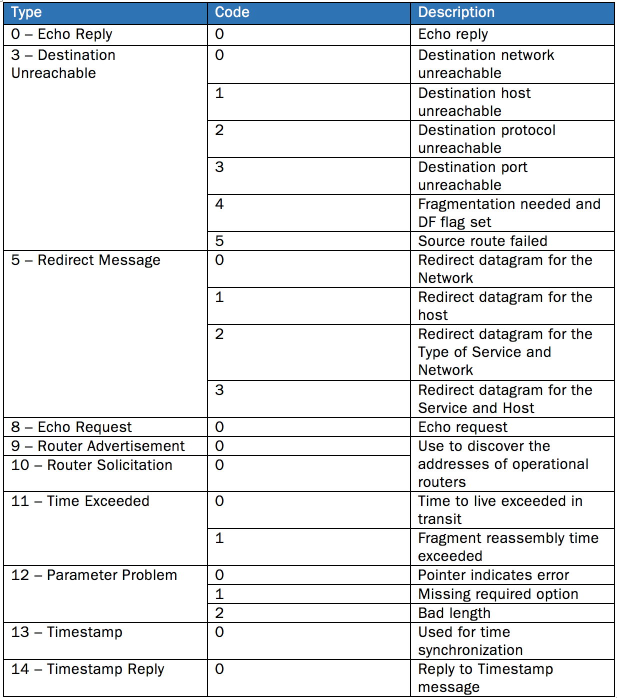
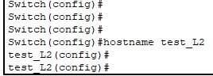
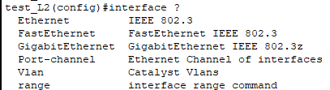
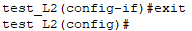
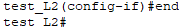
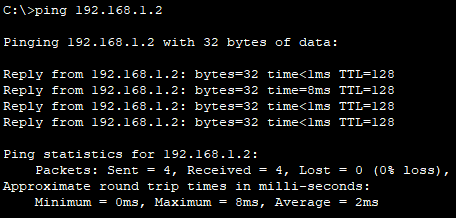
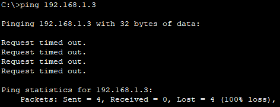

# 2024.07.08

5문제   
단답2 객관3

## TCP/IP 프로토콜

### 네트워크 정의
노드(node), 링크(link)

요즘은 클라우드로 다 옮기고 있다.


#### 링크 역할   
유선
- 동케이블(전기) 저속, 전송거리짧
- 광케이블(빛) 고속, 전송거리 길

무선
- 마이크웨이브(전파) 이동편리, 쉽게 범위 확장(보안이 상대적 취약)

</br>

### 통신 프로토콜
통신 규약

```
Protocol -> 기기들이 서로 통신하기 위해 주고 받는 언어
```

</br></br>

## 대표적인 네트워크 프로토콜 종류
TCP/IP
- 인터넷에서 사용하는 Protocol

</br>

### 종류
```
7, 6, 5 계층
- FTP, DNS, SNMP, TFTP, TELNET, HTTP

4 계층
- *TCP*, UDP

3 계층
- ARP, *IP*, ICMP

2, 1 계층
- Ethernet frame, Ethernet, Token Ring, ATM
```

</br>

### TCP/IP 프토코로의 계층적 구조
```
데이터 캡슐화 : 송신 측 입장에서 데이터 생성 과정

데이터 역 캡슐화 : 수신 측 데이터 

데이터에 제어 정보를 덧붙이고 떼고 하는 과정
```
</br>

---
### 네트워크 엑세서 계증(1,2계층)

MAC 어드레스

앞 6자리는 = 제조사/기관에 부여된 고유 값

뒷 6자리는 = 시리얼 넘버

</br>

---
### 인터넷 계층(3계층) 프로토콜
IP프로토콜
- 호스트의 주소 지정과 패킷 분할 및 조립 기능 담당

</br>

패킷의 헤더 주소
```
클래스A : 10.0.0.0 ~ 10.255.255.255   
클래스B : 172.16.0.0. ~ 172.31.255.255
클래스C : 192.168.0.0 ~ 192.168.255.255
```
**NAT**   
사설IP에서 공인IP로 바꿔주는 장치 

#### IP Fragmentation
```
패킷을 전송하고자 하는데 패킷의 크기가 MTU(Maximum Transmission Unit)을 초과하면 한번에 전송할 수 없다.   
패킷을 MTU 이하의 조각으로 분할하는 것을 단편화(Fragmentation), 분할된 조각을 단편(Fragment)이라고 한다.   

1,500byte로 짤라서 보냄

순서	페이로드	헤더	More Flag	offset
1	    1480	   20	   1	       0
2	    1480	   20	   1	       185
3	    1020	   20	   0	       370
```

#### IP 프로토콜의 한계
- 비연결성
- 비신뢰성

#### ICMP 프로토콜
ICMP TYPE   
ICMP CODE   


#### ARP 프로토콜
ARP 테이블

PC의 arp 테이블 확인 명령어   
arp -a

L3장비의 arp 테이블 확인 명령어   
sh arp
```
가. Arp 요청을 보내기 전에 ARP cache Table에서 목적지 IP의 물리적 MAC주소가 있는지 확인
나. ARP cache Table에서 목적지 IP의 물리적 MAC주소가 없으면 Arp Request 및 Reply 과정 수행

요청은 Broadcast (1:N) <-> 응답은 Unicast(1:1)
```

---
### 전송 계층(4계층) 프로토콜
TCP 프로토콜
- 신뢰성이 높은 데이터 흐름 제공

UDP 프로토콜
- 아주 단순한 형태의 서비스 제공

#### 연결 구조
TCP   
- 3-Way Handshake  

UDP   
- 과정이 없음.


#### TCP/UDP의 서비스 port


#### TCP 프로토콜 Flag 정보 
URG, ARK, PSH, RST, SYN, FIN


#### 연결 해제
4-Way handshake

#### PC에서 session 연결 상태 확인
netstat -an   
명령어

---
### 응용계층(7계층)프로토콜

TCP
- TELNET 23
- SMTP 25
- FTP 21
- HTTP 80
- DNS 53

UDP
- DNS 53
- SNMP 161


### 내 PC에서도 TCP/IP 계층 구조 확인
ipconfig /all

#### TCPView
ftp 서비스 프로세스?   
telnet 서비스 프로세스?

#### 패킷 분석
★   
ARP
- ARP Request 는 Broadcast 패킷인가요?
```
네. (ARP Reply = Unicast)
```

IP
- Fragment 표시는 무엇으로 확인이 가능한가요?
```
IP 헤더의 Flags 필드와 Fragment Offset 필드로 확인할 수 있습니다.
```
TCP
- 3 Way Handshake 과정에 주고 받는 flag 값은 무엇인가요?
```
SYN, ACK
```
DNS
- DNS 쿼리와 응답 패킷의 내용은 무엇인가요?
```
DNS 쿼리와 응답 패킷은 도메인 이름을 IP 주소로 변환하기 위해 질문과 답변을 포함하는 네트워크 데이터입니다.
DNS 쿼리와 응답 패킷에는 도메인 이름, 요청한 레코드 유형, 클래스, 응답에서는 해당 도메인의 IP 주소 및 기타 관련 정보가 포함됩니다.
```
HTTP
- HTTP는 TCP의 몇 번 포트를 이용하고 있나요?
```
80
```


## 네트워크 장비 종류 이해

### TCP/IP 계층별 네트워크 장비
```
OSI 7 Layers        TCP/IP      data unit 　　system
7응용 6표현 5세션    4응용        data         L7 스위치
4전송     　　　     3전송        segments     L4 스위치
3네트워크            2인터넷      packets      L3 스위치 
2데이터링크          1네트워크    frames  　　  L2 스위치   
1물리        　　　　1네트워크　　 bits 　　　　 Hub
```
### 컴퓨터 간의 네트워크 연결
PC 2대를 연결하려면   
LAN 케이블만 있으면 됨

**3대 이상** 연결   
***L2 스위치***

### 물리계층 중요 장비
리피터 
- 감쇠된 전송신호를 새롭게재생하여 다시 전달하는 장비   
**신호재생**

허브 
- 들어온 신호를 연결된 모든 포트로 전달하는중계 장비(멀티포트 리피터)   
**신호재생 + 모든 포트 전달**

브릿지
- 물리적으로 떨어진 동일한 LAN을 연결해 주는 장비   
**LAN과 LAN 연결**

L2 스위치
- MAC address table를 정보를 보고 목적지 MAC주소의 포트에 패킷 전송    
**MAC 주소 관리 + 특정 포트 전달**   
collision domain 구분   
running forward 기능?? 핵심기능이라고?   
**MAC table 관리**

---

### L2 스위치 장비의 동작 원리

#### 스위치(L2 Switch) 장비 핵심 기능   
- 동일 네트워크를 연결하는 장비
- 전원만 키면 바로 동작/사용 가능
- MAC Learning
- Forwarding

    MAC Learning은 출발지 주소가 MAC 테이블에 없으면 MAC 주소 저장.   
    Forwarding은 목적지 MAC주소가 MAC Table에 있으므로 저장된 포트로만 전달.

근데 따라가다 보면 다른 거 있다 했는데 여기는 L2 장비가 있다???   
L2, L3, 게이트웨이, 

L2 스위치


### 라우터(L3) 장비의 동작 원리
라우팅 테이블 관리

### L3(라우터) 장비의 핵심 기능
- 다른 네트워크와 연결할 때 사용(네트워크 간 연결)
- 라우터 장비는 NW별 IP주소 및 라우팅 설정을 해야 동작/사용
- 다른 네트워크로 찾아갈 수 있도록 최적의 경로를 찾아주는 역할 수행

라우터 하나를 지날 때마다 홉(hop)이 카운팅 되는데   
경로를 찾는 알고리즘..    
홉이 적은가? 시간이 짧은가? 등등


### 라우터에서 Routiong Table 만드는 방법
#### 정적 라우팅(static routing)
- 관리자 권한으로 특정 경로를 통해서만 패킷이 지날 수 있도록 설정
- 네트워크 변경사항이 발생하면 라우팅 테이블을 수동으로 직접 고쳐야 함

#### 동적 라우팅(dynamic routing)
- 라우터가 네트워크 연결 상태를 스스로 파악하여 최적의 경로를 선택해 전송
- 네트워크 연결 형태가 변경되어도 자동으로 Routing 경로 업데이트
- RIP, OSPF, ISIS 등 다양한 동적 라우팅 프로토콜 존재

#### 동적 라우팅 종류
- 거리 벡터 라우팅 (거의 안씀)
    - 최소 hop만 제공
    - 주기적으로 이웃 노드와 자신의 라우팅 테이블을 공유
    - RIP, IGRP

- 링크 상태 라우팅 (요즘 다 이거 씀)
    - 라우팅 테이블을 구성하기 위해 다익스트라(Dijkstra) 알고리즘 사용
    - 네트워크 전반적인 데이터베이스 (LSDB)를 가지며, 변화가 생기면 라우팅 정보 발송
    - OSPF IS-IS

show ip route


### L3 스위치 장비의 동작 원리
**L2 계층의 스위칭 기능 +  L3 계층의 라우팅 기능**   
-> 장비를 무슨 용도로 사용할지 목적에 따라 config 설정


---
### 정리 

L2, L3 장비가 뭔지 개념

L2 = 동일 네트워크 연결 장비. 쌈   
L3 = 다른 네트워크 연결 장비. 비쌈

L3 스위치 - 라우터  
L2 스위치 - 스위치 - 허브 - 스위치 허브


----
### Collision Domain 과 Broadcast Domain

#### Collision Domain 
: 전기적인 충돌이 일어나는 영역

Hub   
허브 장비는 collision이 발생할 수 있음


스위치 장비는 포트마다 MAC이 뭔지 기억하니까   
얘들에 의해서 충돌 발생이 적음   


#### Broadcast Domain 
: Broadcast 패킷을 받을 수 있는 영역
- 자신이 속하지 않은 다른 네트워크로 Broadcast 패킷 전송 불가


각 장치 별 CD / BD
허브 스위치 라우터 표

---

### L4 스위치의 동작 원리(서버 부하 분산의 원리)

#### L4 스위치의 중요 기능
부하 분산과 Fail Over 기능

Load balancing

수로 서버 앞단.

특수 기능

3개의 서버 중 하나의 서버에 장애가 일어나면    
나머지 2개의 서버로 로드 밸런싱을 해서 고객이 장애가 일어났는지 모르게 한다.


서버 로드 밸런싱

방화벽 로드 밸런싱


### L7 스위치의 중요 기능
컨텐츠별(URL 정보, 쿠기 등)로 종합적으로 검사하여 사용자별로 차별화 서비스 제공

---
L2 장비와 L3 장비의 중요 기능

L2 장비
- 동일 네트워크 연결 장비. 쌈   
- VLAN과 TRUNK 설정 활용 가능

L3 장비
- 다른 네트워크 연결 장비. 비쌈
- NAT 기능, DHCP서버, 접근제어 등 다양한 부가 기능 보유

```
장비명  스위칭 기능           용도             비고
L2      MAC주소              LAN연결          VLAN
L3      IP주소               LAN G/W          망 연동
L4      TCP/UDP Port        부하분산, Qos     FLB, NLB
L7      URL주소, 파일명 등   부하분산, 필터     기준다양
```


## L2 스위치 운용

### L2 스위치 구조

이더넷 구조 
- 일반 사용자 PC 등의 단말기를 연결하는 포트

광 포트
- 상위 장비, 원거리 장비 연결하기 위한 광 CA 연결 포트

콘솔 포트
- 장비 Config 설정하기 위한 운용PC 연결 포트

#### Consol 있는가?
일반 스위치 X   
인텔리전트 스위치 O   
</br>

### VLAN 정의
하나의 스위치를 여러 개의 분리된 스위치처럼 사용 가능하도록 지원 기능
```
VLAN은 번호(ID)로 구분   
VLAN 번호는 
 - 1~1005까지는 일반 VLAN
 - 1006~4096은 확장 VLAN 

VLAN 번호를 만들고, 특정 인터페이스에 해당 VLAN 번호를 부여하면 된다.
```
</br>
</br>

## 실습
로그인   
en

configure terminal 이동   
conf t

이름 바꾸기   






빠져나오기   
exit   


end   



## 1.VLAN_1번 실습.pkt
sh vlan   


vlan 이름 바꾸기   


192.168.1.1 PC에서   
192.168.1.2 PC에게 Ping test 결과


192.168.1.3 PC에게 Ping test 결과



## 2.VLAN_2번 실습.pkt

ip rount

ip rounti

숙제


## L2 스위치 운용

### TRUNK 프로토콜
★   
트렁크(Trunk)란 복수개의 VLAN 트래픽을 전송할 수 있는 1개의 링크를 말함.

디폴트로 엑세스 포트

트렁크 인캡슐레이션 -> 802.1Q, ISL 등으로 부름

### 실습 
트렁크로 사용할 interface(port)에 명령어 입력으로 설정   
switchport mode trunk

트렁크 사용할 수 있는 VLAN 추가하기   
switchport trunk allowed vlan 10,20


show interface trunk


---
보안의 목적   
분리, 분할, 나누기, 쪼개기

해킹의 원리   
제일 쉬운 건 옆사람 PC

컨설팅 가면 어차피 L2 장비는 안본다.   
제일 중요한 건 L3 장비.

---
### STP 프로토콜

STP(Spanning Tree Protocol)
- Physical Loop를 발견, 방지, 제거하는 프로토콜

1. 루트 스위치 선발
2. 루트 포트
3. 대자구내아타두 포트
4. 대체 포트

#### Root 스위치 선발 기준
BPDU - Bridge ID값이 가장 낮은 SW가 Root 스위치   
PVST - VLAN ID별로 하나씩
기본 Bridge ID = 기본 Priority + VLAN ID + MAC Address


### 실습


## L3 스위치 운용

### L3장비의 중요 기능
라우터와 L3 스위치 장비는 IP패킷의 경로를 찾아 주는 역할

IP패킷 경로 찾는 방법
- 정적 : 관리자가 경로를 직접 지정
- 동적 : 자동으로 네트워크 탐색하여 경로 등록
    - 거리백터 : Hop count 가 작은 경로 선택
    - 링크상태 : 비용(cost)이 가장 작은 경로 선택


### 정적 라우팅이란? 
수동으로 라우팅 테이블 만들고 경로 결정   
소규모에서는 장점, 중규모 이상은 작업관리가 어려움


### L3장비의 정적 라우팅

### 동적 라우팅 프로토콜

#### 거리벡터 
hop count

#### 다익스트라(Dijkstra) 알고리즘
cost

### OSPF 라우팅 프로토콜
OSPF의 장점 = 거리벡터의 단점

링크 스테이트의 장점..?


## L3 스위치의 ACL(접근통제) 기능

### ACL(접근제어) 설정


#### ACL(Access Control List)란?
- 특정 트래픽의 접근을 허용할지 차단할지 결정하는 리스트
- 보안을 위해서 많이 사용
- ACL은 standard(1~99)와 Extended(100~199)로 구분
    - standard Access list -> source address만 참조해서 filtering 결정
    - Extended Access list -> source address 외에도 destination address, protocol, Port 번호 등 좀 더 자세한 정보를 참조해서 filtering 결정

#### ACL 동작 방식 
- 인바운드, 아웃바운드 구분(어느 방향에 필터링 걸었냐)

#### ACL 적용할 곳 선택
- 자기 기준으로 in, out이 달라지기 때문에 잘 보고 결정해야 함.

#### L3장비의 ACL 설정을 활용한 접근통제
- standard Access list -> source address만 참조해서 filtering 결정
- Extended Access list -> source address 외에도 destination address, protocol, Port 번호 등 좀 더 자세한 정보를 참조해서 filtering 결정
</br>
</br>

filter 조건 
- IP : 출발지 IP, 목적지 IP
- 프로토콜 : TCP, UDP, ICMP 등
- 포트 : 0 ~ 65535


#### 외부 IP-Spoofing 공격 필터링
Ingress 필터링(보안기사)
- 사네 네트워크로 들어오는 패킷의 소스 IP나 목적지 포트 등을 체크하여 허용하거나 거부
- 외부에서 유입되는 IP 주소 중에 내부의 사설 IP가 있다면 차단
- Loop 주소, 사설 IP 주소를 외부 공중망 인입 구간에 필터링 설정

Egress 필터링
- 내부에서 라우터 외부로 나가는 패킷의 소스, IP를 체크하여 필터링
</br></br>

**과제**   
1. R1에서 외부망 20.20.20.0/24 에서 내부망 192.168.10.10/24로 ping 접근하는 것을 차단   
2. R1에서 내부망 192.168.10.0/24 에서 외부망 20.20.20.20/24로 ping 접근하는 모든 서비스를 차단


## 무선 WIFI 기술 이해

### 무선랜 WIFI 기초

#### 무선 AP장비가 유선랜 엔드포인트로 구성
BSS
- 하나의 AP와 이것에 접속된 단말로 구성된 그룹이다. BSSID는 해당 AP의 MAC주소이다.

ESS
- 여러 개의 AP들이 분배망에 연결되어, 각 단말들 간에 상호 접속이 가능한 확장된 그룹 ESSID는 논리적으로 ESS를 구분하는 식별자로서 문자열이다.

#### 무선랜 프로토콜의 역사
역사는 2가지 종류   
1 속도   
2 암호화


#### 무선랜 WIFI의 보안관리 방법
SSID 감추기
- Hidden SSID로 설정하여 SSID 노출을 막음
- 대부분 AP장비는 default로 설정된 SSID를 broadcast 하도록 설정됨

MAC 인증
- Source MAC 어드레스를 기반으로 필터링하여 접근 제어
- AP에서 구현할 수 있는 가장 기본적인 접근 제어

WEP 암호화
- 가장 기본적인 무선 데이터 암호화 방식
- 많은 취약점이 공개됨

WPA/WPA2 암호화
- WPA는 TKIP라는 암호화 방식, WPA2는 AES-CCMP 알고리즘을 사용
- Dictionary 공격에 대한 취약점 존재

WPA3 암호화
- SAE(Simultaneous Authentication of Equals) 이용한 암호화 강화
- 간단한 암호문을 사용하더라도 Dictionary 공격에 노출되지 않도록 개선

#### 암호화 방식 TKIP와 AES 비교
TKIP
- 임시 키 무결성  프로토콜, 기준 사용중인 WLAN 장비에 단지 펌웨어 업그레이드만으로 구현 가능

AES
- 3DES 보다 더 안전하고, 더 효율적이며, 다양한 하드웨어 상에 구현이 용이하기 위함 

엔터프라이즈급 AP?

### 무선랜 보안 강화 방안

#### 무선랜 공격 탐지/차단 시스템(WIPS) 도입
테더링을 켰는데 연결이 안되네? WIPS 의심.

#### 