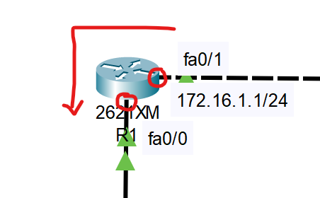

ACL 접근 통제 실습을 하기 위해서

Cisco Packet Tracer에서 

1. R1에 외부망 20.20.20.0/24 에서 내부망 192.168.10.10/24 로 ping 접근하는 것으로 차단
2. R1에 내부망 192.168.10.0/24 에서 외부망 20.20.20.0/24 로 ping 접근하는 모든 서비스 차단

## R1에 외부망 20.20.20.0/24 에서 내부망 192.168.10.10/24 로 ping 접근하는 것으로 차단

20.20.20.0/24 로 문제에서 나오기 때문에   
ACL 명령어를 조금 수정해주었다

```
access-list 111 deny tcp 20.20.20.0 0.0.0.255 host 192.168.10.10 eq 80
access-list 111 permit ip any any
interface fa0/0
ip access-group 111 in
```

차단이 되지 않고    
20.20.20.20 PC에서 192.168.10.10 PC로 핑이 잘 나가는 것을 확인

```
access-list 112 deny tcp host 20.20.20.20 host 192.168.10.10 eq 80
access-list 112 permit ip any any
interface fa0/0
ip access-group 112 in
```
이것 또한 차단 안되었음.

```
access-list 113 deny ip host 20.20.20.20 host 192.168.10.10
access-list 113 permit ip any any
interface fa0/0
ip access-group 113 in
```
이것도 차단이 안되었음

```
access-list 111 deny icmp 20.20.20.0 0.0.0.255 host 192.168.10.10 echo
access-list 111 deny ip 20.20.20.0 0.0.0.255 host 192.168.10.10 
access-list 111 permit ip any any
```
이것도 안됨

이유가 뭔지모르겠음... 질문


---
---
---
# 해결

일단 잘못생각한 게 
```
access-list 111 deny tcp 20.20.20.0 0.0.0.255 host 192.168.10.10 eq 80
access-list 111 permit ip any any
interface fa0/0
ip access-group 111 in
```
세번쨰 프로토콜 설정하는 부분에서

1. ping test를 하는 데 필요한 건    
ICMP패킷인데 TCP패킷을 차단하니까 안되는 거였음.   
**tcp -> ICMP 로 변경**

2. 프로토콜이 ICMP로 변경되면 뒤에 eq 번호가 필요없어짐.

3. in / out 기준이 잘못되었음.   
라우터 기준으로 in / out이 아니라,   
포트 기준으로 in / out이다.

</br></br>


fa0/0 기준)    
왼쪽 점선 라인에서 실선 라인 안으로 들어가는 것임.   
ICMP Ping은 이미 라우터 안으로 들어왔음.   
그래서 fa0/0에게는 나가는 것을 허용할지 말지 정해야 함.   
그래서 무조건 out밖에 없음.

fa0/1 기준)   
왼쪽 점선 라인에서 실선 라인 안으로 들어가는 것임.   
ICMP Ping이 라우터 안으로 들어가는 입구 포트임.   
fa0/1에게는 들어가는 것을 허용할지 말지 정해야 함.   
그래서 무조건 in밖에 없음.




# 정답
```
access-list 111 deny icmp 20.20.20.0 0.0.0.255 host 192.168.10.10
access-list 111 permit ip any any
interface fa0/0
ip access-group 111 in
```


## R1에서 내부망 192.168.10.0/24 에서 외부망 20.20.20.20/24로 ping 접근하는 모든 서비스를 차단
```
access-list 111 deny icmp 192.168.10.0 0.0.0.255 host 20.20.20.20
access-list 111 permit ip any any
interface fa0/1
ip access-group 111 out
```