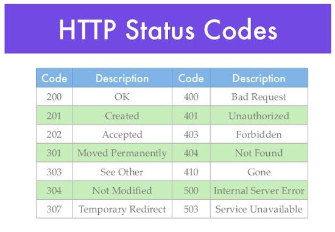

# 2024.07.15

## HTTP PROTOCOL

Hyper Text Transfer Protocol
- www 상에서 주로 HTML 문서를 주고 받는 데 사용되는 어플리케이션 계층의 요청/응답 프로토콜
- 1996년 1.0버전, 1999년 1.1버전 발표
- HTTP 버전 1.1 에서는 가상호스트, 지속적인 연결 등 추가
- 텍스트 형태의 프로토콜
- HTTPs

RFC문서?   
RFC(Request for Comments) 문서는 비평을 기다리는 문서   
RFC는 HTTP와 같은 프로토콜의 표준과 사양을 정의하기 위한 공식 문서 역할   


google.com 을 쳤는데   
cache에도 없고, hosts에도 없으면?   
DNS로 질문을 함   
google에 대한 IP주소를 받음


ipconfig /flushdns
ipconfig /displaydns

nslookup   
기본 서버 쪽으로 dns쿼리를 보낸ㄷ??

cns1.hananet.net   
이런 이상한 dns서버를 왜 쓸까??    
-> 우리가 그렇게 설정해서

DHCP 하는 일 : 자동으로 IP 할당해주는 것   
우리가 수동으로 IP설정 안해도 랜선만 꽂으면 알아서 설정해주는 것.

dns서버는 2개.   
1차 dns 서버가 다운되면 2차 dns 서버로 커버할 수 있게


다른 dns를 지정하는 방식은?   
네트워크 설정가서    
IPv4   
기본 dns, 보조 dns 설정

nslookup www.naver.com   쳤을 때 4개나 나오는 이유는
- 로드 밸런싱


## 응답과 요청

GET방식으로 Web Server에 요청함.

### 요청값
```
Method     URL    HTTP Vesion(:1.1)
Header Name : Header Value
Body
```
```
Method : GET   
URL : /    
HTTP Vesion :1.1    
Header Name : Header Value
- User-Agent:웹 브라우저 버전   
- Host:어디다 보내는지   
- Referer:못들었음
Body
- GET 방식에는 Body가 없음
- POST방식에는 있음
```

### 응답값
```
HTTP Version    상태 코드    코드 설명   
Header Name : Header Value
Body
```
```
HTTP Version : HTTP 버전    
상태 코드 : 200, 300, 400, 500 등등 다 의미가 있음  
Header Name : Header Value :   
코드 설명 :
```


## URL Structure
<h1>http://server[:port]/path/program?query_string

### [:port]
http   : 80   
https  : 443   
ftp    : 21   
ssh    : 22   
telnet : 23   
SMTP   : 25   
pop3   : 110   
RDP    : 3389

### path
디렉토리 경로

### program
*.php   
*.asp   
*.html      

### ?query_string
? : query_string 구분자   
& : 각 변수의 구분자
= : 변수 데이터 대입 

## Requset Method
GET    : 일반적으로 특정 리소스를 요청하는 데 사용(넘기는 용도로도 사용된다.)   
POST   : 일반적으로 특정 리소스를 서버로 전송할 떄 사용. 리소스 요청에도 사용   
DELETE : 요청 리소스 삭제   
PUT    : 지정된 리소스에 전달된 데이터 저장   
(delete, put method는 허용을 하면 안된다.(해킹가능성))
HEAD   : 요청한 데이터에 대해 리소스는 반환하지 않고 헤더만 요청   
OPTION : 웹 서버에서 지원하는 METHOD를 알려줌       
TRACE  : 요청한 request를 그대로 반환    
CONNECT : Proxy와 함께 터널링 목적으로 사용


## Response Code
```
구분                    응답 코드    응답 메시지
1xx : Information       100         Continue
2xx : Success           200         OK
                        201         Created
                        202         Accepted
3xx : Redirection       

```



## method

GET  : URL에 정보를 싣고 서버로 감   
POST : body에 정보를 싣고 서버로 감

GET방식으로 URL에 쉽게 적을 수 있으니까,   
 그나마 귀찮게 POST방식으로 하는 것을 권장함

## Cookie & Session
Cookie
- Client에 정보 저장
- 서버 부하를 줄이는 용도로도 사용
- 조작 가능
- Set-Cookie 헤더를 통해 전송(ex> Set-Cookie : name=value)

Session
- Server에 정보 저장
- Key는 Cookie로 전송
- 인증 정보에 많이 사용됨
- Session Key는 Cookie(Set-Cookie)를 통해 전달됨
- Session Key 키값은 유추할 수 없어야 함

## Client Side - Script Language
CSS   
자바 스크립트   
VB 스크립트   
j스크립트   
HTML

## Server Side - Script Language
SSS   
ASP   
ASP.NET   
PHP   
JSP   
CGI


## 웹 프로세스 구조
웹 방화벽 : 80, 443 포트를 제어

### IDS, IPS 차이점
IDS는 탐지만,   
IPS는 탐지도하고 막기도 함

### Web Server
방화벽
- 80
- 443
port open

웹서버 
- IIS    (.asp)
- Apache (.php)
- Tomcat (.jsp)

웹 어플리케이션
- asp
- php
- jsp

데이터베이스
- Oracle
- MMSQL(윈도우서버만)(나머지는 리눅스도 윈도우도 다 가능)
- MySQL
- DB2


#### Cent OS
cmd창에   
>ftp 192.168.0.241

id : test / pw : test

> dir

> get "다운원하는 파일명 복붙"
 
CentOS7에 APM 설치하기.pdf   
MobaXterm_Installer_v23.0.zip   
CentOS_7.9.2009_VMM   


centos 실행 후

id : centos / pw : centos

sudo su -

ifconfig   
뭔가 바꿔야한다고 했음

- CentOS 우클릭
    - Virtual machine settings 가서   
        - Network Adapter 
            - NAT 로 설정 
            - OK

설정하고 다시 centos가서   
ifconfig 해보면

ifdown ens33   
ifup ens33   
ifconfig 다시 하면 ip가 바뀌어야 한다.   
그리고 인터넷이 되는지 확인하려면   
ping www.naver.com 해서 인터넷 되는지 확인


#### moba 
- mobax 실행   
- 우측 상단Session
    - SSH
    - Remote host : (centos ip)
    - id : centos / pw : centos

- id 치면 gid=1000
- sudo su - 
- id 치면 gid=0


- vi /etc/yum.repos.d/CentOS-Base.repo
    - d를 계속 눌러서 다 지움.
    - i 눌러서 insert모드로 바꾸고
```
[base]
name=CentOS-$releasever - Base
baseurl=http://mirror.kakao.com/centos/$releasever/os/$basearch/
gpgcheck=1
enabled=1
gpgkey=file:///etc/pki/rpm-gpg/RPM-GPG-KEY-CentOS-7

#released updates
[updates]
name=CentOS-$releasever - Updates
# kakao
baseurl=http://mirror.kakao.com/centos/$releasever/updates/$basearch
gpgcheck=1
enabled=1
gpgkey=file:///etc/pki/rpm-gpg/RPM-GPG-KEY-CentOS-7

#additional packages that may be useful
[extras]
name=CentOS-$releasever - Extras
baseurl=http://centos.mirror.cdnetworks.com/$releasever/extras/$basearch
gpgcheck=0
gpgkey=file:///etc/pki/rpm-gpg/RPM-GPG-KEY-CentOS-7

#additional packages that extend functionality of existing packages
[centosplus]
name=CentOS-$releasever - Plus
baseurl=http://centos.mirror.cdnetworks.com/$releasever/centosplus/$basearch
gpgcheck=1
enabled=0
gpgkey=file:///etc/pki/rpm-gpg/RPM-GPG-KEY-CentOS-7

#contrib - packages by Centos Users
[contrib]
name=CentOS-$releasever - Contrib
baseurl=http://centos.mirror.cdnetworks.com/$releasever/contrib/$basearch
gpgcheck=1
enabled=0
gpgkey=file:///etc/pki/rpm-gpg/RPM-GPG-KEY-CentOS-7
```

- 우클릭 해서 paste   
- esc 눌러서 insert 모드 나가기
- :wq

- CentOS7에 APM 설치하기.pdf 보고 따라하기
    - is this OK [y/d/n]
    - Y
- netsta -na|more


- phpmyadmin
    - yum install phpMyAdmin 부분이 안된다면 밑 코드 입력 후 다시
    - yum install epel-release

- mysql_secure_installation
    - 비밀번호 test 설정 
    - 다 Y

#### 크롬
- 10.10.10.10/phpmyadmin
- root / test
- 데이터베이스
    - 새 데이터베이스 만들기 
    - user 
    - 만들기
    - pdf 따라 다 하기

#### moba
- mysql -u root -p
- test
- show databases;
- use user;
- show columns from user;
- select * from user;
- \q

#### cmd
ftp 강사님 거 다시 들어가서 source.zip 파일 받음.

#### moba
- cd /var/www/html
- cat > index.php
    - index.php 파일 내용 붙여넣기
    - Ctrl + c
- more index.php
    - 잘 입력되었는지 확인

#### 크롬
- 10.10.10.10/index.php

#### moba
- vi connect.php
    - db 아이디, db 비밀번호를 내껄로 해줘야 함

#### 크롬
- 10.10.10.10/index.php
- id, pw 틀리면 알림창 뜨면서 접근불가
- id, pw 맞으면 접근 가능


#### moba
- pwd (/var/www/html)
- mkdir bbs
- cd bbs
- yum -y install git
- git clone https://github.com/gnuboard/gnuboard5.git
- rm -rf .git .gitattributes .gitignore
- setenforce 0
- cd gnuboard5
- ls
- mkfir data
- chmod 707 data
- mysql -u root -p
    - create database gnuboard;
    - Ctrl + c

#### 크롬
- 10.10.10.10/bbs
- 그누보드 설치
- User : root
- Password : test
- DB : gnuboard
- 회원ID : admin
- 비밀번호 : test
- 우측 상단 관리자 버튼 클릭

## 구글 해킹
구글 해킹을 통한 정보 수집
- 많은 정보를 수집하기 위해서는 검색 엔진을 이용하면 유용
    - 검색 엔진 중에는 구글이 많이 사용됨.
```
검색 인자                            설명                                            검색 추가 인자
site        특정 도메인으로 지정한 사이트에서 검색하려는 문자열이 포함된 사이트를 찾음   YES
filetype    특정 파일 유형에 한하여 검색하는 문자가 들어 있는 사이트를 찾음             YES
link        링크로 검색하는 문자가 들어 있는 사이트를 찾음                             NO
cache       특정 검색어에 해당하는 캐시된 페이지를 보여줌                              NO
intitle     페이지의 제목에 검색하는 문자가 들어 있는 사이트를 찾음                     NO
inurl       페이지의 URL에 검색하는 문자가 들어 있는 사이트를 찾음                      NO
```

### 구글 해킹을 통한 정보 수집
- 주요 검색 인자
    - site
        - wishfree.com 도메인이 있는 페이지에서 admin 문자열을 찾으려는 예
```        
filetype: xlsx password   
filetype: txt @gmail.com username password
filetype: txt 패스워드
intitle:index.of admin
User-agent: googlebot
User-agnet: *
Disallow: dbconn.ini
inurl: robot.txt
www.naver.com/robots.txt
www.kisa.or.kr/robots.txt 
```


