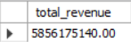
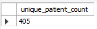
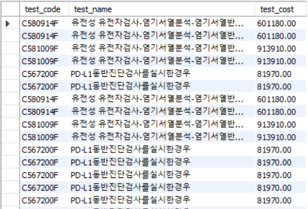
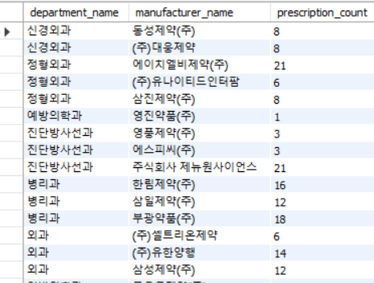
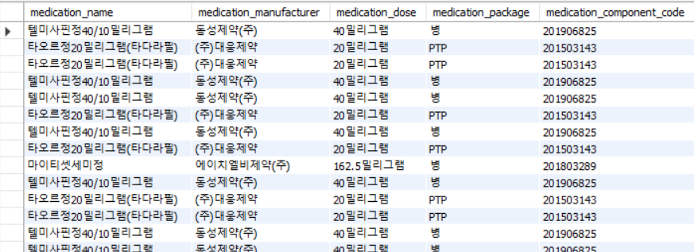
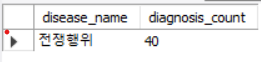

## Create Table
```
-- 환자 테이블
CREATE TABLE patients (
    patient_id INT PRIMARY KEY,
    name VARCHAR(255),
    gender CHAR(1),
    birthdate DATE,
    email VARCHAR(255)
);

-- 진료 테이블
CREATE TABLE appointments (
    appointment_id INT PRIMARY KEY AUTO_INCREMENT,
    patient_id INT,
    department VARCHAR(255),
    appointment_time DATETIME,
    appointment_cost DECIMAL(10, 2),
    payment_status VARCHAR(1),
    FOREIGN KEY (patient_id) REFERENCES patients(patient_id)
);

-- 검사 테이블
CREATE TABLE tests (
    test_id INT PRIMARY KEY AUTO_INCREMENT,
    appointment_id INT,
    test_type VARCHAR(255),
    test_code VARCHAR(255),
    test_name VARCHAR(255),
    test_cost DECIMAL(10, 2),
    FOREIGN KEY (appointment_id) REFERENCES appointments(appointment_id)
);

-- 질병 테이블
CREATE TABLE diseases (
    disease_code VARCHAR(255) PRIMARY KEY,
    disease_name VARCHAR(255)
);

-- 진료-질병 관계 테이블
CREATE TABLE appointment_diseases (
    appointment_id INT,
    disease_code VARCHAR(255),
    PRIMARY KEY (appointment_id, disease_code),
    FOREIGN KEY (appointment_id) REFERENCES appointments(appointment_id),
    FOREIGN KEY (disease_code) REFERENCES diseases(disease_code)
);

-- 투약 테이블
CREATE TABLE medications (
    medication_id INT PRIMARY KEY AUTO_INCREMENT,
    appointment_id INT,
    medication_number INT,
    medication_name VARCHAR(255),
    medication_package VARCHAR(255),
    medication_dose VARCHAR(255),
    medication_manufacturer VARCHAR(255),
    medication_component_code VARCHAR(255),
    FOREIGN KEY (appointment_id) REFERENCES appointments(appointment_id)
);
```

## 열 이름 영어로 매핑
환자번호 → patient_id    
환자성명 → patient_name   
환자성별 → patient_gender    
환자생일 → patient_birthdate   
환자이메일 → patient_email   
진료과명 → department   
진료시각 → appointment_time   
진료비금액 → appointment_cost   
납부여부 → payment_status   
검사유형 → test_type   
검사코드 → test_code    
검사명 → test_name   
검사금액 → test_cost    
상병코드 → disease_code   
상병명 → disease_name   
투약번호 → medication_number    
투약명 → medication_name   
투약패키지 → medication_package   
투약용량 → medication_dose    
투약제약사 → medication_manufacturer   
투약성분코드 → medication_component_code    


## 데이터 넣기
```
import pandas as pd
import mysql.connector
import numpy as np

# 데이터베이스 연결
conn = mysql.connector.connect(
    host='localhost',
    user='root',
    password='test',
    database='gpt'
)
cursor = conn.cursor()

# XLSX 파일 읽기
df = pd.read_excel('C:/Users/USER/Downloads/20240731_finalDBen.xlsx', engine='openpyxl')

# NaN 값을 처리하기 (예: NULL로 변환)
df = df.where(pd.notnull(df), None)

# 환자 데이터 삽입
for index, row in df.iterrows():
    cursor.execute('''
        INSERT IGNORE INTO patients (patient_id, name, gender, birthdate, email)
        VALUES (%s, %s, %s, %s, %s)
    ''', (row['patient_id'], row['patient_name'], row['patient_gender'], row['patient_birthdate'], row['patient_email']))
    conn.commit()

# 진료 데이터 삽입
for index, row in df.iterrows():
    cursor.execute('''
        INSERT INTO appointments (patient_id, department, appointment_time, appointment_cost, payment_status)
        VALUES (%s, %s, %s, %s, %s)
    ''', (row['patient_id'], row['department'], row['appointment_time'], row['appointment_cost'], row['payment_status']))
    
    # 마지막으로 삽입된 appointment_id 가져오기
    appointment_id = cursor.lastrowid
    conn.commit()

    # 검사 데이터 삽입
    cursor.execute('''
        INSERT INTO tests (appointment_id, test_type, test_code, test_name, test_cost)
        VALUES (%s, %s, %s, %s, %s)
    ''', (appointment_id, row['test_type'], row['test_code'], row['test_name'], row['test_cost']))
    conn.commit()

    # 질병 데이터 삽입
    cursor.execute('''
        INSERT IGNORE INTO diseases (disease_code, disease_name)
        VALUES (%s, %s)
    ''', (row['disease_code'], row['disease_name']))
    conn.commit()

    # 진료-질병 관계 데이터 삽입
    cursor.execute('''
        INSERT IGNORE INTO appointment_diseases (appointment_id, disease_code)
        VALUES (%s, %s)
    ''', (appointment_id, row['disease_code']))
    conn.commit()

    # 투약 데이터 삽입
    cursor.execute('''
        INSERT INTO medications (appointment_id, medication_number, medication_name, medication_package, medication_dose, medication_manufacturer, medication_component_code)
        VALUES (%s, %s, %s, %s, %s, %s, %s)
    ''', (appointment_id, row['medication_number'], row['medication_name'], row['medication_package'], row['medication_dose'], row['medication_manufacturer'], row['medication_component_code']))
    conn.commit()

# 연결 종료
cursor.close()
conn.close()
```

## 파이썬 라이브러리 설치
pip install pandas     
pip install mysql   
pip install mysql-connector-python   
pip install openpyxl


## ERD
```
+------------------+
|    patients      |
+------------------+
| patient_id (PK)  |
| name             |
| gender           |
| birthdate        |
| email            |
+------------------+
          |
          | 1
          |
          | N
+------------------+
| appointments     |
+------------------+
| appointment_id (PK) |
| patient_id (FK)     |
| department          |
| appointment_time    |
| appointment_cost    |
| payment_status      |
+------------------+
          | 1
          | N
          |
          | 1
+------------------+
| tests            |
+------------------+
| test_id (PK)     |
| appointment_id (FK) |
| test_type        |
| test_code        |
| test_name        |
| test_cost        |
+------------------+
          |
          | N
          |
          | 1
+------------------+
| appointment_diseases |
+------------------+
| appointment_id (FK) |
| disease_code (FK)   |
+------------------+
          | 1
          | N
          |
          |
+------------------+
| diseases         |
+------------------+
| disease_code (PK)|
| disease_name     |
+------------------+

+------------------+
| medications      |
+------------------+
| medication_id (PK) |
| appointment_id (FK) |
| medication_number  |
| medication_name    |
| medication_package |
| medication_dose    |
| medication_manufacturer |
| medication_component_code |
+------------------+

```
## 개발 SQL
1. 병원 총 수입금액 (환자가 납부한 금액 기준)
```
SELECT SUM(appointment_cost) AS total_revenue   
FROM appointments   
WHERE payment_status = 'Y';   
```


2. 전체 진료 환자수 (Unique 환자수)
```
SELECT COUNT(DISTINCT patient_id) AS unique_patient_count   
FROM appointments;   
```


3. 진단검사의학과 검사 기본정보 (검사코드, 검사명, 검사금액)
```
SELECT test_code, test_name, test_cost   
FROM tests   
WHERE test_type = '진단검사의학과';    
```
   
281개

4. 진료과별, 투약제약사별 투약 처방수 조회
```
SELECT   
    a.department AS department_name,   
    m.medication_manufacturer AS manufacturer_name,   
    COUNT(m.medication_id) AS prescription_count   
FROM   
    appointments a   
JOIN   
    medications m ON a.appointment_id = m.appointment_id   
GROUP BY   
    a.department, m.medication_manufacturer;   
```


5. 투약 기본정보 (투약명, 투약제약사, 투약용량, 투약패키지, 투약성분코드)
```
SELECT
    medication_name,
    medication_manufacturer,
    medication_dose,
    medication_package,
    medication_component_code
FROM
    medications;
```


6. 가장 많은 진단을 받은 상병명 (동률이 있는 경우 모두 출력 권고)
```
-- 가장 많은 진단을 받은 상병명을 조회하는 쿼리
WITH DiagnosisCounts AS (
    SELECT
        d.disease_name,
        COUNT(*) AS diagnosis_count
    FROM
        appointment_diseases ad
    JOIN
        diseases d ON ad.disease_code = d.disease_code
    GROUP BY
        d.disease_name
),
MaxDiagnosisCount AS (
    SELECT
        MAX(diagnosis_count) AS max_count
    FROM
        DiagnosisCounts
)
SELECT
    disease_name,
    diagnosis_count
FROM
    DiagnosisCounts
WHERE
    diagnosis_count = (SELECT max_count FROM MaxDiagnosisCount);

```


7. 진료과별 환자의 연령대/성별 수 (연령은 예전 한국 연령 기준으로 10살씩 구분. "0대", "10대", "20대")