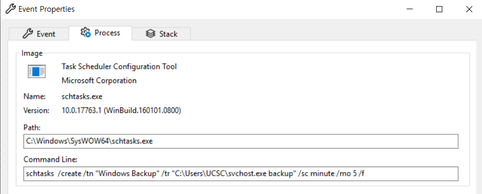
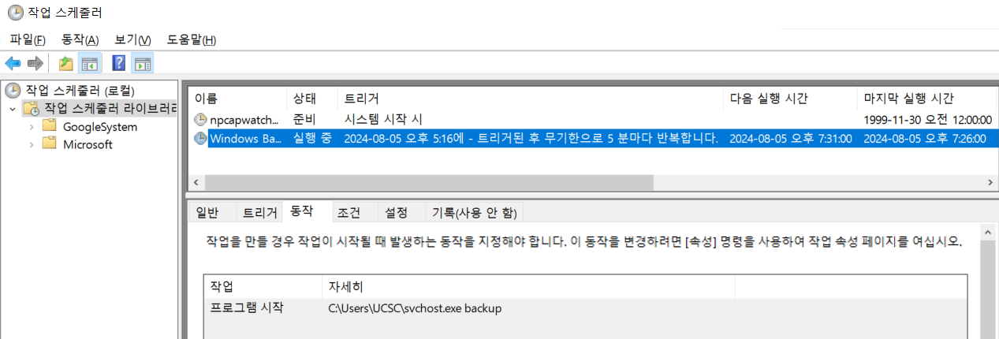

# 실제 악성코드 분석 결과

## 정적 분석
die.exe (Detect It Easy) 실행   
Setup.exe 파일 올려보면   
   
인스톨러가 있는 거 보니까   
윈도우에서 동작하는 인스톨러겠구나! 유추 가능   

hashmyfiles 실행    
Setup.exe 파일을 올려서 나온 Hash값을    
virustotal.com 사이트에 검색해봄
 

droper, Trojan... 악성코드로 유추 가능

## 동적 분석
mal 폴더에서    
Setup.exe 파일을 설치 후    
 

Process Explorer 에서 확인해보니까   
기본적인 것 외엔 아무 정보도 나오지 않음
 

Process Monitor 프로그램 열어서 Setup.exe 파일 열어볼 것임   
상단 Tools 탭 - Process Tree    
들어가면 확인가능
    


svchost.exe 우클릭   

\- Go To Event - 해당 파일이 처음 동작하기 시작한 위치로 이동    
\- include Filter - 해당 파일만 보는 필터를 적용   
둘 다 클릭

우측상단 5개 아이콘 중에서 show process and thread activity 제외하고 다 끔      
  

Go To Event, include Filter를 해줬기 때문에    
제일 처음 실행한 svchost.exe 파일을 확인할 수 있음   

그 svchost.exe 우클릭 후 Properties 클릭   
   
Command Line 읽어보면 cmd라는 프로세스를 동작시키면서 인자값으로 c를 두고 작업스케줄러를 등록하는 행위를 함   
```schtasks  /create /tn "Windows Backup" /tr "C:\Users\UCSC\svchost.exe backup" /sc minute /mo 5 /f```

/sc minute  등등 이런 명령어가 스케줄러를 등록한다는 의미   
'아 그럼 지속성을 유지하기 위해 작업스케줄러를 등록하는 작업을 하고 있구나'라고 알 수 있음


커맨드 창에서 작업스케줄러 등록했는지 여부를 확인해보자

윈도우에서 작업스케줄러 검색

 
svchost.exe 파일은    
원래 윈도우 폴더 밑에 있어야 하는데   
UCSC 폴더 밑에 있다는 걸 보고 이상하다고 느껴짐   

실제로 그 폴더로 들어가보면   
    
오늘 날자로 svchost.exe 파일이 생성이 된 걸 확인할 수 있음    
뭔가 의심이 감

Process monitor에서 어떤 동작을 했는지 면밀하게 관찰이 가능함

이제 우측상단 show process and thread activity 해제하고     
file system 킴   
   
이 파일이 별도로 파일을 설치한 과정은 없음     
   
그럼 다시 tree로 가서 어떤 일을 하는지 다시 확인해보자

    
unrar.exe 파일을 실행했네    
클릭해서 하단 command를 확인해보니까   
   
```"C:\Users\UCSC\AppData\Local\Temp\is-MRENO.tmp\unrar.exe" x -y -p1q2w3e4r C:\Users\UCSC\AppData\Local\Temp\is-MRENO.tmp\src.rar```   
tmp 폴더에 어떤 걸 압축해제 했구나 라고 확인이 가능함    
그럼 실제로 파일이 존재하는지 확인해봄    


실제로 존재함   
그럼 이 unrar.exe 파일은 악성코드인가?    
hashfile 프로그램에서 다시 hash값 찾아서 검색 사이트에 찾아보니까?      
딱히 악성프로그램은 아님

그럼 unrar.exe 파일은 문제가 없고   
svchost.exe 파일에 포커스를 맞춰야 함

svchost.exe 파일을 다시 hash값을 추출해서 바이러스토탈에 올려보니까    
   
죄다 빨간색으로 나옴.    
이 파일이 문제가 있다는 것을 확인할 수 있음    
backdoor, trojan으로 보고 있다고 나옴   
그럼 이 파일이 악성코드일 가능성이 높겠구나 라고 확인이 가능함