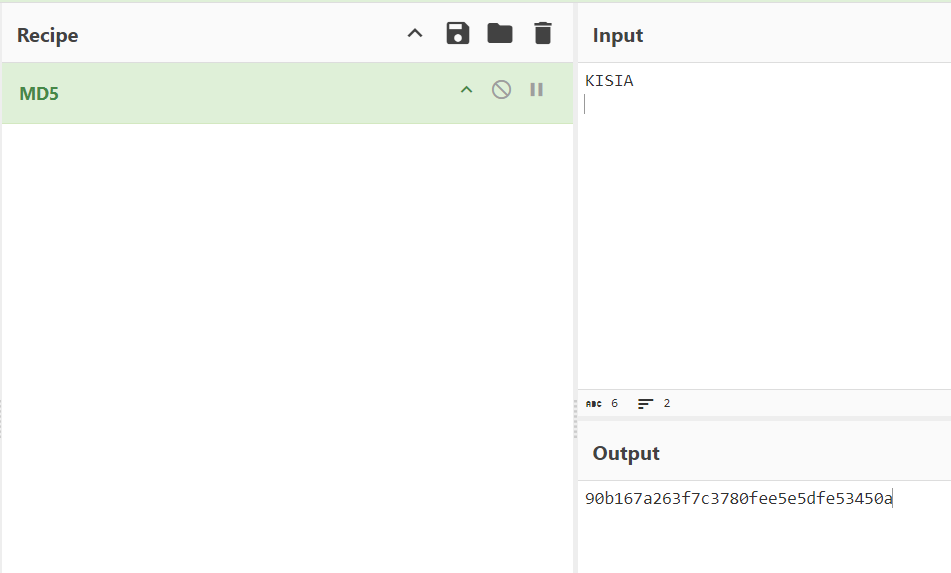
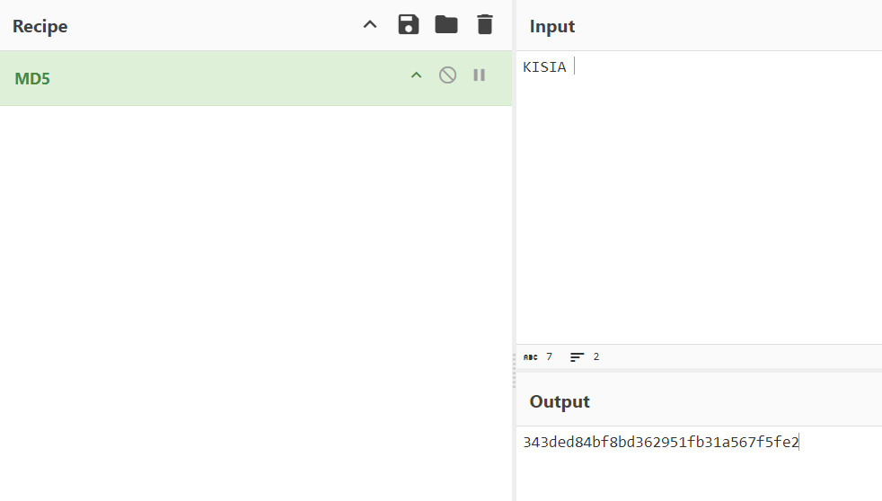

# 악성코드의 이해

## 악성코드란?
사용자의 의지와 관계없이 시스템에 상주해 시스템 자원을 사용하거나 사용자에게 피해를 입히는 프로그램을 총칭

## 악성코드의 종류
- Virus
    - <U>다른 파일을 감염해 기생</U>하는 악성코드(Virut, sality)
- Worm
    - 네트워크를 통해 <U>자가 복제 및 타 시스템을 감염</U>시키는 악성코드
- Trojan
    - 외형적으로는 정상 프로그램 같아 보이지만 시스템 파괴 등의 악의적인 행위를 포함하고 있는 악성 프로그램
- Downloader
    - 추가적인 악성코드를 <U>다운로드 받아 실행</U>하는 악성코드
- Dropper
    - 추가적인 악성코드를 <U>생성하고 실행</U>하는 악성코드
- Backdoor
    - 시스템에 상주하면서 서버로부터 명령을 받아 명령에 따른 악성행위를 수행하는 악성코드
- Rootkit & Bootkit
    - 시스템에 설치되어(부팅시) 특정 악의적인 프로세스나 파일등의 흔적을 사용자가 볼 수 없도록 하는 악성 프로그램
- Ransomware
    - 컴퓨터 상의 파일을 악의적으로 암호화하여 이를 복호화하는 것을 인질로 하여 금전적인 이득을 취하기 위하여 작성된 악성 프로그램
- Spyware
    - 사용자의 동의없이 설치되어 개인 및 <U>컴퓨터에 대한 정보를 무단으로 수집하여 유출하는 목적</U>의 악성 프로그램
- Adware & PUP
    - 특정 소프트웨어에서 <U>광고를 보여주기 위해 만들어진 악성 프로그램</U>으로 광고에 따른 수익을 그 목적으로함

**악성코드가 고도화되고 복잡해 지면서 대분류가 흐려진 부분이 많음**

# 악성코드의 이해

## 악성코드 감염 경로

### SpearPhishing을 통한 악성코드 감염
- 조직 내 특정 개인, 또는 그룹을 대상으로 이메일 내 악성 문서나 파일, 링크를 첨부해 전달하는 공격


### Software 취약점을 통한 악성코드 감염
- 외부 접점이 있는 서버, 또는 탈취한 계정을 통한 내부 시스템 접근
- 악성코드 유포   

### Software 취약점을 통한 악성코드 감염 사례
- 외부 접점이 있는 서버를 통해 내부 시스템 접근 후 악성코드 유포

### Watering Hole을 통한 악성코드 감염
- 특성 대상이 주로 방문하는 사이트에 악성 스크립트를 심어 악성코드 감염

### 공급망 공격 (Supply Chain Attack)
- 내부 시스템에 침투해 개발단계의 소스코드에 악성코드 삽입 후 배포

### 공급망 공격 사례
- IT 관리 솔루션 솔라윈즈 해킹 사태

## 실제 악성코드 공격 케이스 1.
- 국내 포털 사이트로 위장한 HTML을 통해 ID/Password 탈취 시도
- 취약한 WordPress 사이트를 공격 거점으로 이용
- 탈취한 ID/Password를 이용한 연속적인 공격으로 추정

### 미국 소재의 C2 사용


## 실제 악성코드 공격 케이스 2.
- 국내 기업들을 대상으로 무차별적 스피어 피싱 공격을 수행
- Microsoft Office의 Macro 기능을 악용해 악성코드 유포
- Microsoft Installer, 백신 탐지, Workgroup 탐지, 암호화 통신 등을 통한 은밀한 공격 수행
- 매크로 실행 시 숨김 페이지의 코드 실행해 MSI 파일 다운로드 및 실행

### 특정 환경에서만 동작하도록 설계
- 보안 소프트웨어 탐지
- WORKGROUP, workgroup 탐지

### RC4로 인코딩된 악성코드를 다운받은 뒤 복호화
- RC4 Key : 12byte “LKFGWPEIOjtk”
- 자동실행 : 버전에 따라 자동실행 레지스트리 or 서비스 형태로 등록
- Flawed Ammyy 악성코드 (유출된 Ammyy Admin 기반 RAT)
- 시스템 정보를 탈취해 C2로 전송
- OS 버전, 권한, 사용자 크레덴셜, PC명, Anti-Virus 목록, 빌드타임 등

APT 공격 방식과 이 공격 방식 차이점이 있다.

# 악성코드 분석가
## 악성코드 분서가란?
### 악성코드
- 사용자의 의지와 관계없이 시스템에 상주해 시스템 자원을 사용하거나 사용자에게 피해를 입히는 프로그램을 총칭
### 분석가
- 특정 주제 (데이터, 기업/주식, 신용, 부동산, 악성코드 등) 에 대해 심도 있게 파고들어 유의미한 결과를 도출해내는 직업 군
### 악성코드 분석가
- 악성코드를 다양한 측면에서 분석하고 심도 있게 파고들어 유의미한 산출물을 생산하는 직업ㅂ
- 분석을 통해 알아낼 수 있는 유의미한 데이터

데이터를 뽑아내고 뽑아낸 데이터가 기존 악성코드와 유사한 점이 있다면 클러스터링 해서    
사이버 스파이짓을 하는 위협행위자를 도출해낼 수 있음


## 분석을 통해 생성하는 산출물

### 파일/네트워크 시그니처
- 악성 파일을 식별할 수 있는 **파일 고유의 값** : Hash 값 ☆
- 악성 파일을 식별할 수 있는 **시그니처 기반 탐지 로직**
- 악성 파일을 식별할 수 있는 **네트워크 IP 및 도메인 / 통신 형태**
### 행위 정보
- 악성 파일 동작시 나타나는 시스템 **파일/레지스트리/네트워크/프로세스** 정보
### 악성코드 군집
- 악성코드 형태에 기반한 **유사 악성코드 모음**
### 위협 행위자
- 공격을 수행한 공격자 또는 공격 그룹

## 파일/네트워크 시그니처
### 악성 파일을 식별할 수 있는 파일 고유의 값
- HASH : 악성 파일을 식별할 수 있는 **파일 고유의 값, 인간의 지문**
- 입력값 (파일, 문자열 등)을 단방향 암호화를 통해 만들어내는 고정된 길이의 고유의 값
    - MD5, SHA-1, SHA-256 
- 파일과 HASH 값은 1:1 대응관계를 가짐
    - 파일을 구성하는 값 중 하나의 값이라도 다를 경우 다른 해시를 가짐

침해지표에 Hash 값이 들어감   
이 아티클에서 분석해놓은 글은 이 파일을 기반으로 분석한 거다라고 알 수 있음

### https://gchq.github.io/CyberChef
   
   
스페이스바 하나만 추가해도 값이 완전히 달라진다

### Option
Hexdump

### 악성 파일을 식별할 수 있는 파일의 탐지 로직
- 시그니처 기반 탐지 로직 : 악성코드의 문자열, 특징, 함수, 코드 모양 등을 기반으로 파일을 탐지하는 방식
- 시그니처 : 특정하게 나타나는 파일/행위의 특징

### YARA Rule   
rule 키워   
meta 진단과 상관없는 메시지를 남기는   
strings   
condition   

마지막날 실습

### Hash 알고리즘 기반 탐지 vs 시그니처 기반 탐지 로직
```
1:1         1:N 
시그니처 기반 : 
하나의 악성코드 탐지 로직으로 여러 가지를 잡을 수 있으니까 효율이 좋음 
스크립트는 난독화 방식이

hash 기반 :
그 외 일반적으로 시그니처 기반 탐지
```

### 악성 파일을 식별할 수 있는 네트워크 IP 및 도메인 / 통신 형태
- 악성 파일을 식별할 수 있는 네트워크 탐지 로직

네트워크 통신은 필연적으로 발생할 수밖에 없다.

### 악성 파일을 식별할 수 있는 네트워크 IP 및 도메인 / 통신 형태
- 악성 파일을 식별할 수 있는 네트워크 탐지 로직
### 식별 가능한 도메인 정보
- http://attacker.c2.com/info.php
- http://attacker.c2.com/backdoor.php
    - 누가 봐도 공격자 도메인인데 attacker.c2.com   
보통 정상 사이트를 해킹해서 웹쉘올려놓고 공격하기 때문에   
정상 서비스를 막는 경우가 될 수도 있음
### 식별 가능한 IP 정보
- 111.231.30.42
    - IP는 함부로 차단하면 안됨.   
### 식별 가능한 URL 정보
- GET http://attacker.c2.com/info.php?status=online&name=victim
- GET http://attacker.c2.com/backdoor.php?status=online&pc_name=pc1&os=WIN7.1
    - 고정된 필드명이 있다면 얘는 무조건 악성코드니까 앞이 뭐가 됐든 차단해라.

## 행위 정보
- 악성 파일 동작시 나타나는 시스템 파일/레지스트리/네트워크/프로세스 정보

특정 경로 자기 복제 및 자가 삭제 - Backdoor.exe    
자동실행을 위한 윈도우 레지스트리 등록 - 자동실행 레지스트리   
시스템 정보 수집 - 시스템 정보   
공격자의 서버로 시스템 정보 전송 - C&C 서버


마이터 어택 매트릭스

- 악성 파일 동작 시 나타나는 시스템 파일/레지스트리/네트워크/프로세스 정보

프로세스 생성 (악성코드 인젝션)
- CreateProcess(“cmd.exe”)
- CreateProcess(“userinit.exe”)
- CreateProcess(“svchost.exe”)
- CreateProcess(“iexplorer.exe”)

프로세스 생성
- CreateProcess(“ifconfig.exe”)
- CreateProcess(“arp.exe –a”)
- CreateProcess(“systeminfo.exe”)
- CreateProcess(“tasklist.exe”)

파일 생성
- CreateFile(“Ahnlab~.dll”)
- CreateFile(“cse7E63.tmp”)
- CreateFile(“mg_1234.zip”)

네트워크 통신
- http://poulerr.scienceontheweb.net
- http://mail.daum.net

**실행과정에서 생성된 파일/프로세스/네트워크 행위는 모두 Artifact**


### 위협 행위자
- 공격을 수행한 공격자 또는 공격 그룹
- 분석된 내용을 토대로 위협 행위자 도출

## 분석 정보 읽어보기
- https://stic.secui.com/main/main/threatInfo?id=72
- https://www.boannews.com/media/view.asp?idx=109692&page=1&kind=1
- https://stic.secui.com/main/main/threatInfo?id=25
    - [위협 분석] GoldDragon/BravePrince 악성코드를 사용하는 Kimsuky 그룹의 국내 공격
- https://stic.secui.com/main/main/threatInfo?id=69
    - [위협 분석] 자바스크립트로 실행되는 Appleseed v2.1

# 악성코드 동적 분석
## 악성코드 분석 과정
- System Monitoring
    - Nerwork Connection
- Suspicious behavior
- Get Suspicious File
- File Analysis
- Dynamic Analysis
- Static Analysis

레지스트리 확인 - 악성코드는 지속성 때문에   
시작파일 확인

### 파일 형태 분석
- 파일 타입 : PE, ELF, APK, Power shell, bat, Shell Script

### 동적분석
생략

## 악성코드 분석 과정 – 파일/네트워크/레지스트리/프로세스 등의 분석과정 필요
- 의심스러운 파일 생성 여부 확인
- 시작위치의 파일 생성 여부 확인
- 의심스러운 프로세스 생성 여부 확인
- 정상 프로세스의 비정상 행위 탐지
- 자동실행을 위한 레지스트리 등록 여부 확인
- 외부 서버로의 통신여부 확인

## 도구의 이해
- Process Monitoring Tools
    - Process Explorer (sysinternals suite)
    - Process Hacker
        - 시스템에서 실행중인 프로세스에 대한 정보 확인
- Network Monitoring Tools
    - TCPView
        - 현재 시스템의 네트워크 연결 여부를 보여줌 (netstat -na 의 GUI 버전)
        - 네트워크 통신중인 프로세스명, 네트워크 연결여부, 포트 등을 확인 가능
    - Wireshark
        - 네트워크 연결뿐만이 아니라 시스템에서 발생하는 모든 패킷을 모니터링
- Registry Monitoring Tools
    - Regshot
    - Action Analysis Tools
    - SysAnalyzer
- Process Monitor(sysinternals suite)
    - Sandbox Tools
    - Sandboxie
    - Cuckoo Sandbox

+ Autoruns

# 악성코드의 이해
## 무엇을 봐야하는가? - Artifact
- Path
    - C:\users\[user name]\AppData\LocalLow\temp : 임시파일경로, 시스템 탈취 정보 등을 주로 저장
    - %AppData%\Microsoft\Windows\Start Menu : 시작프로그램 모음
- Registry
    - HKEY_CURRENT_USER & HKEY_LOCAL_MACHINE
        - SOFTWARE\Microsoft\Windows\CurrentVersion\Run : 부팅시 등록된 프로그램 실행
        - SOFTWARE\Microsoft\Windows\CurrentVersion\RunOnce : 부팅시 등록된 프로그램 실행
- Process
    - 주기적으로 하위 프로세스를 생성하는 프로세스
    - 네트워크를 사용하는 프로세스

# Reverse Code Engineering 개요
## Reverse Engineering 이란?
- Reverse
    - [동사] (정반대로) 뒤바꾸다, 반전[역전]시키다
- Engineering 
    - [명사] 공학 기술   
- 리버스 엔지니어링(영어: reverse engineering, RE) 또는 역공학(逆工學)은 장치 또는 시스템의 기술적인 원리를 그 구조분석을 통해 발견하는 과정

## 윈도우 시스템의 이해
### 건들면 안되는 레지스터
EIP : 이걸 바꾸면 프로그램의 흐름이 엄한대로 튐. 프로그램 흐름이 꼬이고 코드가 깨짐


## Assembly Code 실습
### mov dest, src 
데이터를 이동한다

mov eax, 1 (eax=1)
mov ecx, ebx (ecx=ebx)
mov edx, 0x400000 (edx=0x400000)
mov dex, DWORD PTR [0x400000] (0x400000 주소 위치의 값을 가져와라)
mov dex, DWORD PTR [ebp-4] (ebp에 4만큼 떨어진 곳에 있는 값을 가져와라)

### lea dest, src
데이터가 저장된 메모리의 주소를 가져옴(주소값 로드에 사용되는 명령)

lea eax, dword ptr ds:[407030] (407030 주소값이 eax에 들어감)

### push data
스택에 값을 넣는다

push eax
push 1 (push에 상수 1 넣음)
push dword ptr ds:[407030]

### pop dest
스택에서 값을 가져온다

pop eax
pop edx
pop ecx

### add
특정 위치에 값을 더한다

add eax, 1 (eax 레지스터 값에 +1 한 뒤에 저장)   
add eax, ebx (eax = eax + ebx. eax에 저장)

### sub
특정 위치에 값을 뺀다

### mul
eax의 값을 전달된 값으로 곱한다

mul ebx

### shr
지정된 비트수만큼 오른쪽으로 시프트
'

### shl
지정된 비트 수 만큼 왼쪽으로 시프트

### rol
지정된 비트 수만큼 왼쪽으로 회전

### ror
지정된 비트 수만큼 오른쪽으로 회전

### not
피연산자의 비트를 반전

### and
두 피연산자의 비트에 대해 AND 연산 수행

### or
두 피연산자의 비트에 대해 or 연산 수행

### xor
두 피연산자의 비트에 대해 xor 연산 수행

### call
특정 위치의 함수를 호출

### ret
함수 실행 후 원래의 위치로 이동

### jmp
특정 위치로 무조건 점프

### conditional jmp
특정 조건에 따라 jmp 수행


je - 비교한 두 값이 같을 경우 점프 - ZF = 1
jne - 비교한 두 값이 다를 경우 점프
jg - 처음 값이 두번째 값보다 크면 점프
jl - 처음 값이 두번째 값보다 작으면 점프

### test
두 피연산자를 AND 연산 후 결과에 따라 플래그 세팅

### cmp
두 피연산자들을 빼 결과에 따라 플래그를 세팅

## 윈도우 프로그램의 메모리
### Stack

### Stack Frame

### Stack Data
로컬 변수 ,함수 복귀 주소, 함수 호출 인자, 베이스 포인터


---
### Step1   
```
지역변수            main() 
베이스포인터
리턴 주소
매개변수
```
### Step2

add()
```
지역변수            add()
베이스포인터
리턴주소
1
2
3

지역변수            main()
베이스포인터
리턴 주소
매개변수
```

### Heap
- 데이터들을 자유롭게 사용하기 위한 빈 공간
- 사용자는 동적할당을 통해 Heap 영역을 할당하고 사용할 수 있음

## x32/x64 DBG
- 프로그램을 실행하며 디버깅 할 수 있는 디버거
- Stack, Register, Disassembly, Memory Map 등에 대해 모니터링 가능

이 프로그램을 사용하면 게임해킹 가능


## 실습
Memory map


CPU 탭으로 가서   
맨 앞에 주소값이 사람들마다 다르지만 77로 시작함

컨트롤G - eip - enter   
파일을 메모리 로드했고 지금 이 위치에 멈춰있다는 의미.   

얘는 7*으로 시작함.    
분석할 파일을 메모리에 로드는 해뒀고   
메인스레드는 생성하지 않았고   
대기중이다. 라는 것을 의미

다시 CPU 탭   
f9 누름   
맨앞에 주고 확인해보면    
4010 뭐시기 일 거임   

시스템을 바이너리에 올려놓고    
f9(실행)을 누르면 그 프로그램의 시작 위치로 간 것음   
**f9는 특정 조건이 만족될 때까지 실행.**    
디버그 자체에서 f9 한 번 누르면 멈추라고 세팅이 되어 있기 때문에   
f9를 눌러서 멈춰져있는 건데   

만약 지금 f9를 한 번 더 누르게 되면    
지금 바이너리가 메모리에 로드된 상태에서   
프로그램이 멈출 수 있는 조건이 없기 때문에   
바탕화면에서 더블클릭했을 때랑 똑같이    
프로그램이 쭈루룩 진행되고 프로그램 죽어버릴 것임.

프로그램 시작위치 : ...    
아무런 정보도 없을 때 분석가가 갖아 먼저 하는 것은   
어떤 API를 참조하는지? 어떤 문자열을 사용하는지?    

문자열을 확인 방법   
마우스 우클릭 - 다음을 찾기 - 현재 구역 - 문자열 참조    
프로그램을 사용하는 문자열이 쭉 나옴
우리가 분석할려는 프로그램이 사용하는 문자열을 다 가져오라는 뜻   
다 리스트업 해서 가져온 것

어셈블리 practice 문자열있을 것임   

맨 위에 있는 네비게이션 메시지를 더블클릭   
그럼 다시 CPU 화면으로 감

맨 위에 올라가면 push ebp, ~~~ 뭐시기 있음   
함수 시작하면 push ebp ~~ 이런 걸 하는 구나    
강사가 만들어놓은 프로그램 시작위치임.   

그럼 이제 여기서부터 실습 시작    
시작위치 찾았으니까 멈추게 해야 함.   
이 위치에 break point 걸어야 함.   
break point 방법 : f2    
빨간색으로 불이 들어옴

f7 누르면 ebp가 들어갔고   
한 칸이 실행이 됨.   
한 칸 내려감   
: 어셈블리 한 줄을 실행시켜라   
step in
f7은 call문을 따라감.   
더 자세히 알 수 있음

f8 누르니까 또 한 칸 내려감   
step out
f8은 call 문을 따라가지 않고 한 줄 구문 실행   
알고 있는 내용을 굳이 자세히 알 필요는 없고 바로 넘어가는 느낌


00401194 == printf

Enter   
call 클릭하고 엔터 누르면 실행하는 건 아니고 함수 안을 확인하는 것

-   
enter 치고 다시 - 누르면 원래 위치로 돌아왔음

shift + ;   
shift + ; 누르고 printf 적고 완료 누르고   
다시 - 누르면 기존 위치에 있던    
00401194 가 printf로 변한 것을 확인할 수 있음.   
이렇게 하나씩 기능을 확인해가면서 정리해나가면 됨.


---
컨트롤+g    
004070A4   
[navigation_message] ex 2. Arithmetic Instructionc Instruction   
전체 드래그해서   
우클릭 - 바이너리 편집기 - 편집   
내용 수정 후    
f8 한 번 눌러서 push 실행하고    
f8 두 번 눌러서 call 실행하면   
수정된 값이 print 된 것을 확인 가능함


---
how to use dbug

메모리 맵에 가보라 했고    
까만색으로 표시 되어 있음   
ntdll 코드 영역임.    
어차피 디버그는 프로그램 시작 위치에서 한 번 멈추도록 되어 있으니까     
시작위치로 갔음.

dbg0 assembly practice로 갔음

마우스 우클릭 다음을 찾기 현재 구역 문자열 참조

aeembly example 더블클릭 하니까

함수 프롤로그 존재   
push ebp   
mov ebp,esp
0040100B 여기가 시작지점임

break point 걸어야 하니까 f2 누르면 빨갛게 변함


## 정리
F9 눌러서 시작점 이동

문자열 찾기

안녕하세요 더블클릭
