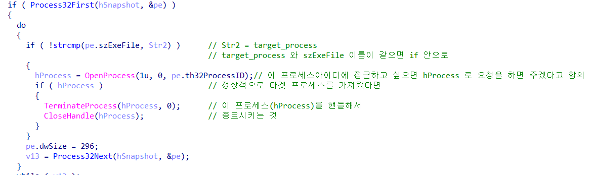

GetModuleFileNameA

GetTempPathA  
어떤 파일이든 접근할 수 있는 임시 파일이 있는 곳

★ training_hm =    
자기 자신을 숨기는 기능

```
파일 - 명령줄 바꾸기
"C:\Users\anon\AppData\Local\Temp\mal_edu\malicious_sample.exe"" "C:\Users\anon\Desktop\kisia_samples\4_ida_training\ida_training\training1_hm.exe"
```

## training2_tp.exe

CreateToolhelp32Snapshot =   
이 함수를 실행하는 순간   
작업관리자의 프로세스 리스트들 스냅샷을 찍어   
어딘가에 저장하는 함수

프로세스의 리스트가 어디에 있다는 건   
그곳에 접근하기 위해서는   
핸들이라는 게 있어야 한다는 것

Process32First(hSnapshot) : 시스템 스냅샷 발생한 첫 번째 프로세스에 대한 정보를 검색   
Process32Next(hSnapshot) : 시스템 스냅샷 기록된 다음 프로세스에 대한 정보를 검색    
ProcessEntry32 : 스냅샷 수행되었을 때 시스템 주소 공간에 있는 프로세스 목록의 항목을 설명   
    - th32ProcessID : 각 프로세스만의 고유 ID   
    - szExeFile : 프로세스에 대한 실행 파일의 이름
hSnapshot : 핸들   
API

Process32Next <- 접근하는 핸들
Process32Next(hSapshot, &pe)
&pe : 구조체 들어갈 자리(th32ProcessID,szExeFile 등)

strcmp



training2_tp.exe 만 실행시키면 notepad가 종료되는 이유는   
코드에 따라서 일치하지 않으면 notepad만 종료시키는 거고   
인자가 하나 더 있다면?    
`training2_tp.exe calc.exe` 라고 한다면

strcmp 코드 타이밍에 notepad를 키면 노트패드가 꺼질까??☆   
노트패드는 죽지 않는다...

처음시점에서 시작해서 다시 run을 하면 notepad 프로세스는 죽는다

### 보안 프로그램을 죽이기 위한 악성코드

## 3
### 악성코드가 레지스트리에 등록하여 자동으로 실행되도록 하는 악성코드 