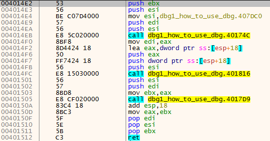
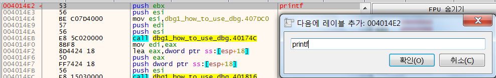
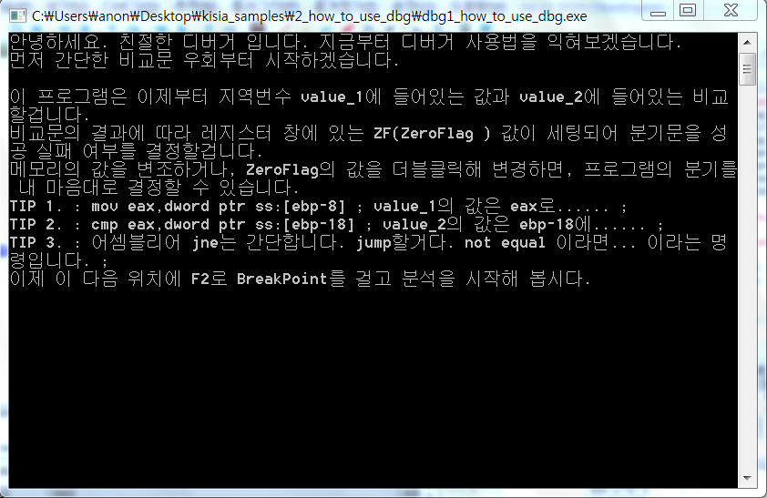
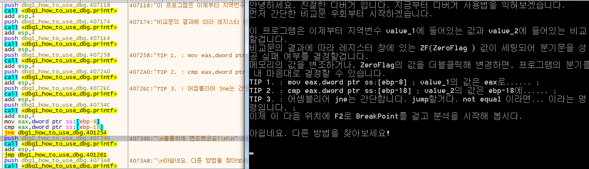
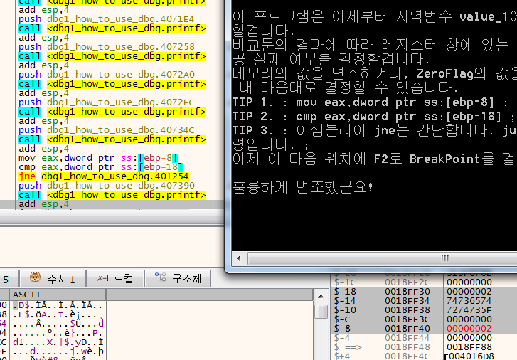
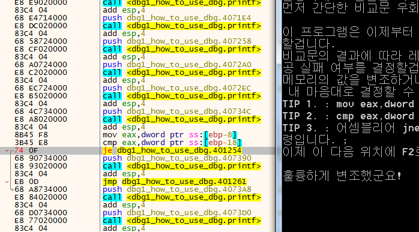
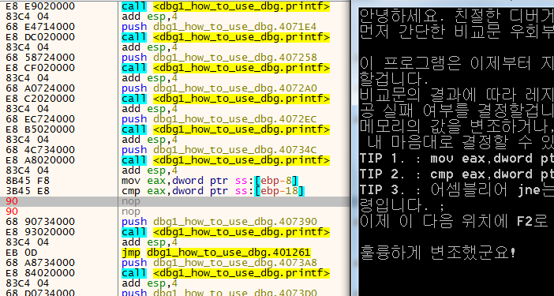
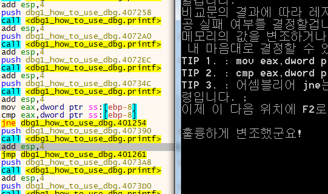

# dbg1_how_to_use_dbg
x32dbg 프로그램 실행   
dbg1_how_to_use_dbg 열기   

F9 눌러서 실행      
다음을 찾기 - 현재 구역 - 문자열 참조   
"안녕하세요 ~~ " 더블클릭해서 이동   

00401172 클릭 후    
F2 눌러서 Break Point 설정   
빨간색 확인   

F7, F8을 이용해서 한 줄씩 실행

call 4014E2 클릭 후   
Enter 눌러서   
4014E2 기능 확인   
    
확인해보니 출력하는 기능을 가졌음

Shift + ; 눌러서   
printf로 별명 설정   

쭉 F8 눌러서 계속 출력하면서    
흐름 및 결과 확인   
   

훌륭하게 변조했군요! 라는 문구를 통과하는 것을 확인   
이 문구를 출력해야 성공.

## 해결방법
### memory
ebp 고정   
ebp-8 = 00000001   
ebp-18 = 00000002   
jne -> 같지 않으면 점프를 함.   

1과 2는 같지 않기 때문에 점프를 하니까   
ebp-8 과 ebp-18 메모리를 같게 만든다.   

->   
ebp-8 = 0000000<U>**2**</U>   
ebp-18 = 00000002   

### jump not equal
jne = jump not equal   
같지 않으면 점프를 한다. -> 같으면 점프를 한다.   
1와 2는 같지 않기에 점프를 하지 않음.   

->   
jne -> je   

### nop
jne ~~~ -> nop   
점프 구문 자체를 nop으로 없애버림   
제어문이 없어졌기 때문에 바로 원하는 구문 print   

->   
nop   

### ebp-숫자
mov ~ [ebp-8]   
cmp ~ [ebp-18]   
ebp의 주소를 -8과 -18 기준으로 비교하는 중임   
cmp 비교 자체를 같은 주소를 비교하게 만들어버림

->   
mov ~ [ebp-8]   
cmp ~ [ebp-8]   
