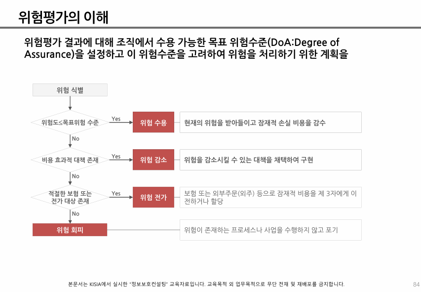

개인정보 안전성 확보조치 기준 ☆
7조 암호화
1. 주민등록번호 
2. 여권번호 
3. 운전면허번호 
4. 외국인등록번호 
5. 신용카드번호 
6. 계좌번호 
7. 생체인식정보 


## 위험평가의 이해
위험평가 방법은 크게 4가지로 나누어져 있다
☆
```
                 평가방법            장/단점
베이스라인       
비정형 접근법
상제위험 분석
복합 접근법

복합 접근법을 제일 많이 사용
```



```
위험평가
자산중요도(C + I + A = 3~9)
취약성 (하 중 상 = 1~3)
위협 = 발생가능성 (하 중 상 = 1~3)

1
위험평가 = 자산중요도 + 취약성 + 발생가능성 = 5~15
            (3~9)   +  (1~3) + (1~3)     = 5~15

ex) *고객관리 CRM = 9 + 3 + 3 = 15점

2
위험평가 = 자산중요도 + 취약성 * 발생가능성 = 4~18
             (3~9)  +  (1~3) * (1~3)     = 4~18

3
위험평가 = 자산중요도 + 2 * 취약성 = 5~15
             (3~9)  +  2 * (1~3) = 5~15
4
위험평가 = 자산중요도 + 취약성 * 발생가능성 + 법률가중치 = 4~22
             (3~9)  +  (1~3) * (1~3)     +   (0~5)   = 4~22
```x