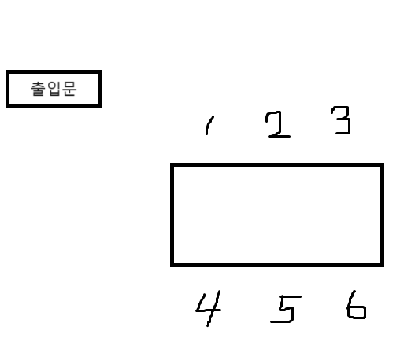

김지숙 이사님

## 회사와 약속

## 센스와 싹수가 순식간에 엇갈리는 순간
인사 잘하는 사람 싫어하는 사람은 없다

신입사원의 입사 초기   
순간의 말로 행동이 자칫 회사 생활 내내 꼬리표처럼 따라 붙을 수 있다.

하나를 보면 열을 안다는 말, 그런 평가 대부분은 '인사'로 좌우 된다는 무서운 사실 한 가지만 기억하면 된다.

밝게 웃으며 먼저 인사하는 신입사원을 싫어하는 상사나 동료는 없다.

### 가벼운 목례

</br>

## 자율 복장
### TPO
Time, Place, Occasion

옷을 입을 떄는 시간, 장소, 경우에 따라 착용하는 것이 중요

신입사원의 복장은 첫인상과 초기 이미지 형성에 중요한 작용   
복장 규정이 캐주얼이라도 일정기간 점잖은 복장으로   
신입사원으로서의 기본 자세를 갖췄다는 느낌을 주도록 하는 것 추천

</br>

## 외모 관리? 몸매 관리?

일을 시키면 결과물은 좋지만, 다음 날 힘들다며 출근을 하지 못하는 직원

vs

일을 성실하게, 중간 정도의 결과물을 내지만, 맡겨 놓은 일을 꾸준히 수행하는 직원

### 무엇보다 중요한 것은 건강 관리

</br>

## 상대를 배려하고 높이는 호칭
- 신입 사원의 경우 동기를 제외하고는 대부분 선배나 상사
- 직급이 없어도 자신보다 회사 생활을 오래한 사람에게는 <U>"선배님"</U>
- 나보다 나이가 어린 선배일 경우 <U>'OO선배, 높다면 'OO선배님'</U>
- 직급이 있는 상사에게는 <U>'과장님', '부장님'</U>
- 직급을부를 때도 성과 직급을 함께 부르는 것이 좋다
- 회사에서는 언니, 오빠는 없다. 선배면 선배고 후배면 후배입니다

</br>

## 존경어, 겸양어, 압존법

팀장님, 커피 나오셨습니다?
```
1. 부장님, 이것은 김과장이 드리는 보고서입니다.
2. 부장님, 이것은 김과장님이 드리는 보고서입니다.
3. 부장님, 이것은 김과장님께서 드리시는 보고서입니다.   
    - 1, 2번이 정답

1. 저희 나라 vs 우리 나라
    - 우리 나라
2. 저희 회사 vs 우리 회사
    - 우리 회사

1. 사장실 vs 사장님실
    - 사장실
```

</br>

## 회의 준비
(내가 회의를 서포트 할 때)

- 사전에 진행될 회의 내용이 어떤 것인지, 무슨 이야기를 해야 하는지 미리 준비
- 회의 당일에는 적어도 1시간 or 30분 전 도착
- 회의 자료가 정상적으로 작동하지 않을 경우를 대비해서 PDF 버전 준비
- 노트북과 컴퓨터 연결 확인(중요한 회의라면, 여분의 노트북)
- 회의 자료는 기본은 흑백 자료지만, 그래프나 표가 포함된 경우에는 컬러 출력도 준비(14% 이해도 상승)
- 중요 부분은 포스트잇으로 표기, 필기하도록 여분의 포스트잇도 추가
- 음료나 차를 준비하고 기호에 맞게 준비한다면 센스 만점
- 내일 미팅에 필요한 내요을 한 번에 정리해서 질문

</br></br>

### Q1.   
회사를 방문한 손님,   
손님의 자리는 어디가 좋을까요?



A : 4,5번 자리

1. 뷰가 좋은 자리
2. 출입문이 보이는 자리

</br>

### Q2.   
전화 응대   
전화를 받을 때 :   
- 벨은 세번 울리기 전
- 내게 온 전화가 아니라면 당겨서 받는다.
- 받을 때는 OOO를 준비하라.


전화를 연결할 때 :    
- 상대방이 찾는 담당자가 부재중일 경우 부재 상황을 설명하고,   
- 상대릐 소속, 이름, 전화번호, 용건 등을 메모해서 전달한다

A : 메모장

</br>

### Q3.   
지금은 휴가 중
- 당신은 어제까지 업무로 시달리다 지친 심신을 달래기 위해 연차를 내고 휴가를 떠났다.
- 휴대폰을 꺼놓고 하루를 온전히 즐겼다. 그런데 휴대폰을 켠 순간 회사에서 걸려온 전화가 10통이 넘고, 톡과 메시지가 수두룩하다. 지금 어떤 일이 일어난 것일까?

A.
- 어제 팀장님께 보낸 파일이 잘못된 것
- 회사 컴퓨터에 비밀번호로 잠겨 있음
- 회사 업무 보고는 거의 대부분 전화, 이메일, 보고로 이루어지는 회사
- 직장에서 가장 많이 쓰는 도구 "이메일"

</br>

## 메일 작성
- 수신인을 제대로 적었는지 확인
- 보안이 필요한 상황인데, 엉뚱한 사람에게 보낸 건 아닌 지 확인
- 주소, 호칭이 틀리지 않았는지, 오탈자는 없는지, 첨부 파일은 빠지지 않았는지 확인
- 메일의 명함 "이메일 서명(footer)도 함께 넣어 회신 가능하도록
- 마지막 보낸 이를 적을 때 "배상, 올림, 드림" 중 선택

### Q4.
메일을 쓰는 중입니다. 마지막에 내 이름 옆에 OO를 씁니다.
- 윗 사람이라면 OO
- 연배와 상관없이 서로가 존중할 때 OO 

A. 올림. 드림

</br>

### Q5.
메일에서 빠른 커뮤니케이션을 위해 사용하는 약어, 무슨 뜻일까요?      
FW   
FYI   
TBD  
  
FW = Forward "전달"      
FYI = For your information "참고하세요, 전달드립니다"    
TBD = To be determined "곧 결정될 것" 

</br>

### Q6.
업무 보고 언제 어떻게 하는 게 좋은가?

지금은 8월 17일입니다.   
팀장님께서 8월30일까지 처음해보는 업무를 저에게 완료하라고 하셨어요.   
업무 보고는 언제 해야 할까요?

A.   
8월25일 중간 보고.   
8월29일 or 8월30일 최종 보고

</br>

## 업무 보고의 기술

우리 상사는 어떤 스타일인가?

### 두괄식, 미괄식, 양괄식

</br>

### Q7.
아마추어와 프로의 차이

상사가 당신에게 인삼을 캐오라고 했는데,   
도라지를 캐오면 해고, 인삼을 캐오면 당신은 아마추어   
산삼을 캐오면 뛰어난 아마추어

프로는?    
도라지와 인삼, 산삼을 캐 와서   
필요에 따라 선택할 수 있게 하면 당신이 프로

</br>

신입사원으로서 챙겨야 할 필수 2가지 정하자면   
Q6, Q7

</br>

## 회사의 용어
내또출, 만반잘부?


### Q8.   
지출결의서 :    
지출이 예상되어 비용을 사전에 승인 받기 위해 작성하는 문서

보고서 :   
업무 과정 또는 결과를 보고하는 서식

ㅍㅇㅅ :    
결재권자에게 업무를 승인해 줄 것을 요청하는 문서

A : 품의서

</br>

### Q9.
OO :    
대금을 주고 받아 거래 관계를 끝맺는 것   
돈과 관련된 용어

OO :   
업무를 위해 상사에게 보고하고 이를 승인 받는 것

A : 결제 결재

</br>

### Q10.
OOO (영어약자)   
여러 부서와 협업이 필요한 업무를 수행할 때 당장 적합한 인원을 모아 임시로 만든 팀

A : TF팀

## 각 위치 상석
엘리베이터 :   
출입문에서 가장 먼 구석 자리가 상석   
버튼 조작하는 앞자리가 막내

식당 :    
회의실과 마찬가지로 출입문에서 먼쪽 
`
자동차 :   
 
2명 = 보조석 뒤   
3명 = 보조석 뒤   
4명 = 보조석 뒤   
2명(상사운전) = 옆에

</br>

## 인간 관계를 묶는 "명함"
명함 교환은 이렇게 해보세요.

- 다른 회사에 방문했다면 지위에 관계 없이 방문한 사람이 먼저 건네는 것이 예의입니다.
- 직급이 다른 멤버가 동행한 경우라면, 직급이 높은 사람 먼저 상대편에게 건넵니다.
- 명함을 받은 후에는 명함을 받은 즉시 상대방의 이름과직급을 확인하고 다시 인사를 합니다.
- 테이블에 앉을 경우 건네 받은 명함을 테이블 오른쪽에 잘 보이도록 비치하여 자신이 상대방을 확인하고 있음을 보여줍니다.
- 인원이 많을 때는 앉은 자리대로 받은 명함을 배치하는 것이 기억하기 좋습니다.
- 상대를 기억하기 위해, 만나 장소, 상대방의 특징, 관심사에 적는 것은 좋지만, 상대방이 보는 앞에서 명함에 메모하는 것은 결례입니다.


명함 교환
- 가능하면 최근 정보를 담아야 합니다.
- 평소 충분한 수량을 준비하고, 여러 사람을 만나는 미팅에서는 여유 있게 수량을 준비합니다.
- 명함은 오염되지 않도록 명함 지갑에 넣어 항상 깨끗하게 보관하세요.
- 서열이 낮은 사람이 먼저, 상대 측이 한 명 이상이라면 직급이 높은 순서대로 명함을 주고 받습니다.
- 직급