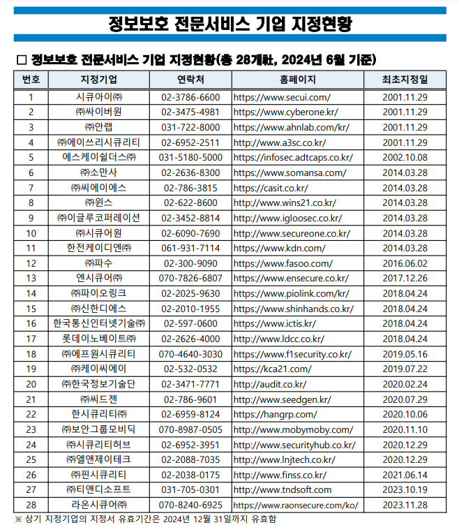

김병모   
010-3072-0812   
kbm1116@naver.com

5문제 

## 목차
- 취약점 진단 개요
- 주요정보통신 기반시설 점검의 이해
- 네트워크 장비의 보안 점검 / 실습
- 유닉스 서버 보안 점검 / 실습
- 윈도우 서버 보안 점검 / 실습
- 보안장비 보안 점검 / 실습

</br></br>

# 취약점 진단 개요
## 취약점이란?   
위협발생의 사전 조건으로 자산이 가진 취약한 속성

안전 장치의 부재   
보안상의 결정

예)   
- 서버에서 실행되는 오래된 버전의 서비스
- 제한 없는 네트워크 접근
- 침입차단 시스템의 열린 포트
- 느슨한 통제구역의 물리적 보안
- 서버와 PC에 취약한 패스워드 설정

</br></br>

## 서버에서 실행되는 오래된 버전의 서비스
- OS, 웹서비스(apache,nginx), WAS, DB(MySQL) 등
    - apache의 버전에 취약점이 발견되어 버전 업그레이드를 하면?
    - 버전이 달라져 융합이 안될 수가 있음
    - = 서비스가 제대로 동작하지 않음
- 1.잘되는 서비스 버전 업데이트를 해서 서비스 먹통 상황
- 2.보안패치를 안해서 해킹당한 상황
- 둘 중에서는 1번에 대한 질책이 더 큼
- 그래서 잘 안건드려고 함

IPS 솔루션     
탐지해서 막아줌   

IDS 솔루션    
탐지만 해서 알려줌

방화벽   
허용하냐 차단하냐만 해줌

### IPS 특징   
알려진 공격들의 패턴을 DB에 저장함   
IPS가 가지고 있는 공격 패턴과 들어온 트래픽과 비교를 함   
공격성을 띈 트래픽은 차단함   
다시 공격이 안오면 차단해제함

### UTM
IPS, IDS, 방화벽 등등   
여러 보안 솔루션을 지금까지는 개별적으로 관리했다면   
이제는 UTM으로 통합적으로 관리 함

</br></br>

## 제한 없는 네트워크 접근
- 네트워크 접근을 차단하기 위한 방화벽 정책.
- 룰셋이 있으면 가장 위에 있는 것부터 적용☆
    - 첫번째 있는 보안 정책 부터 적용
    - 제일 위에 all commit 되어 있으면...
    - 밑에 어떤 정책을 해도 다 열려있음

</br></br>

## 침입차단 시스템의 열린 포트
- 포트를 통해서 트래픽을 주고 받을 수 있음

</br></br>

## 물리적 보안
넘아감

</br></br>

## 서버와 PC에 취약한 패스워드 설정
### 인증과 인가
- ID, PW를 통해서 허가된 사용자인지 인증을 함(인증)
- 허가된 사용자에게 권한을 줌(인가)   


### 패스워드
- 비밀번호는 단방향 암호화 해야 한다
- 단방향 암호화 하면 다시 복구할 수 없도록 하는 것
- SHA
- 비밀번호 찾기를 해도 비밀번호를 안보여주고 리셋 시키는 것


</br></br>


IPS 솔루션     
탐지해서 막아줌   

IDS 솔루션    
탐지만 해서 알려줌

방화벽   
허용하냐 차단하냐만 해줌

### IPS 특징   
알려진 공격들의 패턴을 DB에 저장함   
IPS가 가지고 있는 공격 패턴과 들어온 트래픽과 비교를 함   
공격성을 띈 트래픽은 차단함   
다시 공격이 안오면 차단해제함

### UTM
IPS, IDS, 방화벽 등등   
여러 보안 솔루션을 지금까지는 개별적으로 관리했다면   
이제는 UTM으로 통합적으로 관리 함

</br></br>

## 취약점 발생 유형
### 환경 및 시설 
- 문, 창문 등의 물리적 보호 결여   
    - 도난
- 불안전한 전원 설비   
    - 정전
    - 오작동
- 재해를 입기 쉬운 입지 조건
    - 홍수
    - 지진
    - 재해
### 하드웨어
- 온ㆍ습도의 변화
    - 고장
    - 오작동
- 기억매체의 유지보수 부족
    - 중요 데이터 유실
### 소프트웨어
- 명세서의 미준비
    - 소프트웨어 장애
    - 오작동
- 부적절한 패스워드
    - 부정접속
    - Lock
    - 정보유출
- 백업의 결여
    - 중요 데이터 소실 

## 취약점 점검 분류 기준
관리적 관점 :    
기술적 관점 : 네트워크, 서버, 웹, PC 보안점검 등을 통한 취약점 점검   
물리적 관점 :   

### 기술적 관점
#### 컴퓨터/통신 관련
- 인증 매커니즘
- 접근 통제
- 감사 증적
- 시스템 패치

#### 정보보호 시스템 관련
- 방화벽
- 침입 방지 시스템 IPS
- 침입 탐지 시스템 IDS

#### 시스템 개발 관련
- 조직이 사용하는 어플리케이션 개발이   
안전하게 이루어지는지 점검
- 시큐어 코딩

## 취약점 진단 절차
기술적으로 분석하는 과정
1. 자산 조사 및 분석
2. 진단 대상 선정
3. 제약 사항 및 일정 확인
4. 진단 수행
5. 결과 분석
6. 결과 보고서 작성ㆍ보고
7. 진단 완료

### 자산 조사 및 분석
어떤 자산에 대해 수행할 것인지 선정

</br>

### 진단 대상 선정
샘플링 or 전수 조사

샘플링   
동일 역할, 동일 기종

전수 조사   
전체 시설 점검

누락되는 자산이 발생하지 않는 범위 내에서 적절한 방법 선택

</br>

### 제약 사항 및 일정 확인
취약점 점검 수행하는 시간대   

일정 분배

</br>

### ☆취약점 진단 수행 
설정 정보 수동 점검 -> 네트워크 시스템

자동화 도구 기반 점검 -> 윈도우 계열 서버

☆ 스크립트 기반 점검 -> 유닉스 계열 서버 

스크립트 기반 점검과 자동화 도구 기반 점검 중에   
어떤 걸 써서 보안활동을 해야 하냐??   
= 자동화 도구 기반 점검

해킹 당할 위험성을 찾아내고   
방어할 수 있는 방안을 빨리 수립해서 적용하는 게 중요.   
Tool 이용하여 점검

## 수동 진단 
주통기반 가이드

## 자동 진단
Nessus

해외보다 국내 취약점 진단 프로그램이 안좋음

</br></br>

# 주요정보통신 기반시설 점검의 이해

## 정보통신기반 보호법
주요정보통신 기반시설 점검은 정보통신기반보호법 제9조(취약점의 분석ㆍ평가) 및 시행령 제17조(취약점 분석ㆍ평가의 시기)를 준용하고 있음.

#### 제1조(목적) 이 법은 전자적 침해행위에 대비하여 주요정보통신기반시설의 보호에 관한 대책을 수립ㆍ시행함으로써 동 시설을 안정적으로 운용하도록 하여 국가의 안전과 국민생활의 안정을 보장하는 것을 목적으로 한다.

https://www.law.go.kr/%EB%B2%95%EB%A0%B9/%EC%A0%95%EB%B3%B4%ED%86%B5%EC%8B%A0%EA%B8%B0%EB%B0%98%EB%B3%B4%ED%98%B8%EB%B2%95

### 제8조(주요정보통신기반시설의 지정 등)
①중앙행정기관의 장은 소관분여의 정보통신기반시설중 다음 각호의 사항을 고려하여 전자적 침해행위로부터의 보호가 필요하다고 인정되는 정보통신기반시설을 주요정보통신기반시설로 지정할 수 있다.
1. 해당 정보통신기반시설을 관리하는 기관이 수행하는 업무의 국가사회적 중요성
2. 제1호에 따른 기관이 수행하는 업무의 정보통신기반시설에 대한 의존도
3. 다른 정보통신기반시설과의 상호연계성
4. 침해사고가 발생할 경우 국가안전보장과 경제사회에 미치는 피해규모 및 범위
5. 침해사고의 발생가능성 또는 그 복구의 용이성

②   
③   
④   
⑤   
⑥   
⑦

대통령령으로 ~~   
시행령보면 나옴

### 제9조(취약점의 분석ㆍ평가) 
①관리기관의 장은 대통령령으로 정하는 바에 따라 정기적으로 소관 주요정보통신기반시설의 취약점을 분석ㆍ평가하여야 한다.   
② 중앙행정기관의 장은 다음 각 호의 어느 하나에 해당하는 경우 해당 관리기관의 장에게 주요정보통신기반시설의 취약점을 분석ㆍ평가하도록 명령할 수 있다.
1. 새로운 형태의 전자적 침해행위로부터 주요정보통신기반시설을 보호하기 위하여 필요한 경우
2. 주요정보통신기반시설에 중대한 변화가 발생하여 별도의 취약점 분석ㆍ평가가 필요한 경우

③관리기관의 장은 제1항 또는 제2항에 따라 취약점을 분석ㆍ평가하고자 하는 경우에는 대통령령이 정하는 바에 따라 취약점을 분석ㆍ평가하는 전담반을 구성하여야 한다.    
④관리기관의 장은 제1항 또는 제2항에 따라 취약점을 분석ㆍ평가하고자 하는 경우에는 다음 각호의 1에 해당하는 기관으로 하여금 소관 주요정보통신기반시설의 취약점을 분석ㆍ평가하게 할 수 있다. 다만, 이 경우 제3항에 따른 전담반을 구성하지 아니할 수 있다. 
- 주요시설 지정했고 매년 취약점 진단을 해야 하느데 누가 하느냐?
- 자체 전담반을 운영할 수 있음.
- 아니면 밑 4가지 조건에 따라 전담반 구성.    
4개 외우면 됨.
1. 「정보통신망 이용촉진 및 정보보호 등에 관한 법률」 제52조의 규정에 의한 한국인터넷진흥원(이하 “인터넷진흥원”이라 한다)
2. 제16조의 규정에 의한 정보공유ㆍ분석센터(대통령령이 정하는 기준을 충족하는 정보공유ㆍ분석센터에 한한다)
3. 「정보보호산업의 진흥에 관한 법률」 제23조에 따라 지정된 정보보호 전문서비스 기업
4. 「정부출연연구기관 등의 설립ㆍ운영 및 육성에 관한 법률」 제8조의 규정에 의한 한국전자통신연구원

⑤과학기술정보통신부장관은 관계중앙행정기관의 장 및 국가정보원장과 협의하여 제1항 및 제2항에 따른 취약점 분석ㆍ평가에 관한 기준을 정하고 이를 관계중앙행정기관의 장에게 통보하여야 한다.   
⑥주요정보통신기반시설의 취약점 분석ㆍ평가의 방법 및 절차 등에 관하여 필요한 사항은 대통령령으로 정한다

## 정보통신기반 보호법 시행령
### 제17조

### 과학기술정보통신부고시 제2021-103호

안했을 때 과태료는 얼마인가?   
3천만원 이하....

3천만원 내면 그만아니야?   
계속 괴롭힘.   
감사, 제재가 계속 들어옴

## 주요정보통신기반시설 취약점 분석 평가 기준
고시로 나와있음.

취약점 분석 평가 전담분 구성 기준      
취약점 분석 평가 기준 '상' 항목   
취약점 분석 평가 기준 '중,하' 항목   
...


## 정보보호산업의 진흥에 관한 법률 (약칭 : 정보보호산업법)
### 제23조(정보보호 전문서비스 기업의 지정ㆍ관리)
전문 서비스 기업으로 지정을 받아야 할 수 있음.

## 정보보호 전문서비스 기업 지정 등에 관한 고시


https://www.ksecurity.or.kr/kisis/subIndex/469.do


## 취약점 분석 및 평가 수행
1.취약점 분석ㆍ평가 개요- 취약점 분석ㆍ평가란, 악성코드 유포, 해킹 등 사이버 위협에 대한 주요 정보통신기반시설의 취약점을 종합적으로 분석 및 평가ㆍ개선하는 일 년과 정을 말함
- 주요 정보통신 기반 시설 관리기관은 주요 정보통신 기반 시설의 안정적 운영을 위하여 사이버보안 점검 항목과 세항목별 세부 점검 항목을 도출하여 취약점분석을 실시
- 취약점분석 결과 발견된 취약점에 대해 위험등급 부여, 개선 방향을 수립하는 등의 유기적인 평가 수행

2.취약점 분석ㆍ평가 수행 주체 및 주기   
□ 수행 주체
- 취약점 분석ㆍ평가는 주요 정보 통신 기반 시설의 관리기관이 직접 수행하거나 외부기관데 위탁하여 실시할 수 있음
- 관리기관이 직접 수행할 경우, ‘정보통신기반 보호법 시행령[별표1]정보통신기반보호법시행령[별표1]’에 따라 자체전담반 구성
- 관리기관이 외부 기관에 위탁할 경우, 정보통신 기반 보호법 제9조 제3항에 따른 전문 기관   
(한국인터넷진흥원, 정보 공유ㆍ분석센터, 한국전자통신연구원, 정보보호전문 서비스기업 등)에 위탁   
※ 정보보호 전문 서비스기업: 정보보호 산업의 진흥에 관한 법률 제23조에 따라 과학기술정보통신부 장관 이지 정한 기업- (2024년 현재, 28개 기업)

누가 진단할 수 있느냐.   
```
★ 4가지 외워야 함
한국인터넷진흥원
정보 공유ㆍ분석센터
한국전자통신연구원
정보보호전문 서비스기업
```


## 주요정보통신기반시설 기술적 취약점 분석 평가 상세 가이드
이 체크리스트를 통해서 진단을 하는 것.

자주 봐야 한다...

</br></br></br>

# 주통기반 취약점 분석 가이드

## 네트워크 장비
p.369

1. 계정 관리
2. 접근 관리
3. 패치 관리
4. 로그 관리
5. 기능 관리


## 1.1 패스워드 설정
p.371

초기 비밀번호는 인터넷에 공개되어 있기 때문에   
초기 비밀번호를 변경하지 않았다면 누구나 접근이 가능함 

양호 : 기본 패스워드를 변경한 경우   
취약 : 기본 패스워드를 변경하지 않거나 패스워드를 설정하지 않은 경우

```
> en   
# show running-config
```
1. enable 패스워드 설정 확인
2. VTY, 콘솔, 보조(AUX) 포트의 로그인 인증 방식 및 패스워드 설정 확인
- 콘솔 : 하드웨어적 연결할 수 있는 포트
- 보조(AUX) : 보조 포트. 예전 로뎀을 통해서 원격으로 접속할 때 사용하는데 지금은 거의 사용을 안함
    - 거의 사용을 안하기 때문에 disable 되어있어야 함

login : 라인 패스워드 인증  
login local : 로컬 사용자 인증
login authentication : AAA 인증   
no login : 인증 없이 사용자 모드(User EXEC mode) 접근 (잘못된 것.)

## 해결방안

### Step 1) enable 패스워드 설정
```
Router(config)# enable secret <패스워드>

Router(config)# enable password <패스워드>
```

###  Step 2) 가상 터미널(VTY) 패스워드 설정
```
Router# config terminal
Router(config)# line vty ?
<0X4> First Line number
Router(config)# line vty 0 4    5개에 대해서는 로그인 허용?? 먼말
Router(config-line)# login
Router(config-line)# password <패스워드>
```

###  Step 3) 콘솔 패스워드 설정
```
Router# config terminal
Router(config)# line console ?
<0X0> First Line number
Router(config)# line console 0
Router(config-line)# login
Router(config-line)# password <패스워드>
```

###  Step 4) 보조(AUX) 포트 패스워드 설정
```
Router# config terminal
Router(config)# line aux ?
<0X0> First Line number
Router(config)# line aux 0
Router(config-line)# login
Router(config-line)# password <패스워드>
※ AUX 포트는 일반적으로 무단 접근을 방지하기 위해 N-17 항목(불필요한 보조 입·출력 포트 사용 금지)과 같이 비활성화 설정
```

## 1.2 패스워드 복잡성 설정
네트워크 장비에 <U>기관 정책에 맞는</U> 계정 패스워드 복잡성 정책이 적용되어 있는지 점검   
※ 패스워드 복잡성: 계정 패스워드 설정 시 영문(대문자, 소문자), 숫자, 특수문자가 혼합된 패스워드로 설정하는 것

config는 대부분 패스워드가 암호화 되어 있음   
그래서 config만으로는 확인이 불가   
실제 현장에서는 인터뷰를 함   
패스워드를 어떤 식으로 설정하고 있나요? 등

그냥 양호로 체크하고 인터뷰를 통해 확인해야 함. 

## 1.3 암호화 된 패스워드 사용
1. enable secret 사용 확인
2. username secret 사용 확인
3. Password-Encryption 서비스 동작 확인

enable secret 은 시스코 내 계정이 하나일 때 enable secret 사용 함.

enable password는 시스코 자체 암호화 알고리즘으로 암호화를 시킴.   
근데 이게 crack 되었기 때문에   
enable password는 사용하지 않고   
enable secret 사용을 권고하고 있음.
```
# service password-encryption
```
이게 설정이 안되어 있으면 패스워드가 그대로 보임

enable secret 5 $1$mERr$9WCswBwUv6WeC6M8kNSs8   
5. 해쉬함수로 되어 있음. 단방향 암호화.


enable password 7 0822455D0A1648121C0A0E082F   
7. 시스코가 자체적으로 적용된 암호화 알고리즘을 적용

딱 봐도 secret 암호화가 password 보단 강력한 암호화 알고리즘으로 이루어져 있다고 볼 수 있음.

## 2.1 VTY 접근(ACL) 설정
원격 터미널(VTY) 통해 네트워크 장비 접근 시 지정된 IP에서만 접근이 가능 하도록 설정되어 있는지 점검

화이트리스트. 가장 효과적인 보안 방법
 
지정된 IP 만 네트워크 장비에 접근하도록 설정되어 있지 않을 경우, 비인가자가 터미널 접근 시도 공격(무작위 대입 공격, 사전 대입 공격 등)을 시도 하여 관리자 계정 패스워드 획득 후 네트워크 장비에 접근하여 장비 설정(기능, ACL정책) 변경 및 삭제 등의 행위를 통해 네트워크 장비를 경유하는 데이터의 유출 및 가용성 저하 등을 발생 시킬 수 있는 위험이 존재함

양호 : 가상 터미널(VTY) 접근을 제한하는 ACL을 설정한 경우   
취약 : 가상 터미널(VTY) 접근을 제한하는 ACL을 설정하지 않은 경우

### Cisco IOS
```
VTY 접근 허용 IP 설정  
Router# config terminal
Router(config)# access-list <ACL 번호> permit <IP 주소> 
Router(config)# access-list <ACL 번호> deny any log 
Router(config)# line vty ?
<0X4> First Line number
Router(config)# line vty 0 4
Router(config)# access-class <ACL 번호> in
```
line vty 0 4 <-- 기본적으로 5개를 허용하고 있음

라우터를 기준으로 ACL 번호 허용된 것만 접속 허용

## 2.2 Session Timeout 설정
Session Timeout 설정 유무를 점검하여 터미널 접속 후 일정 시간(Session Timeout 지정 시간)이 지난 뒤 터미널 세션이 자동으로 종료되어 관리자의 부재(터미널 작업 중 자리 비움, 작업 완료 후 터미널 접속을 종료하지 않음) 시 발생 가능한 비인가자의 터미널 접근 통제가 되는지 확인하기 위함

네트워크 장비에만 있는 게 아니다.

Session Timeout 설정 (5분 이하 권고)
```
Cisco IOS
Router# show running-config
각 Line Access의 exec-timeout 설정 확인
```
```
1. Console
Router# config terminal
Router(config)# line con 0
Router(config-line)# exec-timeout 5 0
2. VTY
Router# config terminal
Router(config)# line vty 0 4
Router(config-line)# exec-timeout 5 0
3. AUX
Router# config terminal
Router(config)# line aux 0
Router(config-line)# exec-timeout 5 0
```

★모든 구간에서 다 5분으로 되어 있어야 함.

다른 한 곳만 5분 위로 올라가 있으면 취약.

</br>

고객사에 10분으로 되어 있으면 취약인가??   
-> 컨설턴트틑 보수적으로 접근해야 한다.   

기준이 무너지면 취약으로 줄 부분이 하나도 없음.


## 3.1 최신 보안 패치 및 벤더 권고사항 적용

라우터라는 장비는 밖에서 직접 접근할 수 있는 장비가 아니다.   
솔루션으로 보호되고 있는 장비임.

라우터가 해킹당할 위험성은 없다.   
= 보안설정을 안해도 될까?   
-> 내부에서 접근하는 경우도 많기 때문에 보안설정 필요

Cisco IOS
```
Router# show version
버전정보 확인
```

Backbone 장비에 대해서는 유지보수를 함   
Backbone 아니면 거의 유지보수를 안 함

Cisco    
https://software.cisco.com   
https://tools.cisco.com/security/center   
최신인지 확인하면 됨.


## 5.1 SNMP 서비스 확인
SNMP(Simple Network Management Protocol):    
TCP/IP 기반 네트워크상의 각 호스트에서 정기적으로 여러 정보를 자동으로 수집하여 네트워크 관리를 하기 위한 프로토콜을 의미하며 v1, v2, v3 세 가지 버전이 존재하는데 v2까지도 요청, 응답 패킷이 평문으로 전송되기 때문에 스니핑이 가능하지만 v3 이상부터는 HMAC-MD5 또는 HMAC-SHA 알고리즘 기반의 인증을 제공함

NMS 시스템 : 네트워크 관리해주는 시스템    
NMS 시스템에 없었을 땐 어떻게 관리 했냐?   
-> ping 을 쏴서 확인했음.   
ping 쏴서 답 없으면 장비 죽었네?

요즘은 ICMP를 다 차단해놓음.   
ICMP로 너무 많은 정보가 확인이 가능해서

</br>


양호 : 사용하지 않는 SNMP 서비스를 비활성화한 경우   
취약 : 사용하지 않는 SNMP 서비스를 비활성화하지 않은 경우   
보안 수준이 높은 SNMPv3 사용을 권고

☆SNMP   
community 이름을 디폴트로 쓰고 있고    
장비에 접근할 수 있는 IP를 지정하지 않으면   
취약

community 이름을 디폴트로 쓰고 있지 않고,   
장비에 접근할 수 있는 IP를 지정했다면   
양호

보안 설정이 제대로 되어 있으면 양호로 봐도 무방.

## 5.2 SNMP community string 복잡성 설정
SNMP 서비스 사용 시 Community String을 기본 설정(public, private)으로 사용하고 있는지 점검

SNMP community string : 비밀번호 역할

양호 : SNMP 서비스를 비활성화하거나 SNMP 커뮤니티 스트링을 유추하기 어렵게 설정한 경우   
취약 : SNMP 커뮤니티 스트링을 디폴트 또는 유추하기 쉽게 설정한 경우

### Step 1) Community String 문자열 변경
```
Router# config terminal
Router(config)# snmp-server Community <커뮤니티>
```

SNMP가 UDP 161번을 사용.


## 5.3 SNMP ACL 설정
SNMP 서비스 사용 시 네트워크 장비 ACL(Access list)을 설정하여 SNMP 접속 대상 호스트를 지정하여 접근이 가능한 IP를 제한하였는지 점검

Cisco IOS
```
Router(config)# access-list <ACL 번호> permit <IP 주소>
Router(config)# access-list <ACL 번호> deny any log 
Router(config)# snmp-server community <커뮤니티 스트링> RO <ACL 번호>
```
RO <- 권한 (Read Only)   
RO 설정이 되어 있는지 봐야 함.

</br></br>


★SNMP에 대해서 지켜야 할 5가지
```
불필요할 경우는 disable
커뮤니티 이름은 삭제
유추하기 어려운 커뮤니티 이름을 생성
SNMP에 대해서 접근할 수 있는 IP에 대해서 지정을 한다
SNMP 커뮤니티에 대해서 권한 설정을 할 때 write 권한을 주지 않는다.
```
read 권한만 줘야 함.

write 권한을 줄 때도 있음    
교육청 같은 곳에는 라우터가 1000개가 넘음   
이런 장비에 정책을 일괄적으로 지정하고 싶을 때   
SNMP write 권한이 있으면 1000대에 한 번에 적용할 수 있음   

write 권한 없으면 1000대 하나씩 1000번 다 설정을 해줘야 함

위험성   
장비에 어떤 action을 취할 수 있기 때문에 write 권한을 주지 않는다가 정석


## 5.4 SNMP 커뮤니티 권한 설정
SNMP 커뮤니티에 반드시 필요하지 않은 쓰기 권한을 허용하는지 점검

SNMP 커뮤니티 권한이 불필요하게 RW로 설정되어 있으면, 공격자가 Community String 추측 공격을 통해 Community String을 탈취했을 시 SNMP를 이용하여 네트워크 설정 정보를 변경하여 내부망 침투가 가능해짐

write 권한이 있을 때 write 권한을 가지고 라우터를 리부팅 시킬 수 있음.   
interface 다운 시킬 수 있고, 다운로드도 가능. 아무튼 위험

## 5.5 TFTP 서비스 차단
TFTP(Trivial File Transfer Protocol): 임의의 시스템이 원격 시스템으로부터 부팅   
(Booting)코드를 다운로드하는데 사용하는 프로토콜로 UDP 기반으로 포트는 69번을    
사용함. FTP와 같은 기능을 하지만 FTP보다 구현하기 쉽고 사용하기 편하지만, 인증절   
차 없이 사용할 수 있어 보안에 취약하고 데이터 전송 과정에서 데이터가 손실될 수    
있는 등 불안정한 단점이 있음 


nmap 을 사용해서 port 오픈되어 있는지 확인 가능   
1. 열려있는 port 번호 확인
2. 명령어 쳐서 확인

## 5.6 Spoofing 방지 필터링 적용 또는 보안장비 사용
Spoofing = 속인다   
IP정보를 속이면 IP Spoofing   
arp 정보를 속이면 arp Spoofing   
dns 정보를 속이면 dns Spoofing   

사설 네트워크, 루프백 등 특수 용도로 배정하여 라우팅이 불가능한 IP 주소를    
스푸핑 방지 필터링(Anti-Spoofing Filtering)을 적용하여 차단하는지 점검

네트워크 경계에서 소스 IP 주소가 <U>명백히 위조된</U> 트래픽을 차단하여    
IP 스푸핑 기반 DoS 공격으로부터 인프라를 보호
</br>
</br>

명백히 위조된 =   
source IP를 랜덤하게 바꿔서 보내는 경우   
source IP 와 destination IP 가 같은 경우

사설IP는 NAT를 통해 공인IP로 변경되어 인터넷망으로 들어감

사설 IP =    
a클래스. 10.0.0.0/8   
b클래스. 172.16.0.0/12   
c클래스. 192.168.0.0/16   
공격하는 source IP가 사설IP로 기재되어 있다면?   
명백히 위조된 것이라고 확인 가능   
사설IP는 souceIP로 될 수 없기 때문에

점검할 때 어느 위치에 있는 라우터에 따라서   

명백히 위조된 IP 차단해야 할 IP 종류
a클래스. 10.0.0.0/8   
b클래스. 172.16.0.0/12   
c클래스. 192.168.0.0/16   

★시험   
a클래스. 10.0.0.0/( )   
b클래스. 172.16.0.0/( )   
c클래스. 192.168.0.0/( )   
8. 12. 16 적으면 정답

## 5.7 DDoS 공격 방어 설정 또는 DDoS 장비 사용
라우터에서는 DDoS 공격 방어를 하지 않음.

체크할 때 해당없음으로 체크하면 됨.

DDoS 공격에 대해서   
ACL   
Rate Limiting   
TCP Intercept

## 5.8 사용하지 않는 인터페이스의 Shutdown 설정

Cisco IOS
```
Router# show interface
비활성화한 인터페이스는 Administratively down으로 표시
```

조치방법
```
Router# config terminal
Router(config)# interface <인터페이스>
Router(config-line)# shutdown
```

## 1.4 사용자·명령어별 권한 수준 설정
장비별 점검방법 예시

Cisco IOS
```
Router# show privilege
사용자·명령어별 레벨 설정 확인
```

장비별 조치방법 예시

Cisco IOS

시스코 IOS에서는 0에서 15까지 16개의 서로 다른 권한 수준을 규정하고 있으며,    
레벨 1과 레벨 15는 기본적으로 정의되어 있음   
사용자 EXEC 모드는 레벨 1에서 실행되며 privileged EXEC 모드는    
레벨 15에서 실행되고, IOS 각 명령어는 레벨 1이나 레벨 15 중    
어느 하나의 레벨이 사전에 기본적으로 지정되어 있음   
레벨 1에서는 라우터의 설정 조회만 가능하고 레벨 15에서는 라우터의 전체 설정을   
조회하고 변경할 수 있으므로 중요한 명령어의 권한 수준을 높여서   
제한하는 것이 보안상 안전함


## 2.3 VTY 접속 시 안전한 프로토콜 사용
네트워크 장비 정책에 암호화 프로토콜(ssh)을 이용한 터미널 접근만 허용하도록   
설정되어 있는지 점검

telnet은 사용 금기.   
ssh만 사용   
-> 암호화 때문.   
telnet은 암호화 되지 않기 때문에 주고받는 내용이 다 보임.   
ssh는 암호화 되기 때문에 안보임


## 2.4 불필요한 보조 입·출력 포트 사용 금지
사용하지 않는 보조(AUX) 포트 및 콘솔 점검    
장비 관리나 운용에 쓰이지 않는 포트 및 인터페이스가 비활성화 되어 있는지 점검

양호 : 불필요한 포트 및 인터페이스 사용을 제한한 경우   
취약 : 불필요한 포트 및 인터페이스 사용을 제한하지 않은 경우


조치 방법
```
1. AUX 포트 접속 차단
Router# config terminal
Router(config)# line aux 0
Router(config-line)# no password (어떤 사용자도 접속 금지)
Router(config-line)# transport input none (어떤 입력도 받지 않음)
Router(config-line)# no exec (어떤 명령도 실행 안 됨)
Router(config-line)# exec-timeout 0 1 (1 초 지나면 자동 타임아웃)
```

## 2.5 로그온 시 경고 메시지 설정
로그인 시 첫 메시지 = 배너

이건 보안이랑 다른 거 같은데 왜 포함이 되었는가?   
해커가 시스템에 접근을 해서 해킹을 했고    
해커를 추적을 해서 잡았음.   
해커가 한 말이.   
문구 메시지가 welcome이라고 적혀있더라. 그래서 환영하길래 좀 놀다 왔다   
무죄
```
Router(config)# banner motd #
```


## 4.1 원격 로그서버 사용
네트워크 장비의 로그를 별도의 원격 로그 서버에 보관하도록 설정하였는지를 점검

양호 : 별도의 로그 서버를 통해 로그를 관리하는 경우   
취약 : 별도의 로그 서버가 없는 경우

```
Router(config)# logging 192.168.3.1 (syslog 서버)
```
```
Router# config terminal
Router(config)# logging on (log 를 console 이외도 전달)
Router(config)# logging trap informational (severity level 설정)
Router(config)# logging 192.168.3.1 (syslog 서버)
Router(config)# logging facility local6 (syslog facility 설정)
Router(config)# logging source-interface serial 0 (syslog interface)
```

## 4.2 로깅 버퍼 크기 설정
일반적으로 16Kbyte에서 32Kbyte의 크기가 적당

## 4.3 정책에 따른 로깅 설정
정책에 따른 로깅 설정이 이루어지고 있는지 점검

## 4.4 NTP 서버 연동
시간 동기화 할 수 있는 NTP 서버가 있는지 확인하는 것
```
Router# config terminal
Router(config)# ntp server <NTP 서버 IP>
```

## 4.5 timestamp 로그 설정
네트워크 장비 설정 중 timestamp를 설정하여 로그 시간을 기록할 수 있게 하였는지 점검
```
Router(config)# service timestamps log datetime msec show-timezone 
```

## 5.9 TCP Keepalive 서비스 설정
네트워크 장비의 Telnet 등 TCP 연결이 원격 호스트 측에 예상치 못한 장애로   
비정상 종료된 경우 네트워크 장비가 해당 연결을 지속하지 않고 해제하도록    
TCP Keepalive 서비스를 설정

TCP keepalive: TCP 연결이 유효한지 확인하기 위해 유휴 연결에 주기적으로    
응답을 요구하는 패킷을 전송하고 원격 호스트가 일정시간 동안 응답이 없으면 연결을 끊음

PC가 접속을 했는데 어떤 이유로 리부팅이 되버림.   
근데 라우터는 세션이 유지된 것으로 착각   
세션 탈취 가능성이 있음

라우터가 지속적으로 모니터링을 하는 것.

```
Router(config) service tcp-keepalives-in

Router(config) service tcp-keepalives-out
```

## 5.10 Finger 서비스 차단
Finger(사용자 정보 확인 서비스): finger 서비스는 접속된 시스템에 등록된   
사용자뿐만 아니라 네트워크를 통하여 연결된 다른 시스템에 등록된 사용자들에   
대한 자세한 정보를 보여줌

```
Router# show running-config
Finger 서비스 설정 확인, 12.1(5) 및 12.1(5)T 이상은 기본적으로 비활성화
```

## 5.11 웹 서비스 차단
장비에 접근할 수 있는 게 telnet도 있고 ssh도 있고 웹 서비스도 접근이 가능함

웹서비스는 왜 차단하라고 할까?   
암호화를 하지 않기 때문에(telnet 이유와 동일)

## 5.12 TCP/UDP Small 서비스 차단
TCP/UDP Small 서비스는 IOS 11.3 이상에서는 기본적으로 서비스가 제거된    
상태이므로 Small 서버들이 Default로 Disable되어 있지만    
낮은 버전의 경우는 직접 설정해 주어야 함

```
Router# show running-config
no service tcp-small-servers 및 no service tcp-small-servers 설정 확인
```

## 5.13 Bootp 서비스 차단
Bootp 서비스: 네트워크를 이용하여 사용자가 OS를 로드할 수 있게 하고 자동으로   
IP주소를 받게 하는 프로토콜임

## 5.14 CDP 서비스 차단
링크가 연결되어 있으면 한쪽에서 연결된 시스코의 정보를 볼 수 있음   
시스코 라우터끼리 정보 확인이 가능한 것을 차단

## 5.15 Directed-broadcast 차단
Smurf 공격: 인터넷 프로토콜(IP) 브로드캐스트나 기타 인터넷 운용 측면을   
이용하여 인터넷망을 공격하는 행위로 브로드캐스트에 대한 응답받을 IP 주소를   
변조하여 해당 IP 주소 호스트에 DoS 공격을 감행하는 공격 기법

서브네팅된 제일 첫번째 아이피 대역을 뭐라고 하지?
c클래스 0부터 127fh qnsflfmf goTsmsep
앞에 있는 0을 어떤 IP로 하나?
-> 네트워크IP

제일 마지막에 있는 127번은 뭐라고 하지?
-> broadcast IP

네트워크IP와 broadcast IP는 울타리 역할.   

IP범위를 지정하는 것임.

broadcast IP 역할은?   
어떤 요청이 오면 자기 범위에 있는 host들한테 reply(전달)을 시켜줌   
broadcast는 방송하다는 의미니까    
그 범위 안에 있는 host들에게 다 forwarding을 시킴   


smurf 공격이 가능하려면?   
broadcast IP가 설정되어 있을 때 가능.

★스머프 공격을 막으려고 하면?   
direct broadcast IP를 차단해야 함.
```
Router(config-if)# no ip directed-broadcast
```

## 5.16 Source 라우팅 차단
목적이 IP를 보고 라우팅을 하는데    
source IP를 참조해서 라우팅을 하면 목적지를 찾아가는 경로를 바꿀 수 있다.

필요할 때?   
-> 기술부서는 매우 중요한 정보를 다루는데    
이 사람들이 외부 인터넷과 통신할 때 프록시 서버를 거쳐가도록 설정.   
감시 목적   

기술부에서 사용하고 있는 IP 대역만 프록시 서버로 가도록 설정을 할 수 있음   
이 설정이 바로 source 라우팅

엄밀히 말하면 해킹.   
이런 설정이 있으면 안된다.
그래서 차단해야 한다.
```
Router(config)# no ip source-route
```

## 5.17 Proxy ARP 차단
Proxy ARP 차단으로 IP와 MAC이 관련된 호스트에 대해 정상적인 통신을 유지함

Proxy ARP : 동일 서브넷에서 다른 호스트를 대신하여 ARP Request에 응답하는 기술

```
각 인터페이스에서 no ip proxy-arp 설정을 확인
```

## 5.18 ICMP unreachable, Redirect 차단
```
Router(config-if)# no ip unreachables
Router(config-if)# no ip redirects
```

## 5.19 identd 서비스 차단
identd 서비스: 특정 TCP 연결을 시작한 사용자의 신원을 확인하는 서비스(113/TCP)

불필요하기 때문에 disable

## 5.20 Domain lookup 차단
명령어를 잘못 입력할 때 발생하는 불필요한 Domain Lookup를 차단

## 5.21 PAD 차단
X.25 프로토콜을 사용하지 않는 경우 PAD 서비스를 중지

## 5.22 mask-reply 차단
mask-reply: 네트워크 장비는 ICMP Address Mask Request 메시지에 대한 응답으로    
인터페이스의 서브넷 마스크 정보를 제공

## 5.23 스위치, 허브 보안 강화
스위치나 허브에서 포트 보안, SPAN 설정이 적용되고 있는지 점검

SPAN: Switch Port Analyzer 로 스위치의 특정 포트에 분석장비를 접속하고   
다른 포트의 트래픽을 분석장비로 자동 복사해주는 기술을 말함   
<-> 미러링

SPAN 기능이 설정되어 있으면 잘못된 것.

