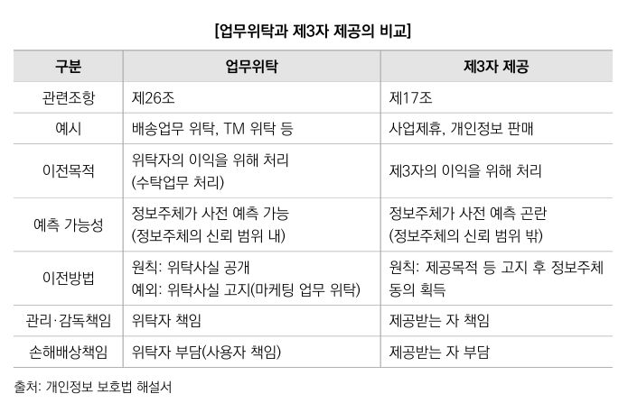
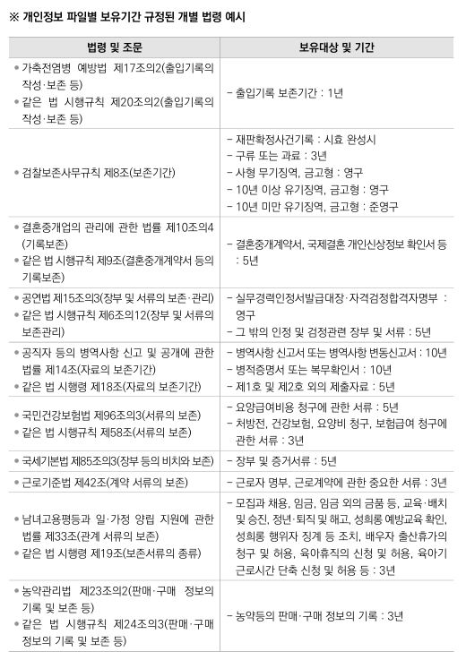

개인정보 보호법력 해석 실무 교재

https://www.gne.go.kr/upload_data/board_data/BBS_0000856/163895647459724.pdf


## 법
개인정보보호법 제29조 -> 개보법 시행령 제30조 -> 보호위원회 고시(개인정보의 안전성 확보 조치 기준)

- 1장 : 일반론
    - 2조 정의
    - 3조 개인정보 보호 원칙
    - 4, 5, 6조 X
- 2장 : 개인정보 보호정책의 수립
    - 7조 ~ 14조전체 생략해도 무방
- 3장 : 개인정보의 처리
    - 1절 중요
    - 2절 중요
    - 3절 중요도 떨어짐
    - 4절 중요도 떨어짐
- 4장 : 개인정보이 안전한 관리
    - 29조 : 제일 중요
    - 29조 외에는 그렇게 중요한 내용 별로 없음
- 5장 : 정보주체의 권리 보장
    - 그냥 넘어가도 무방
    - 35조의2 전송요구권 (시행일 미지정)
- 6장 : 삭제
    - 그냥 넘어가도 무방
- 7장 : 개인정보 분쟁조정위원회
    - 그냥 넘어가도 무방
- 8장 : 개인정보 단체 소솔
    - 그냥 넘어가도 무방
- 9장 : 보칙. 기타 보완하는 규정
    - 58조 볼만함
        - 어디까지 적용되는지 
    - 58조의2 적용제외(익명정보)
        - 개보법 어디에도 익명정보에 대한 내용은 포함되지 않는데 이 58조의2 항목으로 익명정보라는 것을 암시할 수 있음   
        법적 규제가 없어서. 누구나 마음대로 활용 가능
    - 59조 패널티
    - 64조의2 과징금
        - 제일 무서운 법. 매출액의 3%
        - 1항 9호 : 29조 안전성 확보 조치 미이행 과징금
- 10장 : 벌칙  형사처벌
    - 75조 : 과태료
        - 2항 5호 : 29조 안전성 확보 조치 미이행 과태료

</br></br>


## 개인정보보호법 역사
데이터 3법 개정
### 초기
과거엔 개인정보보호법이 그렇게 중요하진 않았음.   
왜냐면 정보통신망법이 훨신 더 중요했음

정보통신망법에 개인정보의 보호 내용이 있음.   
과거 개보법이 겹치는 게 많았음.

개보법은 일반법    
정보통신망법은 특별법    
정보통신망법은 온라인 사업자를 규제하는 법   

기존에는   
온라인 -> 정보통신망법    
오프라인 -> 개인정보보호법   
당연히 온라인에서 사고가 더 많이 터지기 때문에     
정보통신망법이 메인이었음

개인정보 관련된 내용을 싹 다 개인정보보호법에 몰아주기 시작    
정보통신망법에 개인정보가 다 사라짐

### 중기
이때는 온라인 사업자에 대한 특례가 있었음   
예전 개보법에는 특례가 있었지만

### 현재
이제는 이런 온라인 사업자에 대한 특례를 없앰   
온라인, 오프라인 사업자 기준을 없앰

`'개인정보처리자'란 업무를 목적으로 개인정보파일을 운용하기 위하여 스스로 또는 다른 사람을 통하여 개인정보를 처리하는 공공기관, 법인, 단체 및 개인 등을 말한다`

온라인, 오프라인 모든 사업자가 개보법 규제를 받기 시작    
굉장히 강해진 법

</br></br>

## 개인정보보호법 2장
- 2조    
    - 1호 가목   
        - 개인정보라고 할 수 있음
    - 1호 나목
        - 결합정보. 개인정보임
        - 시간, 비용, 기술이 많이 들면 쉽게 결합할 수 없기에 개인정보가 아님.
    - 1의2호
        - 가명정보
- 28조의2
    - 개인정보처리자는 [ 통계작성, 과학적 연구, 공익적 기론 보존 ] 등을 위하여 <U>정보주체의 동의 없이</U> 가명정보를 처리할 수 있다
- 58조
    - 익명정보 : 시간, 비용, 기술을 고려해서 다른 정보랑 붙여봐도 개인을 알아볼 수 없는 정도

### 개인정보
- 2조    
    - 1호 가목   
        - 개인정보라고 할 수 있음
    - 1호 나목
        - 결합정보. 개인정보임
        - 시간, 비용, 기술이 많이 들면 쉽게 결합할 수 없기에 개인정보가 아님.

### 익명정보
- 58조
    - 익명정보 : 시간, 비용, 기술을 고려해서 다른 정보랑 붙여봐도 개인을 알아볼 수 없는 정도

### 가명정보
- 2조
    - 1의 다목
        - 가명정보
    - 1의2호
        - 가명정보
- 28조의2
    - 개인정보처리자는 [ 통계작성, 과학적 연구, 공익적 기론 보존 ] 등을 위하여 <U>정보주체의 동의 없이</U> 가명정보를 처리할 수 있다
    
#### 결합정보 예시
2013고단17

도박 신고 받고 순찰 나간 순찰 팀장.   
가보니 도박장에 순찰 팀장이랑 아는사람1이 있었음   
판돈도 적어서 훈방조치했는데    
며칠 뒤에 아는사람1 이랑 순찰 팀장이랑 같이 술마시는 중에   
도박 신고한 사람 전화번호를 알려달라고 했는데   
경찰은 전화번호 뒷 4자리만 알려줌

판사 왈   
요즘 시대 전화번호 4자리에는 사람들이 특별한 의미를 담아놓는다   
그리고 너가 알려준 4자리를 가지고 아는사람1도 통화내역을 결합하여 누구인지 알아냈다   
개인정보보호법 제2조 제1호에 규정된 개인정보에 해당한다

제1호 만을 거론한 것을 보면   
가목도 해당한다는 것을 의미.

</br></br>

애매한데? -> 까보면 다 개인정보였음.    
다 벌금 과징금 과태료 받음   
애매하면 다 개인정보라고 치는 게 속편함

</br></br>

#### 가명정보
가명처리를 하여 원래의 상태로 복원하기 위한 추가 정보의 사용, 결합 없이는 특정 개인을 알아볼 수 없는 가명정보도 해당됨

추가정보는 가명처리 과정에서 생성 사용된 정보로 제한되고,   
해당 정보를 가명처리 전 정보로 복원할 수 있는 정보라는 점에서   
특정 개인을 식별 가능하게 하는 다른 정보와 구분됨
</br></br>

#### 개인정보의 처리
개인정보에 연관된 많은 행위
</br></br>

#### 정보주체
사람
</br>
</br>

### 개인정보보호법에 걸리려면 2가지를 통과해야 함
1. 개인정보여야 함.
2. 개인정보처리자여야 함
    - 일반인 X
    - 업무를 목적으로 해야 함

#### 업무의 개념
업무란 직업 또는 사회생활상의 지위에에 기초하여 계속적으로 종사하는 사무나 사업의 일체를 의미
</br></br>

### 개인정보파일
개인정보파일은 쉽게 찾을 수 있어야 함

체계적으로 배열 검색할 수 있도록 구성되어 있지 않은 경우는 개인정보파일에 해당하지 않음!!!

블랙박스 -> 개인정보파일    
몇월며칠 기재되어 있으니까

</br></br>


## 개인정보보호법 3장
### 제15조 개인정보 수집ㆍ이용   
총 7개의 개인정보 사용 가능 조건이 있다.

**※법률에 특별한 규정이 있는 경우 예시**    
병역법    
**※법령상 의무 준수를 위해 불가피한 경우에 해당하는 사례**    
리콜
</br></br>

**제15조 1항 4호**   
4. 정보주체와의 계약의 체결 및 이행을 위하여 `불가피하게` 필요한 경우   
->   
4. 정보주체와 체결한 계약을 이행하거나 체결하는 과정에서 정보주체의 요청에 따른 조치를 이행하기 위하여 필요한 경우

= '불가피한 경우'가 사라짐   
수집 이용 가능성이 넓어짐 (규제 완화)   
</br></br>

**제15조 1항 5호**   
5. 정보주체 또는 그 법정대리인이 의사표시를 할 수 없는 상태에 있거나 주소불명 등으로 사전 동의를 받을 수 없는 경우로서     
`명백히 정보주체 또는 제3자의 급박한 생명, 신체, 재산의 이익을 위하여 필요하다고 인정되는 경우`   
->   
5. 명백히 정보주체 또는 제3자의 급박한 생명, 신체, 재산의 이익을 위하여 필요하다고 인정되는 경우
</br></br>

**제5조 1항 7호**    
7. 공중위생 등 공공의 안전과 안녕을 위하여 긴급히 필요한 경우   

코로나 때 생겼음
</br></br>

**제15조 1항 6호**    
6. 개인정보처리자의 정당한 이익을 달성하기 위하여 필요한 경우로서 명백하게 정보주체의 권리보다 우선하는 경우, 이 경우 개인정보처리자의 정당한 이익과 상당한 관련이 있고 합리적인 범위를 초과하지 아니하는 경우에 한한다.   

철도 운전실에 CCTV를 설치하여 두 손을 촬영하는 것   
개인정보가 맞음    
특정 시간에 어떤 운전자가 운행을 하는 것을 확실하게 알 수 있기 때문에 이 손의 주인이 누구인지 판단 가능

1. 철도공사의 정당한 이익에 해당
2. 목적 달성에 필요하다
3. 합리적인 범위를 초과하지 않았다
4. 정보주체보다 철도공사가 명백히 우선하다   
</br>

**제15조 3항**    
LP음반 판매 회사가 고객의 동의를 받아 정기적으로 LP음반의 카탈로그를 보내다가, 오디오, 테이프, CD, DVD 형태의 음악 카탈로그도 보내는 경우
</br></br>

**제17조 4항**    
약국에서 다른 고객의 의약품을 잘못 가져간 경우, 약국이 고객에게 위 사실을 알리기 위하여 처방 병원으로부터 휴대전화번호를 제공받아 전화하는 경우

약을 잘못가져갔기에 환자에게 중대한 위험이 발생할 수 있기 때문에 별도로 동의받지 않고 약국에게 환자의 연락처를 제공할 수 있음
</br></br>

**제16조**   
목적을 넓게 잡아라   
목적이 넓어질 수록 17조 목적 외 활용에 해당할 경우도 적어짐   

제3조와 비슷한 연관이 있음
</br></br>

**제22조**    
제22조 동의를 받는 법   
7. 재화나 서비스를 홍보하거나 판매를 권유하기 위하여 개인정보의 처리에 대한 동의를 받으려는 경우

5항 동의하지 않는다고 서비스 거부하면 안된다

그럼 쿠키 수집은? 
</br></br>

**제22조의2**☆   
제22조의2 아동의 개인정보 보호   
만14세 미만 아동의 개인정보 처리하려면 법정대리인의 동의 받아야 함

개보법 시행령 제17조의2    
3호 동의 내용을 게재한 인터넷 사이트에 법정대리인이 동의 여부를 표시하도록 하고 법정대리인의 휴대전화 본인인증 등을 통하여 본인 여부를 확인하는 방법

?64조의2 2호   
71조의 3호
</br></br>

**제17조**    
개인정보의 제공

업무위탁과 제3자제공 차이   
정보주체가 예측 가능 / 불가능   
개인정보를 활용하여 받는 이익의 주체 위탁사 / 제3자   
누구의 업무인지? 위탁사 / 제3자

모호한 경우?   
둘 중에 하나를 고르면 된다
 
</br></br>


**제21조**    
개인정보의 파기

정당한 사유가 없는 한 근무일 기준 5일 이내에 파기(표준지침 10조 1항)

1. 개인정보 보유기간의 경과
2. 개인정보 처리 목적 달성
3. 가명정보의 처리 기간 경과
4. 개인정보가 불필요하게 되었을 때
    - 개인정보처리자가 당초 고지하고 동의를 받았던 보유기간의 경과
    - 동의를 받거나 법령 등에서 인정된 수집·이용·제공 목적의 달성 
    - 회원탈퇴, 제명, 계약관계 종료, 동의철회 등에 따른 개인정보처리의 법적 근거 소멸
    - 개인정보처리자의 폐업·청산
    - 대금 완전 변제일이나 채권 소멸시효 완성일

안전성확보조치
1. 완전파괴(소각, 파쇄)
2. 전용 소자장비 이용하여 삭제
3. 데이터 복원되지 않도록 덮어쓰기 초기화
4. ..
5. ..
등등..
</br></br>

개인정보 파일별 보유기간
   
 
</br></br>

Q. 회원 개인정보 파기시 연계 회원번호도 파기해야 하는지?
```
회원관리 시스템에서 회원 탈퇴시, 이름, 연락처, 주소 등 개인을 식별하는 정보는 모두 지체 없이 파기합니다. 이때, 생성정보였던, 회원번호 000001도 함께 파기하여야 하는 것일까요? 회원번호 신규 생성 등을 위하여, 회원번호만 따로 순차적으로 관리하려 합니다.
```

000001과 결합할 만한 개인정보를 모두 파기했기 때문에, 결합이 불가능하다.   
그렇기에 회원번호는 익명정보이다.   
익명정보는 파기하지 않아도 된다

Q. 개인정보 매일 파기해야 하는가?   
A. NO. 영업일 기준 5일 내에 파기하면 되기 때문에 일주일에 하루만 정해서 몰아 파기하면 된다

</br></br>

## 제2절 개인정보의 처리 제한
**제23조**    
민감정보의 처리 제한   
민감정보 : 사상 신념 노동조합 정당의가입 탈퇴 정치적견해 건강 성생활

법률 = 법   
법령 = 법률 + 대통령령 + 시행규칙
</br></br>

**제24조**    
고유식별정보의 처리 제한   
고유식별정보 : 주민등록번호, 여권번호, 운전면허번호, 외국인등록번호

15조는 아래 조건에만 처리할 수 있다!   
23, 24조 아래 조건 제외하고는 처리할 수 없다!
</br></br>

**제24조의2**    
주민등록번호 처리의 제한   
24조1항 만족해도 주민등록번호는 아래 조건 아니면 처리할 수 없다

#### 규제 
주민등록번호 >>>> 고유식별정보 = 민감정보 > 일반적인 개인정보 > 가명정보 > 익명정보 > 일반정보
</br></br>

**제25조**    
설치 목적과 다른 목적으로 고정형 영상정보처리기기를 임의로 조작하거나 다른 곳을 비춰서는 안된다.   
녹음기능 불가

불법 - 대화에 참여하고 있지 않는 사람이 녹음하면    
합법 - 대화에 참여하고 있는 사람이 녹음하면

CCTV는 명분만 있으면 설치하여 개인정보 수집이 가능함   
15조와 25조를 동시에 충족할 필요가 없고, 25조만 충족하면 됨.

비공개 장소 - 15조 항목 조건(1호부터 7호 하나 만족해야 함)   
공개된 장소 - 25조 항목 조건(1호부터 6호 하나 만족해야 함)
</br></br>

- **공개된 장소**   
- 도로, 공원, 공항, 항만, 주차장, 놀이터, 지하철역 등의 공공장소
- 백화점, 대형마트, 상가, 놀이공원, 극장 등 시설
- 버스, 택시 등 누구나 탑승할 수 있는 대중교통
- 병원 대기실, 접수대, 휴게실
- 구청·시청·주민센터의 민원실 등 국가 또는 지방자치단체가 운영하는 시설로 민원인 또는 주민의 출입에 제한이 없는 공공기관 내부


Q. 차량 내부 블랙박스 영상을 직원 복무점검에 사용해도 되는지?

A. 직원 동의를 받아 회사차량 내부에 블랙박스를 설치ㆍ운영할 수 있으나, 근태관리 등 목적으로 이용하려면 노사 협의를 거챠야 함.
- 사업장에서 근로자 감시 목적으로 CCTV를 설치하려면 [근로자참여 및 협력증진에 관한 법률]제20조 제14호에 따라 노사 협의 후 설치하거나, [노동조합 및 노동관계조정법]제31조에 따라 노사가 체결한 단체협약에 근거를 마련하여야 함.
- 강형욱 사건에서 CCTV가 직원들을 열람하는 것에 사용이 되었다면 위반 행위
</br></br>

**제25조의2**    
이동형 영상정보처리기기   

업무를 목적으로 이동형 영상정보처리기기를 운영하려는 자는 ~   

업무를 목적으로 하지 않으면   
이동형 영상정보처리기기 사용에 자유로움

추가된 부분    
2. 촬영 사실을 명확히 표시하여 정보주체가 촬영 사실을 알 수 있도록 하였음에도 불구하고 촬영 거부 의사를 밝히지 아니한 경우,   
정보주체의 권리를 부당하게 침해할 우려가 없고 합리적인 범위를 초과하지 아니하는 경우로 한정한다.

25조의2를 위반하면?    
위반했다고 과징금, 벌금 항목은 없고,   
과태료는 있음.   
-> 민사 소송 가능. 민원 넣으면 정부 기관에서 과태료 부과할 수도 있음음

</br></br>

## 가명정보 처리 가이드라인
☆재식별 : 특정 개인을 알아볼 수 없도록 가명정보에서 특정 개인을 알아보는 것

