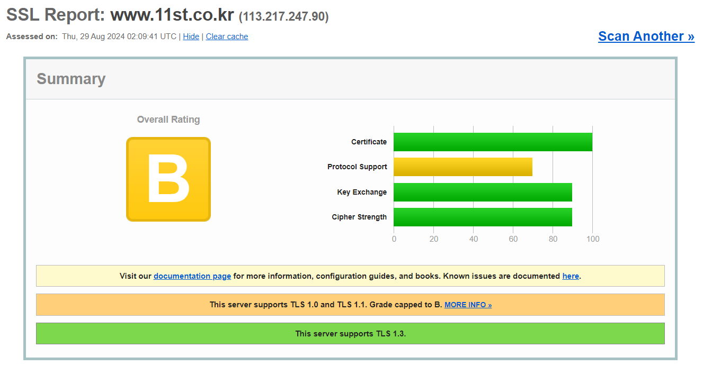
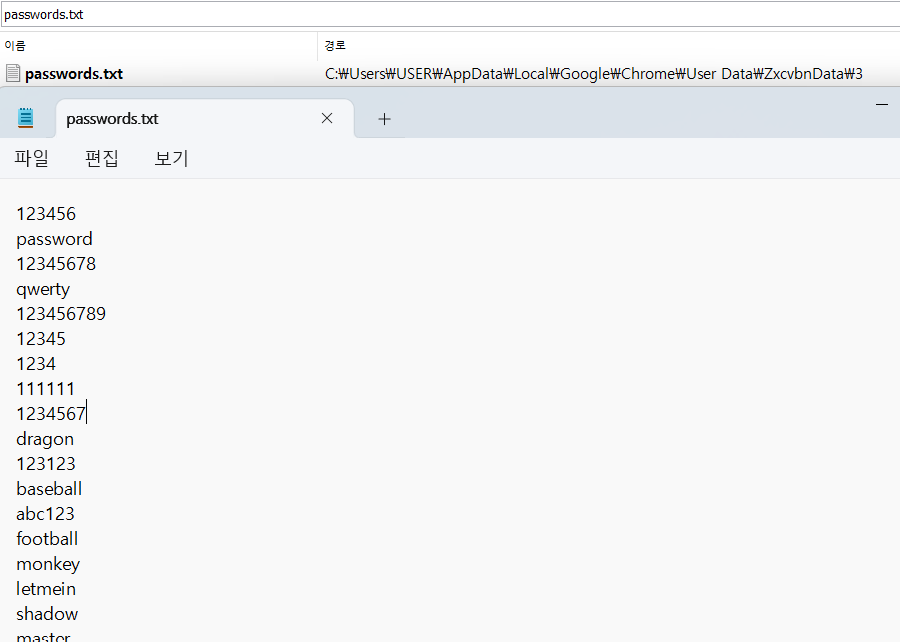
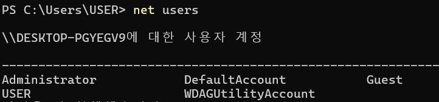
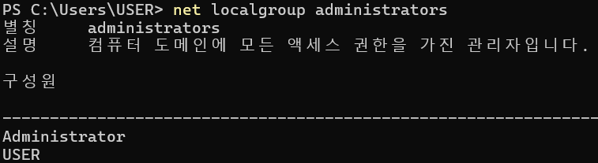

```
ISP1        ISP2
Router      Router
DDoS        DDoS   
IPS         IPS
방화벽      방화벽 - DMZ(Public)
                    WAF - LB
```

`msinfo32/cat/etc/*release`


## 시스템 유형 별 주요 기능
1.OS
- 자원 관리
    - CPU 관리 : 여러 프로그램이 CPU를 사용할 수 있도록 스케쥴링
    - 메모리 관리 : 프로그램이 사용하는 메모리를 할당, 회수 관리
- 파일 시스템 관리
    - 파일 생성 및 삭제 : 파일의 생성과 삭제, 이름 등의 관리
    - 파일 접근 제어 : 파일의 소유, 접근 권한 등을 설정하여 관리
- 프로세스 관리
    - 프로세스의 생성 및 종료 : 작업에 대한 프로세스를 생성하고, 작업이 완료되면 종료
    - 프로세스 스케쥴링 : 여러 프로세스가 실행되는 스케쥴을 관리하고 CPU 시간 등을 분배
- 입출력 관리
    - 키보드, 마우스, 마이크 등 다양한 기기와의 연결을 통해 입출력 신호 처리
</br></br>

2.WEB
- HTTP
    - 요청 수신 : Client로 부터 HTTP 요청 수신
    - 응답 생성 : 요청에 대해 적절한 HTML, CSS 등을 생성하며 응답
    - 상태값 반환 : 요청의 처리 결과를 나타내는 HTTP 코드 반환
- 정적 파일 제공
    - 파일 서빙 : HTML, CSS 등 파일과 이미지 같은 정적 컨텐츠를 제공
    - 캐싱 : 정적 파일을 캐시하여 클라이언트의 반복 요청에 빠르게 응답
- 보안 관리
    - SSL/TLS 암호화 : 서버와 클라이언트 간 데이터 전송을 암호화   
    https://www.ssllabs.com   
    https://www.ssllabs.com/ssltest/   
    www.11st.co.kr 검색하고 Do not show the results on the boards 체크하고 Submit 눌러보면   
    해당 호스트가 얼마나 안전한지 체크해주는 사이트   
    C등급부터는 취약   
    이걸 어디 쓰냐? - 주통기반 웹 취약점 진단할 때   
    SSL/TLS 테스트한 스크린샷을 넣게 되어 있음.   
    쓰면 좋음   
       

암호 알고리즘 및 키 길이 이용 안내서   
이 안내서에 따라서 맞는 알고리즘을 사용해야 함.   
</br></br>

3.WAS
- 비즈니스 로직 처리
    - 애플리케이션 로직 실행 : 로그인, 검색, 결제 등 비즈니스 로직 수행 및 동적 컨텐츠 생성
    - 세션 관리 : 사용자의 세션을 관리하여 로그인 상태를 유지
- 데이터베이스 연동
    - 데이터 요청 : 데이터 조회, 삽입, 수정, 삭제 등의 요청 처리
- 서비스 호출
    - 외부 서비스 연동 : 다른 웹, API 연동을 통해 외부 데이터를 가져오거나 타 시스템과 통신
    - 오류 처리 : 애플리케이션에서 발생하는 오류 처리 및 오류 메시지 제공
</br></br>

4.Database
- 데이터 저장
    - 데이터 입력/수정/삭제 등 수행
        - ☆항상 내부 존에만 있어야 함 
        - WAS서버는 public IP를 받는 건 권고 이지만,
        - DB는 절대 public IP 받지 않음
        - DB존, WAS존 등 애초에 아예 개별로 관리 함

- 데이터 조회
    - 쿼리 실행 : SQL 쿼리를 통해 데이터를 검색 및 정보 반환
    - 인덱스 관리 : 데이터 검색 속도 향상을 위해 인덱스 생성 및 관리

- 데이터 보안
    - ☆접근 제어 : 사용자와 애플리케이션의 데이터베이스 접근 권한을 설정 및 관리
        - 유저1은 접근 안되게 하고, 유저2는 접근 가능하게 하고 이런 접근 제어
    - 백업 및 복구 : 데이터 손실에 대비하여 정기적 백업을 수행하고, 필요시 복구
        - 하나 더 동일하게 구성해놔서 불나도 복구가능하게
    - 암호화 : 저장된 데이터와 전송되는 데이터를 암호화하여 보안 강화
        - AES, RSA 등 암호화해서 안전하게 관리

## 시스템보안 - 1. 계정 관리
시스템 보안의 개념
- 시스템의 input / output 에 대해 통제하는 것
- 사용자, 파일, 폴더, 장치 자체에 제어
- 계정 관리, 세션 관리, 접근 제어, 권한 관리, 로그 관리, 취약점 관리, 모바일 보안
</br></br>

### 1.계정관리
계정 관리의 기본 개념   
= 사용자가 시스템을 사용하는 데 인증하고, 인가 받는 단계
1. 사용자는 시스템에 접근을 하기 위해 식별, 인증, 인가를 받아야 함.
2. 계정은 사용자로 하여금 시스템에서 타 사용자와 구별되게 함.
3. 책임추적성 등을 위해 식별자는 유일함
4. 다양한 인증 수단을 통해 사용자가 해당 사용자임을 인증함

### 인증 방식 상세
지식 : 사용자가 알고 있는 지식을 확인하는 것   
소유 : 사용자가 소유한 것을 확인하는 것   
존재(생체기반) : 사용자의 생체적인 특성을 확인하는 것    
행위(다중요소) : 사용자의 행동 데이터를 누적하여 인증에 활용하는 것   
- FDX(이상금융거래탐지시스템)
</br></br>

### 패스워드의 관리 시 보안 요구 사항
- 부적절한 패스워드의 예시
    - 길이가 너무 짧거나 null인 패스워드
    - 사전에 나오는 단어
    - 키보드 자판의 나열
    - 사용자 관련 정보로 유추 가능한 단어
- 패스워드 관련 정책
    - 최소 길이, 최소 복잡도를 정해두는 것
    - 변경 주기 등을 정해두는 것
    - 잘못된 패스워드 입력 시 잠금, 추가 인증 등의 기능을 정해두는 것
- Windows
    - 윈도우 패스워드는 블록 구조로 구성
    - 패스워드 블록은 7byte + 패스워드 데이터 1byte로 구성
    - 8개 이상이 되면 크래킹 연산에 2배의 시간 소요
- Unix / Linux
    - 1글자 증가 시 패스워드 강도 약 100배 가량 상승
    - John the ripper을 이용하여 shadow 파일 크랙 가능
    - 디폴드, 싱글크랙, ~~~

```
P A S S W O R null   
D             null

PASSWOR 까지는 7byte
D 까지 하면 8byte
크래킹 시간이 더 오래 걸림
```
 
앱은 1~3년   
세션시간 8시간?
</br></br>

### 운영체제의 계정 관리 - Windows 
CMD:   
net users   
net localgroup administrators

- Administrators
    - 관리자 그룹으로, 윈도우 시스템의 모든 권한을 가짐
    - 사용자 계정을 생성, 삭제할 수 있음.
    - 사용할 수 있는 자원에 대한 권한을 설정할 수 있음
- Backup Operators
    - 윈도우 시스템에서
- Users
    - 대부분의 
    - 관리 계정
- Guests
    - 윈도우 시스ㅔㅁ


net users   
      
이런 계정을 가지고 있다고 보여줌

net localgroup administrators   


### 운영체제의 계정 관리 - Unix / Linux
- 기본 관리자 계정으로 root 존재
    - 계정이 많아질 수록 계정 관리가 복잡해짐
    - 개발자 계정 하나만을 가지고, 접근 제어를 앞에 붙여 관리를 함
- /etc/passwd 파일로 계정 목록을 확인 가능
    - root:x:0:0:root:/root:/bin/bash
    - 계정명:패스워드:사용자ID(UID):그룹ID(GID):Description:홈 디렉토리:Default쉘
        - ☆주통기반 U-44
        - root계정 외 UID=0 계정이 존재하면 안 됨.
        - 존재한다면 취약
- /etc/group 파일에서 그룹 목록을 확인 가능
    - root:x:0:root
    - 그룹명:패스워드(사용안함):그룹ID(GID):속한 계정 목록
- /etc/shadow 파일에서 계정과 암호화
    - root:$6$adsfASDIJAsdjasiodjiwXXdjsR/:19960:0:99999:7:::
    - 계정명:패스워드:패스워드 최종 수정일(공백가능):패스워드변경최소일(공백가능):패스워드 변경 최대일(99999일 경우 만료X):만료경고 기간:계정만료 기간(공백가능):예약필드(공백가능)
    - 주통기반
        - 패스워드 변경 최소일이 0일이면 취약
        - 패스워드 변경 최대일이 99999일이면 취약
- 데이터베이스의 계정 관리
    - 데이터베이스의 계정은 MySQL, MS-SQL, Oracle 등 솔루션에 따라 관리자 계정 등이 상이함.
        - 주통기반 U-38, S-01 등
        - 디폴트 관련된 것들은 수정안하면 취약
    - 관리자 계정은 실제 서비스에 사용하지 않는 것을 기본적으로 권고함
- 응용 프로그램의 계정 관리
    - 취약한 응용 프로그램을 통해 공격자가 민감 정보를 습득하여 운영체제를 공격할 수 있음
        - log4j
    - 응용 프로그램의 계정은 용도별(서비스 구동, 외부 API 제공 용도 등)로 구분해야 함
- 네트워크의 계정 관리
    - 네트워크 장비에도 계정을 생성하여 계정 별 명령어 집합을 제한함
    - 대규모의 경우 계정 관리의 어려움으로 TACACS 등을 사용하기도 함.

ec2-user:!!:19960:0:999999:7:::
</br></br>

## 시스템 보안 - 2. 세션 관리
### 세션 관리의 기본 개념
사용자와 시스템 사이 또는 시스템 간의 활성화된 접속을 의미
1. 사용자가 인증 절차를 거친 후, 시스템 접근에 성공하면 세션 연결
2. 매 순간 사용자 인증을 하면 불편함 + 인증 정보 전달 과정의 문제 발생 가능성이 존재 (ex. 화면보호기)
3. 일정 시간 후, 시스템에 동일한 사용자가 접근 시, 해당 사용자가 기존 사용자인지 재 인증
</br></br>

### 세션 관리 시 보안 요구 사항
- 세션 하이재킹
    - 공격자가 인증이 완료되어 정상적으로 통신하는 사용자의 세션을 가로채서,    
    별도의 인증 작업 없이 해당 세션으로 통신을 수항(Cookie Editor / Burp Suite)
- 네트워크 패킷 스니핑
    - 네트워크 상에서 본인이 아닌 다른 상대방들의 패킷 교환을 엿듣는 것 (MITM과 차이 존재)
- 네트워크 패킷 암호화 
    - 스니핑 등을 통해 정보가 노출되어도 패킷이 해독되지 않게 보호
- 세션 정책 마련
    - 시스템 중요도 별로 세션 유지 시간 등을 구분해서 적용
    - 세션에 대한 지속적인 인증을 유지하는 안전한 방법 구현

## 시스템 보안 - 3. 접근 제어
### 접근 제어의 기본 개념
시스템, 서비스가 공격자로부터 보호될 수 있도록 네트워크 관점에서 접근을 통제
1. 현재 인증된 사용자의 권한 수준을 확인하고,
2. 그 권한은 어떤 정보에 접근할 수 있는지에 따라 정보 접근을 허용하고
3. 그 권한은 어떤 기능을 수행할 수 있는지에 따라 기능 수행을 허용하는 것

시스템 및 네트워크에 대한 접근 제어의 가장 기본적인 수단은 IP, 서비스 포트이다.
</br></br>

### 접근 제어의 유형
- ACL
    - 접근 제어 목록
    - 시스템 객체 관점에서 작성된 주체 기준 목록
- MAC
    - 강제적 접근 제어
    - 관리자가 허용/비허용한 기준으로 제한
- DAC
    - 임의 접근 제어
    - 시스템 객체에 대한 접근을 그룹 신원 기준으로 제한
- ☆RBAC
    - 역할-기반 접근 제어
    - 역할에 따른 권한을 부여하고 이를 기준으로 제한
- ABAC
    - 속성-기반 접근 제어
    - 사용자, 시스템 또는 행동의 속성을 구분하고 이를 기준으로 제한

ACL, RBAC만 많이 사용함

RBAC 급여 담당만 하다가 평가로 바뀌었으면 회수가 되어야 하는데 회수가 안되면 취약점.

역할을 할당하고 회수하고 수정하고 파기하는 게 중요
</br></br>

## 시스템 보안 - 4. 권한 관리
### 권한 관리의 기본 개념
사용자에게 부여된 접근 권한의 소유 권한에 따라 서비스에서 접근, 소유 할 수 있는 범위를 관리하는 것
1. 읽기, 실행, 쓰기, 수정, 삭제 등 사용자의 행위에 대한 허용 여부를 관리하는 것
2. 최소한의 사용자에 최소한의 권한을 부여해야 높은 보안성 충족
3. 권한 관리의 오작용으로 인한 보안 사고는 매우 빈번(ex. 아시아나 개인정보 유출)

## 시스템 보안 - 5. 로그 관리
### 로그의 유형
시스템 이벤트 : 운영체제 구성 요소에 의해 발생하는 로그   
네트워크 이벤트 : 네트워크에서 발생하는 로그    
보안 시스템 : 보안 시스템에서 발생하는 로그   
보안 감사 관련 : 사용자 및 시스템에서 보안 감사를 위해 남기는 로그    
개인정보처리시스템 : 개인정보처리시스템에서 법적 요건으로 남겨야 하는 로그


## 시스템 보안 - 7. 모바일 보안
### 모바일 잠금 관리
- 휴대전화 내에는 연락처, 미디어, 계정/권한, 결제 수단 등이 존재하므로 모바일 자체의 잠금이 중요함
- PIN번호, 지문인증, 홍채인증, 패턴인증 등 다양한 인증 방식 존재함 

## 시스템 보안 - 보안 솔루션
시스템 보안을 위한 보안 솔루션의 구성도

본인인증 - 비밀번호 - 계정관리 - 접근통제 - 명령어 통제

- 본인인증
    - 계정인증
    - 2-factor 인증
    - SSO
- 