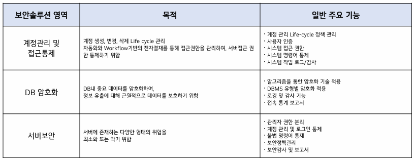
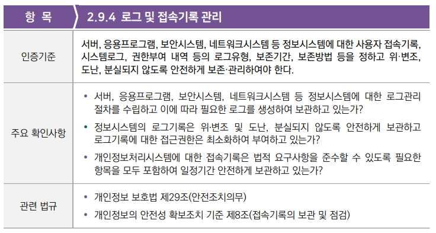
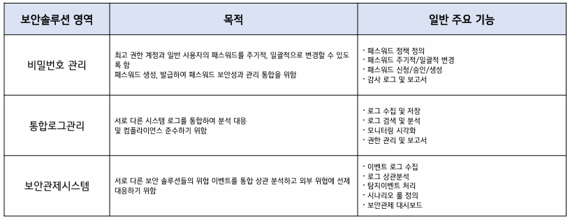
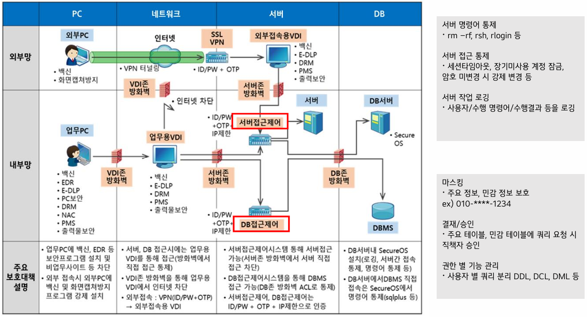

## 시스템 보안 - 보안 솔루션
### 시스템 보안을 위한 보안 솔루션의 구성도

회사 ad 서버 중앙 관리

SAC, DAC

해당 솔루션은 서버,db를 얼마나 더 안전하게 관리하는지에 대한 사진

통합로그관리 : 로그들을 각각 서버들이 본인들의 로그 폴더 하위에서 관리하다가 

계정관리 및 접근통제 : 
- 계정생성, 변경, 삭제 Life cycle 관리 자동화와 workflow기반의 전자결제를 통해 접근권한을 관리하여, 서버접근 권한을 통제하기 위함(AWS - iam)
    - 계정관리 Life-cycle 정책 관리
    - 사용자 인증
    - 시스템 접근 권한
    - 시스템 명령어 통제
    - 시스템 작업 로그/감사


DB암호화
- db 내 주용 데이터를 암호화하여 정보 유출에 대해 근원적으로 데이터를 보호하기 위함
    - 알고리즘을 통한 암호화 기술 적용
    - DBMS 유형별 암호화 적용
    - 로깅 및 감사 기능
    - 접속 통계 보고서

 

불법 명령어 통제 :    
telnet, tcp 등 허용하면 위험

WEB안에서 공격자가 돌아다니다가 어쩔 수 없이 올려져있던 WAS나 레거나 WAS가 있으면    
WAS로 점프할 수 있음

WAS 안에서도 또 DB와 연결되어 있는 구간이 있을 수 있어 DB까지 접근할 수도 있음
</br></br></br>

### 보안 솔루션을 구비하는 목적 및 일반적인 주요 기능
비밀번호 관리
- AD 계정은 90일마다 변경
- 서비스(HR) 계정이 HR의 on/off를 담당하는 계정
- 패스워드 정책(길이, 복잡도)을 잘 지키고 있는가?
</br></br>

통합로그 관리
- 컴플라이언스 : 정책, 감사 등 여러 팀이 맡을 수 있음


2영역은 법규 관련된 내용이 거의 없는데 로그는 법규에 관련된 사항이 있다. 

상세항목 3개 기준으로 점검
- 로그 관리 절차를 수립하고 보관하고 있는지
- 로그 worm 디스크 사용하고 초소한의 접근 권한 부여했는지
- 법적 요구사항을 준수할 수 있도록 일정기간 안전하게 보관하는지

개인정보처리시스템의 

 

**통합로그관리**   
상세항목 3개 기준으로 점검
- 로그 관리 절차를 수립하고 보관하고 있는지
- 로그 worm 디스크 사용하고 초소한의 접근 권한 부여했는지
- 법적 요구사항을 준수할 수 있도록 일정기간 안전하게 보관하는지


**보안관제시스템**   
관련없는 IP가 들어왔을 때 IP 흐름을 보는 것   
어떤 흐름에 따라서 유출, 위험인지 확인하고 알람이 오는 것


### 정보시스템 흐름도
ISMS-P 1.2.2 현황 및 흐름분석 사진


web - was - db

업무용 VDI 말고 망분리 VDI를 하나 더 둔다   

서버 접근 방법   
서버존 방화벽 - 서버접근제어 - 서버   
서버존 방화벽, 서버접근제어를 통해서 서버에 접근할 수 있고   

db 접근 방법   
서버존 방화벽 - DB접근제어 - DB존 방화벽 - DB    
서버존 방화벽, 서버접근제어를 통해서 서버에 접근할 수 있고   


서버팜?

SSL, VPN(ID/PW + OTP) 

**서버 접근 통제**   
- 세션 타임아웃

**마스킹**   
보안팀에서 정책을 만들어서 내려줘야 함

WAS - (DAC) - DB   
WAS와 DB사이에 DAC를 둔다.(마스킹 용도)

**결재/승인**   


**권한 별 기능 관리**   
DBA - DDL, DCL, DML
</br></br>

### 계정관리 및 접근 통제
IM + AM = IAM   

ISMS-P 2.5.5 특수 계정 및 권한 관리


관리자 등 특수권한에 대한 강화된 인증수단 고려 : 인증서, OTP 등

Provisiocing : 모든 서버에 계정을 동시에 적용하는 것   
계정생성, 승인, 권한부여, 잠금, 삭제


## ☆감사로그 및 모니터링
1. 시스템 내 정책 위배행위 로그 기록
2. 사용자 행위 감사 로그 기록
3. 시스템 모니터링


## 주통기반
agent 이용. agent가 진단하게 함.   
agent가 스크립트 돌리고 고정된 결과물에 파일을 떨구고 본인의 수집서버로 가져옴.   
그럼 보안요원이 수집서버로 가져온 결과물로 보기만 하면 됨.

db서버 일부는 저한테 스크립트 주세요..... 제가 다 긁어올게요 라는 사람이 있는 것처럼    
db서버에 agent 설치가 녹록치 않음


## 취약점
취약점이란,   
위협 발생의 사전 조건이며, 자산이 가진 취약한 속성 혹은 보안 자체적인 결함을 말함

- 느슨한 물리적 보안
    - 잠금장치 없는 물리 공간, 공용 공간 내 PC 등
- 침입하기 쉬운 네트워크 상의 보안
    - 방화벽 차단의 부재, 침입 차단 제어가 없는 port 등
- 취약한 패스워드, 혹은 패스워드의 부재
    - 예측하기 쉬운 패스워드의 사용, 패스워드 기재된 PC 등
- 취약점이 많이 존재하는 오래된 버전의 OS, 서비스
    - 구형 OS, exploit 등의 취약점이 존재하는 서비스 등

## 취약점 유형 
취약점 발생 유형은   
환경/시설적 결험, 하드웨어적 결함, 소프트웨어적 결함 등으로 구분
- 환경/시설적 결함
    - 정전, 지진, 홍수, 화재 등
- 하드웨어적 결함
    - 고장, 오작동, 하드웨어 백업 소실 등
- 소프트웨어적 결함
    - 소프트웨어 장애, 부정접속 등

## 취약점 분석 유형
취약점 분석은 관리적, 기술적, 물리적 관점으로 나눠서 수행함
-관리적 관점
    - 정보보호관리체계 보안 통제 항목을 바탕으로 취약점 점검(ISMS-P, ISO)
    - 정보
    - 개인정보보호법
    - 컴플라이언스
- 기술적 관점
    - 서버, 네트워크, DB, PC, 보안솔루션 등 확인된 자산에 대해 취약점 점검
    - 인프라, 보안솔루션 운영, 관제, 진단
- 물리적 점검
    - 문서 검토, 체크리스트, 인터뷰, 육안 실사 등을 통한 취약점 점검
    - Infra, HR


관리체계 수립 및 운영 (16개)   
ISMS-P  8페이지

보호대책 요구사항 (64개) (ISMS)
9페이지


## 취약점 진단 실무 - 업무 프로세스(시스템/어플리케이션 동일)
자산 파악
- 자산 관리 시스템
- 미등록 자산 파악
- DNS 목록 파악
- IP 대역 스캔

진단 수행
- 정적 도구 활용
- 동적 도구 활용
- 담당자 인터뷰
- 결과 수집/항목 분류

결과 진단
- 맞춤 보고서 생성
- 담당자 Comm.
- 결과 비교 관리
- 관리 시스템 활용

조치 및 이행검
- 조치 방법 안내
- 이행 여부 확인
- 이행 조치 관리


## 실습
### U-01
```
#!/bin/bash

grep pts /etc/security > /dev/null 2>&1
if [ $? -eq 0 ]; then
        echo '[WARN]'
else
        echo '[OK]'
fi
```
[OK]

/etc/security 에 pts가 있는지   
있으면 WARN   
없으면 OK

### U-04
shadow
```
#!/bin/bash

ls /etc/shadow > /dev/null 2>&1
if [ $? -eq 0 ]; then
        echo '[OK]'
else
        echo '[WARN]'
fi
```
[OK]   

shadow 파일 있는지

/etc/shadow 에 대한 응답값이 0 이면 OK   
아니면 WARN

shadow 파일이 존재해야 하므로 0 이면 OK 출력해야 한다.


### U-44
passwd
```
#!/bin/bash

NUM=$(awk -F: '{print $3}' /etc/passwd | sort -n | uniq -d | wc -l)

if [ $NUM -gt 0 ]; then
        echo '[WARN]'
else
        echo '[OK]'
fi
```
[OK]

NUM가 gt(greater than)이면 WARN

{print $3} = 세번째 열을 확인  
3번째 열에 중복값이 있냐?

sort -n | uniq -d | wc -l   
숫자만 sort, 중복되어 나오는 라인 중 한 라인 표현, 라인 수 체크

OK가 뜨면 sorting 했을 때 단 하나도 중복되는 값이 없다는 의미.


**코드 진짜 의미**   
파일 내 UID가 중복되는 것이 없는지를 체크해라


### GID 중복 체크 
```
#!/bin/bash

NUM=$(awk -F: '{print $4}' /etc/passwd | sort -n | uniq -d | wc -l)

if [ $NUM -gt 0 ]; then
        echo '[WARN]'
else
        echo '[OK]'
fi
```


수동으로 하는 업무도 있고, 자동도 있음.

자동업무는   
agent 이용. agent가 진단하게 함.   
agent가 스크립트 돌리고 고정된 결과물에 파일을 떨구고 본인의 수집서버로 가져옴.   
그럼 보안요원이 수집서버로 가져온 결과물로 보기만 하면 됨.

db서버 일부는 저한테 스크립트 주세요..... 제가 다 긁어올게요 라는 사람이 있는 것처럼
db서버에 agent 설치가 녹록치 않음

