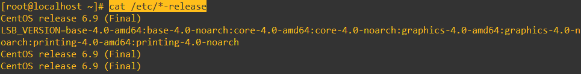

# 1. 취약점 진단 및 모의해킹 개요

### 취약점 진단
- IT 운영환경에 대한 취약점 진단 및 보호대책을 수립하여 정보보호 수준 향상
- 웹 취약점 진단 및 소스코드 취약점 진단
- 서버 OS, DBMS, WEB, WAS, NETWORK, 보안장비 보안 취약점 진단
- 보호대책 및 개선과제 제시

취약점 진단으 

### 모의해킹
- 실제 해킹과 동일한 형태의 공격을 통해 실제적인 보안 취약점 확인 및 제거 방안 제시
- 내/외부 시스템 모의해킹
- APT 진단(내부 정보 유출진단)
- 진단 대상 및 개선과제 제시

취약점 진단과 모의해킹의 차이 :    
취약점 진단은 보안 가이드가 정해져 있음  
- 주통기반
- 금취분평
- 내부규정


유닉스
- centos
- ubuntu
- redhat
- oracle

데이터베이스
- mysql
- mssql
- oracle
- dbto?
- mongodb
- nosql(객체지향형 db가 아님)단순처리 목적 ☆

웹서버
- apache
- nginx
- 
크게 4가지

WAS
- tomcat
- ...

네트워크 
- l2
- l3
- 라우터 (l4)

보안장비
- 방화벽
- WAF
- IPS
- IDS
- UTM (방화벽 아래에 내부 PC에서 외부로 나가는 인터넷을 차단하거나, 외부에서 들어오는 인터넷을 차단함. Whitelist 방식.  URL로 관리. 관리자가 실수하면 hole이 생길 수 있음)
- NAC
- DRM

## 모의해킹
- 블랙박스 
    - 아무런 정보 없이 모의해킹 시작
- 그레이박스
    - 대상 정보만 줌
    - WEB, URL
- 화이트 박스
    - 대상, URL, 계정까지 다 알려줌


```
cmd 
ipconfig
gateway 있는 뭉탱이에서
IPv4 Address  카피

장치 - 네트워크 - 네트워크 설정 
포트 포워딩
이름 - 프로토콜 - 호스트IP - 호스트 포트 - 게스트 IP - 게스트 포트
SSH - TCP - 카피한 IPv4 - 22 - 10.0.2.15 - 22   
확인
확인
virtual box 내림


putty 
카피한 IPv4 - 22 
Open
Security Alert - Accept


notepad++
ID : root
PWD : Pa55word!!@@

putty
root - Pa55word!!@@
```

`cat /etc/*-release`


httpd -v   
rpm -qa | grep httpd

1.5.0 (메이저 버전)   
1.5.0-4 (마이너 버전)

1. 레파지토리 형식으로 설치
2. 소스 형태로 설치

설치 디렉토리가 있는데    
실행중이지 않음.    
진단 대상에 포함해야 하는가?   
-> 실행중이지 않기 때문에 진단 대상이 아니다.

### RPC ☆
RPC : 서버 내부에 RPC 관련 데몬이 존재하는 상태
	  Client가 서버 내부에 존재하는 RPC 데몬을 호출하여 
	  실행이 가능한 데몬을

RPC.STATD : 구동중인 RPC 데몬에 대한 모니터링을 수행하며
			NFS의 잠금상태를 확인하는 데몬
			
NFS 구동이 되려면 : 1. Network Drive가 마운트 되어있는 상태로 파일 주고받음
				  2. NFS 사용자 계 및 패스춰드가 틀렸을 시 RPC.LOCKD 데몬을 통해 계정을 잠금차단 함
				  
RPCBIND : RPC 데몬 구동 시 구동 주소 및 넘버를 부여해서 관리해주는 데몬

### 이중화
testserver01 - tomcat (active)    
tetsserver02 - none (stanby)    
02에 있는 tomcat은 진단 대상에 포함해야 한다


`netstat -tlnp`   
0.0.0.0이 의미하는 것 :    
any

0.0.0.0/0 으로 설정하면 발생하는 문제 :   
IP 주소 전체를 열어주는 것임. ANY    

bastion 호스트. 왜 사용함? :    
실제 접근에 대한 포인트를 나눠놓고 사용하는 것?    
80, 443, 20 번 포트에 대해서 접근하면 안되서

IP접근 제어를 왜 함? :    
접근을 하는 사용자를 구분하기 위해서    
1.233.148.83/22 이렇게 해야 사용하는 사람만 22번 포트 접근이 가능하다는 것

root 계정으로 로그인 된 상태에서 접근해야 모든 정보가 다 나옴   

rc.statd : ?   

wellknown port :    
알고 있으면 wellknown 포트임
1~10


ssh vs telnet 차이점 :    
네트워크 암호화

http vs https 차이점 :    
네트워크 암호화


rpm -qa | grep mysql


프로그램 name에 Jave라고 나오면 무조건 WAS를 사용하는 서버라고 볼 수 있음
ps -ef | grep tomcat   


master 프로그램은 뭘까    
ps -ef | grep master   
/usr/libexec/postfix/master   
postfix를 사용하고 있구나 확인 가능


ls -al /usr/postfix/master.cf | grep -v "#"    
saved 폴더 안에 아무 것도 없기 때문에   
postfix는 사용해도 아무 기능을 안하기 때문에


점심 이후   
ps -ef
init 데몬 : 부팅 시작 데몬  

### init
ls -al /etc/init : 부팅 스크립트 파일들     
ls -al /etc/rc,* : rc쪽 내용을 보면 0~6번 디렉토리가 존재   
ls -al /etc/rc0.d : 심볼릭 링크있는 링크 파일들임.   
init.d 디렉토리에 다 보관이 되어 있음   
모든 부팅 스크립트 파일들은 init에 있겠구나 하고 찾아갈 수 있음


### rsyslog
/sbin/rsyslogd  
로그는 2가지로 나뉨: syslog, su log(su : select user)       
</br></br></br>

Linux에서 안전하게 root 권한을 획득하는 방법    
원래 root 계정에 직접적으로 접근하면 안된다.    
root로 직접적으로 접근이 가능하면 무차별 대입공격에 활용할 가능성이 존재함  
어떻게 하면 안전하게 할 수 있을까?  

### Linux에서 안전하게 root 권한을 획득하는 방법    
1. 일반 사용자 계정이 "wheel" 그룹에 포함
2. "su" 관련 설정 주석의 제거
3. "/bin/su" 파일의 타사용자 권한 제거 및 그룹 소유자 "wheel" 지정

rsyslog
syslog


ps -ef | grep httpd
```
[root@localhost ~]# ps -ef | grep httpd
root      2171     1  0 10:22 ?        00:00:01 /usr/sbin/httpd
apache    2674  2171  0 11:07 ?        00:00:00 /usr/sbin/httpd
apache    2675  2171  0 11:07 ?        00:00:00 /usr/sbin/httpd
apache    2676  2171  0 11:07 ?        00:00:00 /usr/sbin/httpd
apache    2677  2171  0 11:07 ?        00:00:00 /usr/sbin/httpd
apache    2678  2171  0 11:07 ?        00:00:00 /usr/sbin/httpd
apache    2679  2171  0 11:07 ?        00:00:00 /usr/sbin/httpd
apache    2680  2171  0 11:07 ?        00:00:00 /usr/sbin/httpd
apache    2681  2171  0 11:07 ?        00:00:00 /usr/sbin/httpd
```
☆위를 보고 취약인지 양호인지?


pam.d : 리눅스에서 인증을 담당하고 있는 데몬   

apache 설치하고 방화벽 open을 해줘야 하지

tomcat은 레파지토리로 설치가 불가능함.  
rpm으로 설치하는 순간 port 설정까지 설치파일 안에 다 있음   
port와 데몬은 한 쌍임   
데몬은 없는데 port는 오픈되어 있으면? : 관리 소홀   
아파치 중지되면 자동으로 port 꺼짐. 

## 계정
cat /etc/passwd     
root:x:0:0:root:/root:/bin/bash     
계정명:패스워드:UID:GID:계정설명:홈디렉토리:Shell정보   

'bash' shell이 있다는 건 로그인이 가능하다는 뜻   
1. nologin이 가능한 계정이 몇개인지?
2. 로그인이 가능한 계정 중에 어떤 게 시스템 계정인지, 사용자 계정인지

cat /etc/passwd | grep bash
```
root:x:0:0:root:/root:/bin/bash
adiosl:x:500:500:adiosl:/home/adiosl:/bin/bash
mysql:x:27:27:MySQL Server:/var/lib/mysql:/bin/bash
cubrid:x:501:501::/home/cubrid:/bin/bash
```
- 로그인 가능 계정은? : 4개       
- 시스템 사용자 계정은? : 2개
    - 0 ~ 499까지는 시스템 계정 6.X
    - 0 ~ 999까지는 시스템 계정 7.X
    - RHEL 6.X 버전까지 일반사용자 범위 : 500~
    - RHEL 7.X 버전 이상 일반사용자 범위 : 1000~


`ls -al /home/yws/.bash*` 과     
`ls -al /root/.bash*`      
2개 파일을 비교했을 때 차이점은 : history 파일 유무.        
yws에는 history 파일이 없고, root 계정에는 있음     
`bash를 실행한 모든 기록이 모여있는 파일으 history 파일임.`   

.bash_history 파일이 존재하지 않는다면      
로그인한 흔적이 없다는 증거.    
history 파일이 없으면 취약이라고 볼 수도 있음


telnet, ssh, vnc 3개 사용하면 탈락      
server to client 방식   
별도의 프로그램으로 접속하는데 그럴 이유가 전혀 없음

ps -ef | grep "ssh\|telnet"
ps -ef | egrep "ssh|telnet"
 


☆※ 일반사용자 계정 없이 root 계정만 사용하는 경우 su 명령어 사용제한 불필요    
U-45    
1. pam 모듈 사용중
2.  

su 명령어 사용 그룹 
/etc/pam.d/su   
주석처리가 되어 있으면 적용 안됨    

other 권한 
root wheel 로 변경되어야 함

s : UID     
-rwsr-xr-x. 1 root root 34904 2017-03-23 03:52 /bin/su  
s : 4   
-rwxr-sr-x. 1 root root 34904 2017-03-23 03:52 /bin/su      
s : 2   


su 주석 해제
wheel 그룹 추가
bib/su 설정 맞게 

☆은 임의로 했음


## 마무리 정리
포트폴리오 작성?
7장 정도가 가장 nice하다

수행목적 
수행대상
수행기간


본인설명할 떄 
개발능력 운영 등 한 장에 잘 넣는 게 좋다

OWASP Top10 다 외워서 가라

커리어 패스 :       
지금 가지고 있는 능력이 이만큼이고      
갖고 있지 않는 기술이나 지식이 이정도이고       
우선순위는 a,b,c이고 이중 가장 우선적인 것인 a 라고 생각하고 기간은 2개월정도 보고 있고     
b 계획은 어떻게어떻게 할 것이다 