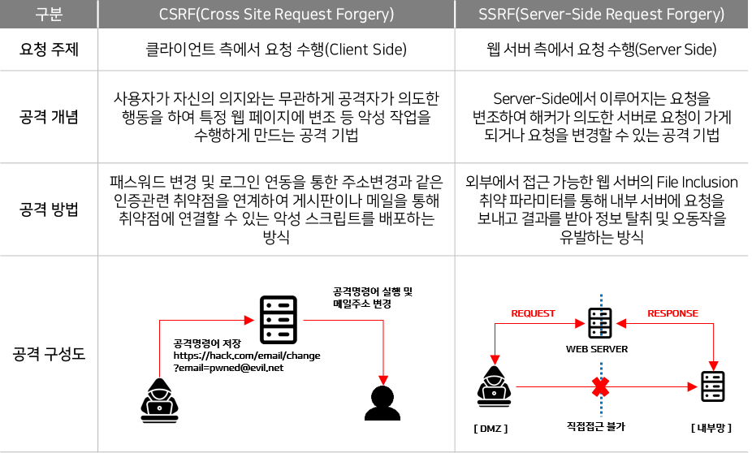

# 2024.07.16

## 웹 프록시 툴

Burp suite, fiddler

목적 : 중간에 잡아서 조작하려고

fiddler 포트 : 8888

- 설정
    - 프록시
        - 127.0.0.1 port: 8080

### burp
- setting  
    - 

window server 2019
30gb

settings
cd
    - 

internet information services (IIS) Manager
WIN
Sites
Default Web site
위에 있는 순서대로 뜸

## OWASP Top 10 취약점 유형
https://cafe.naver.com/sec

##
- Stored XSS
- reflected XSS
- Dombased XSS

### XSS ★
취약점 설명   
사용자 요청에 의해 검증되지 않은 외부 입력 데이터(악의적/부적절한 스크립트)가 포함된 동적 웹페이지가 생성/전송되는 경우, 사용자가 해당 동적 웹페이지를 열람함으로써 웹페이지에 포함된 악의적/부적절한 스크립트가 실행되는 공격이다.

공격유형
- 사용자 정보 유출(피싱 공격)
- 사용자 세션 도용(Cookie Sniffing)
- 악성코드 유포
- Code 실행
- 키로거
- User DoS

### DOM(Document Object Model)은 HTML 및 XML 문서

DOM 기반 XSS 공격 시나리오
- 악의적인 사용자가 보안이 취약한 웹 페이지를 발견했음.
- 보안이 취약한 웹 페이지에서 악성스크립트가 실행되도록 URL 주소를 만들어 일반 사용자에게 전달
- 일반 사용자는 메일 등을 통해 전달받은 URL 링크를 클릭. 서버로부터 HTML 문서를 전달 받음.
- 사용자의 브라우저가 응답 받은 HTML 문서를 읽으면서 필요한 스크립트를 실행하는 중에 악성 스크립트가 동작.
- 악성 스크립트를 통해 사용자 정보가 악의적으로 전달

대응방안
- 보안에 취약한 JavaScript
- 

### 입력데이터 검증 및 표현
배경
- 정적 페이지에서 동적 페이지로의 변화
- Client Side Script
- Cross Site Script(CSS -> XSS)
- 사용자 PC에서 실행(역추적 힘듦)

보안대책
- 특정 문자열 제거 or 치환
- 불필요한 Tag or Script 제거
- DOM Object 재구성
- 주기적 패턴 업데이트(ex> html5)
- HttpOnly 권장

### CSRF SSRF 차이점

