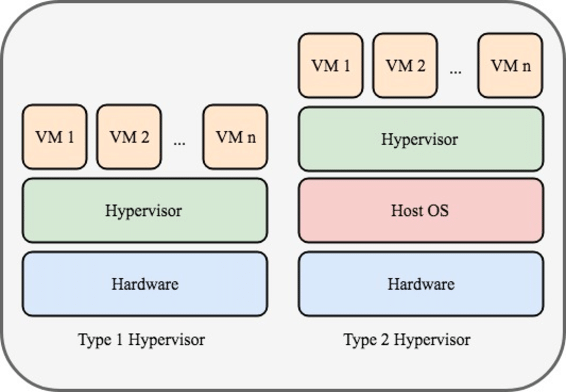

# 2024.07.19

## Linux란?

## 리눅스 배포판 종류

레드햇 계열
- 레드햇 리눅스와, 그 커뮤니티 버전인 페도라에서 파생된 배포판
- 패키지 형식은 .rpm이며 패키지 관리자로 yum을 사용하는 것이 특징
- ex) CentOS, 아시아눅스, Oracle Linux, MeegGo(타이젠), 붉은별 등

데비안 계열
- 데비안에서 파생된 배포판들. 패키지 형식은 .deb
- 패키지 관리자로 apt를 이용
- ex) 우분투, 칼리 리눅스, 스팀 OS, 크롬 OS, 구름 OS, TmasOS, 라즈비안(라즈베리파이 OS) 등

안드로이드 계열
- 모바일 운영체제인 안드로이 계열 배포판, 패키지 형식은 apk
- ex) Android-x86, Wear OS 등

## 가상화 개념
원래는 하드웨어가 있어야 쓸 수 있는데   
소프트웨어 만으로 하드웨어가 있는 것처럼(하드웨어의 기능을 대신하여)    
쓸 수 있는 것이 가상화


Virtual Box = Type2   
VMware = Type1

속도   
Type1 > Type2

편리함   
Type1 < Type2


## 리눅스 명령어 구조

### 리눅스 로그인 프롬프트
- test@ubuntu22:~$
- [로그인 사용자명]@[호스트명][현자 작업 디렉토리][프롬프트 모양]
- [test][ubuntu22][:~][$]

### 명령어 구조
- tree -L 1 /
- [명령어 이름][-옵션][매개변수1][매개변수2]...
- [tree][-L][1][/]

### 계정 정보 확인
- whoami
- id
- users
- groups

## ls

### ls -l
파일/디렉토리의 자세한 정보(type, permission, link, size, owner)까지 리스트 출력
#### drwxrwxrwx 2 test test 4096 JUL 19 10:52 Desktop
```
- = 일반 파일
d = 디렉토리(폴더)
l = 심볼릭 링크 파일
b = 블록 디바이스 파일
c = 문자 디바잇흐 파일
p = 파이프
 
rwx = read / write / excute = 읽기 / 쓰기 / 실행 권한
1rwx/2rwx/3rwx = 1=소유자(User)/2=그룹(Group)/3=그 외 사용자(Other)

test
첫번째 이름은 사용자 이름

test
두번째 이름은 그룹 이름

4096
byte 단위 파일 크기

JUL 19 10:52
날짜 시간

Desktop
이름
```

### ls -a
do- t(.)로 시작하는 숨겨진 파일까지 모두 출력   

### ls -al
- dot(.)로 시작하는 숨겨진 파일과 디렉토리까지 자세한 정보 리스트 출력

### ls -l /tmp


### ls -ald /tmp
- -d 디렉토리 내용이 아닌 디렉토리 자체를 출력

### ls -R /usr/local
- -R 하위 디렉토리까지 모두 출력


## pwd
현재 디렉토리의 전체 경로를 화면에 출력
### cd /tmp; pwd

## cd
디렉토리 이동

cd ~  : HOME 디렉토리로 이동   
cd .. : 상위 디렉토리로 이동


## touch
파일 생성 및 날짜 수정

touch <옵션> 파일이름or디렉토리이름

-a 기존의 파일의 access time 수정   
-m 존재하는 파일의 modification time 수정   
-t 특정 시간으로 설정[[CC]YY]MMDDhhmm[.ss]

### touch sample.file

### touch -t 12250730 sample.file


## mkdir
디렉토리 생성

mkdir <옵션><디렉토리 이름>

-m 퍼미션 설정 (chmod와)   
-p 존재하지 않는 parent directories 생성

### mkdir /home/ubuntu/bin

### mkdir ~/tmp-dir

### mkdir -p ~/dir/subdir

### mkdir -m 777 share

## rmdir
디렉토리 삭제

-p 비어있는 parent directories를 함께 삭제

### rmdir /home/ubuntu/bin

### rmdir ~/tmp-dir

### rmdir -p ~/dir/subdir

### rmdir share

## 리눅스 파일 시스템 특징
대소문자 구분   

일반파일
- 텍스트파일, 실행파일, 이미지파일 등
- 디렉토리 : 파일이나 하위 디렉토리를 포함하는 파일
- 심볼릭 파일 : 원본 파일을 대신하여 다른 이름으로 파일을 지정(윈도우의 바로가기)   
- 장치 파일 : 리눅스에 연결된 장치를 관리하기 위한 특수 파일

### file /bin/date
디렉토리 파일

### file /etc/hosts
일반 파일

### file /bin 
심볼릭 파일

### file /dev/sda
블록기반 장치 파일

## 파일과 디렉토리의 개념

### 디렉토리 별 역할

```
/           : 이름없는 디렉토리. 최상위 디렉토리로 루트 디렉토르라 부름
/bin        : binaries 의 약자로, 시스템에서 가장 필수적인 실행파일을 모아두고 있는 디렉토리
/boot       : 시스템 부팅과 관련된 파일들이 저장된 디렉토리
/dev        : 디스크, 키보드, 터미널과 같은 디바이스 파일들이 저장된 디렉토리
/etc        : 시스템에서 사용하는 여러 가지 설정 파일들이 저장된 디렉토리
/home       : 일반 사용자들의 홈 디렉토리. ubuntu 사용자의 홈 디렉토리는 /home/ubuntu. (홈 디렉토리라는 의미가 2가지. home 과 ubuntu)
/lib,/lib64 : binary 프로그램이 사용하는 library file이 저장된 디렉토리
/sbin       : system binary. 시스템 관리용 명령어가 저장되는 디렉토리
/root       : root 사용자의 홈 디렉토리
/tmp        : 임시 파일들이 저장되는 디렉토리
/var        : 자주 변하는 데이터로 로그나 애플리케이션 데이터, 메일이 저장되는 디렉토리
```

### 절대 경로
- 루트 디렉토리에서 시작해서 목적지로 가는 경로    
- 현재 작업 디렉토리가 test의 홈 디렉토리일 경우 build 디렉토리의 절대경로는 /home/test/bulid   
- root(/)부터 시작하면 무조건 절대 경로   
- cd ~ = cd /home 절대경로

### 상대경로
- 현재 작업 디렉토리를 기준으로 목적지로 가는 경로   
- 상위 디렉토리 : ..   
- 현재 디렉토리 : .   
- cd ../../tmp
- cd ./home

/home/test 경로에서 /tmp로 가는 상대경로는?   
cd ../../tmp

/home/test 경로에서 /home/ubuntu 로 가는 상대경로는?   
cd ../ubuntu

## 디렉토리 구조 보기

### tree
snap install tree : tree 패키지 설치

-L n : 출력할 디렉토리의 계층 레벨 설정
#### tree -L 1 /

#### tree -L 1 /

#### tree home


## man - 리눅스 도움말 보기
-k 메뉴얼 목록을 검색    
-s [section-number] 입력한 섹션에서 메뉴얼 검색해서 출력   
    [1] Executable programs or shell commands   
    [2] System calls   
    [3] Library calls   
    [4] Special files   
    [5] File formats   
    [6] System administration commands   

## [command] --help
ls --help   
date --help

## Wildcard 문자 - 파일이름 매칭

### ? 
모르는 문자 개수만큼 쳐야 함   
te?t01 => test01

### *
앞뒤로 있는 문자 포함되면 다 찾음   
t*3 => test03 tast03

### [..]
ls t[ae]st01 => test01 tast01   
ls t[a-z]st01 => test01 tast01
ls test0[0-9] => test01 test02 test03

### {}
ls {*01,*02} ==> test01 tast01 test02 tast02   
01로 끝나는 모든 문자와, 02로 끝나는 모든 문자 출력

## cp - 파일 복사하기
매개변수 2개 필요.   
원본파일이름, 목적지파일이름

-i 복사할 때 overwrite 할 것인지 질문   
-f 복사할 때 overwrite 질문없이 무조건 덮어쓰기   
-r 디렉토리 복사 


경우의 수 3가지
### cp [파일1] [파일2]
파일1의 복제본을 파일2라는 이름으로 복사
### cp [파일1] [경로]
파일1을 이 경로에다가 복사
### cp -r [경로1] [경로2]
경로1 디렉토리를 경로2 디렉토리에 복사
cp -r a/ ./b
### cp [경로][경로] X


## mv - 파일 이동하기
-i 이름 바꿀 때 overwrite 할 것인지 질문   
-f 이름을 바꿀 때 overwrite 질문없이 무조건 덮어쓰기


## rm - 파일 삭제하기
-i 파일을 삭제할 때 삭제 여부를 한 번 더 질문   
-f 파일을 삭제할 때 질문없이 무조건 삭제   
-r 하위내용을 포함한 디렉토리를 삭제

## whereis - 도움말 페이지 찾기

### whereis ls
### whereis -b ls
### whereis -m ls

## find - 파일 찾기
```
-name   주어진 이름의 파일이나 디렉토리 검색
-user   지정한 사용자의 파일이나 디렉토리 검색
-group  지정한 그룹 소유의 파일이나 디렉토리 검색
-uid    지정한 UID 소유의 파일이나 디렉토리 검색
-gid    지정한 GID 소유의 파일이나 디렉토리 검색
-perm   지정한 퍼미션 값을 가진 파일이나 디렉토리 검색
-type   지정한 파일 유형을 찾는다(d:디렉토리, f:일반파일, i:링크파일, b:블록디바이스...)
-empty  0byte 파일이나 디렉토리 검색
-size n n블록 길이의 파일을 검색. +n은 n블록보다 큰 파일, -n은 n블록보다 작은 파일
-exec   찾은 파일에 적용할 명령어 나열. 결과값은 {}기호로 표시하고 \;으로 종료되어야 함.
```

### ls -lh

### find /bin/ -size +10M -exec ls -lh {} \;
굉장히 많이 쓰는 방법이다?? ㄷㄷ 


### find /bin/ -size +500k -size -5M -exec ls -lh {} \;
500k바이트보다 크고 5메가바이트보다 작은 파일들 다 출력


## 사용자와 그룹 - 사용자 관리와 파일 속성
### cat /etc/passwd
#### 사용자이름:암호:사용자ID:사용자의그룹ID:추가정보:홈디렉토리:기본셸

### cat /etc/group
#### 그룹이름:암호:그룹ID:그룹에속한사용자이름


### adduser - 사용자 추가
adduser user1

sudo adduser user1

--uid <사용자번호> : 사용자 ID를 지정해 계정 생성
--gid <그룹번호>   : 

### 비밀번호 변경
#### sudo passwd user1


### 사용자 계정 삭제
sudo userdel user1

삭제하고 나서 /home디렉토리하고 passwd 파일 비교해봐라.    
이상한 점이 있을 것   

passwd 파일에는 user1 없어졌는데   
/home 디렉토리에는 user1 디렉토리가 남아있음

홈 디렉토리에 있는 user1 까지 함께 없애려면?   
sudo userdel -r user1

## group
groups user1

groups root

sudo groupadd testgroup   
testgroup이란 이름의 group 생성

sudo gpasswd -a user1 testgroup   
user1 계정을 testgroup에 추가

groups user1   
user1 계정에 그룹이 잘 추가되었는지 확인

sudo gpasswd -d user1 testgrup   
user1 계정을 testgroup에 제거

groups user1   
user1 계정에 그룹이 잘 제거되었는지 확인

sudo groupdel testgroup   
testgroup란 이름의 그룹 제거

## 실습
1. dev 그룹과 tester 그룹을 생성 후 다음과 같이 그룹에 사용자를 추가하시오.
- sudo groupadd dev
- sudo groupadd tester
- sudo gpasswd -a user1 dev
- sudo gpasswd -a user2 dev
- sudo gpasswd -a user3 tester
- sudo gpasswd -a user4 tester
- groups user1 (그룹 적용 확인)
- groups user2
- groups user3
- groups user4


2. user1 계정과 user2 계정을 홈 디렉토리와 함께 생성한 뒤, 두 계정을 삭제하시오. 단 user2 계정을 삭제할 떄는 -r 옵션을 사용한 뒤 /home 디렉토리의 차이점을 확인하시오.
- sudo adduser user1
- sudo adduser user2
- sudo userdel user1
- sudo userdel -r user2
- -r을 안한 user1은 /home 디렉토리에 폴더가 남아있고, -r을 한 user2는 /home 디렉토리에 폴더가 사라졌다.


## chmod - 권한 변경
chmod 777 test.php   
chmod 664 test.php   
chmod U+rwx test.php