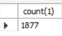
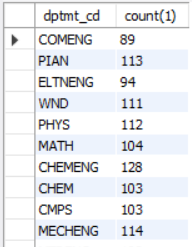
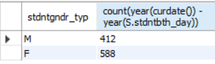
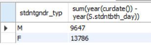
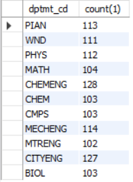
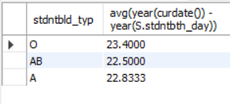
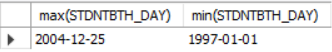

# 2024.07.29
김준범 / paladin00@naver.com   
sk

이론보다는 실습 위주
## Database 개론

#### DATA
의미있는 정보를 가진 모든 값   
사람이나 자동 기기가 생성 또는 처리하는 형태로 표시된 것
#### DB
통합하여 관리되는 데이터의 집합
#### DB Modeling
data 및 database 의 효율적 운영과 관리를 위한 설계 과정

DBMS : 정형 데이터

</br></br>

### 파일시스템의 등장
데이터와 기능의 <U>**이원화 처리**</U>를 위한파일 시스템이 각광

#### 파일시스템 
파일에 기초하여 자료나 정보를 관리하는 시스템

파일 시스템의 데이터 무결성 침패   
응용프로그램만으로 Validation이 충분치 않음.   
중복성도 마찬가지

</br></br>

### DB 등장
데이터를 중앙에서 통합하고 집중화하여 관리하는 방안

### **DBMS와 DB를 구분하기 시작함**

</br></br>

### RDBMS vs NoSQL
Cloud, BigData 등 시대적 변화하는 환경에 맞게 NoSQL이 부각되었으며,    
각각의 목적에 맞게 따라 활용   

NoSQL : Non-relational Operational SQL

둘이 목적이 다름.

</br></br>

### CAP Theory
캡 이론

RDBMS : 정

RBBMS : 정확성을 높음 
    - 성능은 아쉬울 수 있음
    - 대신 정확성 높음
MongoDB : 정확성이 낮음(무결성을 보장하기 위해 ~~ 했습니다.)
    - 대용량, 속도처리
    - 정확성 낮음

몽고db, RDBMS 같이 써보는 게 좋음


## Basic SQL
Set as Default Schema : 기본 스키마로 설정


## sql 유형
```
DQL : 데이터 질의어, 가장 많이 사용되는 sql 유형    
      - SELECT 
DML : 데이터 조작어. 데이터의 변동을 목적으로 사용. TRANSACTION 단위   
      - INSERT 
      - UPDATE 
      - DELETE
DDL : 정의어. 데이터 보관을 위한 저장형태 관리 목적으로 사용   
      - CREATE 
      - ALTER 
      - DROP
DCL : 제어어. 사용권한 관리/제어 역할
      - COMMIT 
      - ROLLBACK 
      - GRANT
      - REVOKE
```

## DB 구성요소 ★
엔티티, 속성, 관계


## 데이터 분류
데이터 특징/구분이 동일한 것들끼리 구성 필요   
데이터의 상위 개념을 활용하여 매핑 필요

### 분석 대상 데이터
성명 성별 생년월일 지도교수명 학과명 주소 사무실위치 정원

## 엔티티
정의 : 대상 데이터의 귀속이 동일한 것끼리 모아놓은 집함.

학과

학생

## Attribute 속성
정의 : 엔티티에서 관리하는 최소 단위의 정보 항목(데이터 저장의 가장 작은 단위)

학과
- 학과명
- 사무실위치
- 지도교수명
- 정원

학생
- 성명
- 생년월일
- 성별
- 주소

## 비유
멘티 : 엔티티명

번호, 성명, 소속대학 ... : 속성
111, 정민재, a대학교 ... : 튜플

전체 : 엔티티

```
Entoity : Table = 마그마 : 용암   
Attribute : Column = 마그마 : 용암
마그마 = 땅속에서 나오기 전
용암 = 땅 밖으로 분출
```
Entity는 구체화되지 않은 ,설계단계에서의 귀속집합.   
Table은 실제로 생성된, Physical 단계의 귀속집합   
Attibute/Column도 동일 개념


## DQL 사용법
```
SELECT      | [컬럼명1], [컬럼명2], [컬럼명3], ...
FROM        | [테이블명1]
WHERE       | [조건절1]
(AND/OR)    | [조건절2]
(AND/OR)    | [조건절3]
?
```

#### 기본    
- SELECT COL1, COL2, ...
- SELECT * : 테이블의 모든 열

#### DISTINCT
- SELECT DISTINCT COL1, COL2, ...

#### 조건부 함수
- SELECT CASE WHEN CON1 THEN RSLT1 ELSE RSLT2 END

#### 기타 다양한 함수
- 내일 배울 거

### wHERE 조건절에 포함될 수 있는 구분자
#### 비교연산자
- = (equal), != or <>
- >, >=, <, <=

#### 논리연산자
- AND, OR, NOT

#### 기타연산자
- BETWWN : X BETWWEN A AND B -> X >= A AND X < B
- IN : X IN (A,B) -> X = A or X = B
- LIKE : 패턴일치 확인 여부(%, _ 사용)
- IS NULL

### 가장 마지막에 추가 가능한 문법
#### ORDER BY
- 결과 데이터의 정렬 순서 지정
- [ORDER BY NAME (ASC), HEIGHT DESC, WEIGHT DESC]
 
#### LIMIT 
- 결과에서 반환할 행의 수 제한
- 결과의 일부분만 선택시 활용

#### OFFSET
- 결과에서 건너뛸 행의 수 지정
- 페어징 구현 가능


## 실습
1.
select * from tst_stdntinfo_m where stdnt_nm like '이%' and STDNTMBTI_TYP = 'ISFP'

2.
select * from tst_stdntinfo_m 
where STDNTBTH_DAY between '2000-01-01' and '2002-01-01' 
and stdntbld_typ = 'AB'

3.
select * from tst_stdntinfo_m 
where STNB like '18%' 
	and STDNTGNDE_TYP = 'M'
	and STDNTBTH_DAY like '2002%'
    -- and YEAR(STDNTBTH_DAY) = '2002'

4.
select * from tst_stdntinfo_m 
where STDNT_NM like '__'
order by STDNTGNDR_TYP ASC, STDNTBTH_DAY DESC

5. 
select * from tst_stdntinfo_m 
where STDNTHOBBY_TYP = ''
limit 50;


## INNER JOIN
from의 대상이 되는 테이블을 2개 이상의 테이블의 조합을 기반으로 사용하는 방법
```
select      |
from        | [테이블명1] <alias>
(INNER) JOIN| [테이블명2] <alias>
```

## 집계함수
다수의 로우로부터 얻어낼 수 있는 항목의 계산식(=수식)을 활용하여 질의하는 방법
```
select      | (집계기준컬럼1), (집계기준컬럼2),
            | [집계함수 (컬럼3)]
from        | [테이블명1]
...
Group by    | (컬럼 집계 기준)
Having      | [집계함수 조건]
```
### 집계함수 유형
AVG   
MIN   
MAX   
SUM   
COUNT


1) 
select count(1)   
	from tst_stdntdptmt_i M;   

     
2)   
select m.dptmt_cd. count(1)   
	from tst_stdntdptmt_i M   
group by M.dptmt_cd ;   
 

3)
select s.stdntgndr_typ,   
	count(year(curdate()) - year(S.stdntbth_day))   
from tst_stdntinfo_m S   
group by S.stdntgndr_typ   

4) 
select S.stdntgndr_typ,   
	sum(year(curdate()) - year(S.stdntbth_day))   
    from tst_stdntinfo_m S   
group by S.stdntgbdr_typ   


5)
select M.dptmt_cd, count(1)   
from tst_stdntdptmt_i M   
group by M.dptmt_cd   
having count(1) > 100;   


6)
select S.stdntbld_typ   
		, avg(year(curdate()) - year(S.stdntbth_day))   
        from tst_stdntinfo_m S   
        join tst_stdntdptmt_i D   
        on  S.stnb = D.stnb   
        where S.stdntgndr_typ = 'F'   
        and D.dptmt_cd = 'COMENG'   
        group by S.stdntbld_typ   
        having avg(year(curdate()) - year(S.stdntbth_day)) < 24
   
컴공다니는 여학생들 중에 혈액형별로 평균나이 구해서 24보다 작은 나이만 출력

select max(STDNTBTH_DAY), min(STDNTBTH_DAY) from   tst_stdntinfo_m m   
join tst_stdntdptmt_i i   
	on m.STNB = i.STNB    
where i.use_yn = 'Y'   
	and (m.STDNTMBTI_TYP like '_S__'   
	or m.STDNTMBTI_TYP like '___P')   



## DQL (select) 구상 순서 ★
1. from 확인
    - 어디서 가져올거지?
2. join 추가 
    - 어딜 join으로 엮을 건지
3. where filtering
    - where 조건으로 필터링
4. select 대상 
    - 어떤 걸 가져올 거냐
5. 집계기준/함수
    - sum, count, max, min 등
6. having
7. order by / limit

where는 column값을 기준으로 하고    
having은 집계함수를 대상으로 함


## DML (Data Manipulation Language)

### Insert
- insert into [table1] ([column1], [column2], ...) values ([val1], [val2], ...)

### Update
- update [talbe1]    
    set [column1] = [val1]   
    ,   [column2] = [val2]   
    where <condition>   

### Delete
delete (from) [table] where <condition>

아래 case의 데이터 처리를 위한 sql을 작성하시오.   
문1) 신규 학생정보를 등록하시오.   
(김길동, 학번 15001960, 남성, 생년월일 2000-06-21, 혈액형O, ENTF)    
insert into TST_STDNTINFO_M   
(STDNT_NM, STNB, STDNTGNDR_TYP, STDNTBTH_DAY, STDNTBLD_TYP, STDNTMBTI_TYP)   
values ('김길동', '15001960', 'M', '2000-06-21', 'O', 'ENTF');   

문2) 성이 이씨인 학생들의 이름을 '길동'으로 변경하시오   
update TST_STDNTINFO_M    
set STDNT_NM = '길동'   
where STDNT_NM like '이%';

문3) '15'학번 모두의 정보를 삭제하시오   
delete from TST_STDNTINFO_M   
where STNB like '15%';

가급적이면 delete 전에 select 해보고 해라


## db modeling
타 sw 설계와 동일하게, 복잡한 현실세계를 쉽게 이해하도록 개념화, 단순화하여 표현


### 정의 : 
현실세계 또는 구현하고자 하는 대상을 컴퓨터의 database 세계에 추상화하여 표현하는 작업   
- 추상화
    - 지도 => 현실세계 투영
    - 연필은 500원이고 지우개는 1000원이다. 고객이 연필 3자루~ 지우개 2개~ 얼마 내야하는가?
        - 계산하는 작업
특징 : 모델(model)이라는 구체적 표현을 통해 이루어지는 과정   

## Identifier 개념 (식별자, Key)
튜플(=row)(=데이터 하나하나)간 구별이 가능한 구분값.   
구별되는 값이 없다면 그 튜플은 무의미

### 개념 :   
엔티티 내에 튜플간 구별이 가능한 기준 또는 항목

### 특징 :    
단일 또는 다수의 속성 조합으로 구성가능   
SEQ(Incremental) 또는 코드+SEQ 등등의 방법 사용

### 예 :    
학생 - 학번    
주민 - 주민등록번호 (Unique)
환자 - 환자번호 (Unique)

## Identifier 유형

### 주식별자(Primary Key)
유일성, NOT NULL을 만족하는 속성중 선택된 값   
튜플간 구별이 가능한 주요 항목

### 고유식별자(Ubique Key)
유일성을 만족하는 속성 중 선택된 값(NULL 허용)   
primary 키를 보조하는 역할

### 외래식별자(Foreign Key)
다른 엔티티를 참조하기 위해 사용되는 속성


## 기본 모델링 문제

1. 먼저 구분에 따라 분리해야 함
2. 
```
학생 table          동아리 table
학생번호 (pk)       기수 (pk)
기수                기수별 찬조금
성명                기수별 찬조품
성별                기수별 준비TF
회사재직           
참석여부
성인여부
학생번호 (pk)
```
기수라는 데이터를 기준으로 