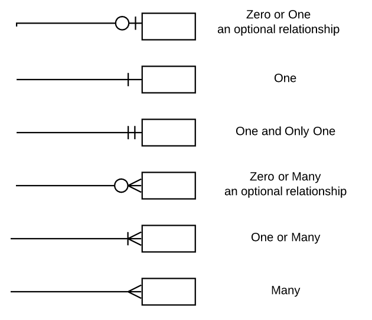

# 2024.07.30

## Data Modeling
구현하고자 하는 사항을 DBMS World 에 투영하여, Table/Column을 생성하고 Realation을 연결하는 작업
```
순서 :
귀속 관계 파악
Attribute 분류
Table/Column 생성
식별자 생성(필요시)
Realation 연결 -1 (PK/Fk)
Realation 연결 -2 (Cardinality1)
```

```
학생 table    |          | 동아리 table
학생번호 (pk) |          | 기수 (pk)
기수 (fk)     |          | 기수별 찬조금
성명          |∋|-----|-| 기수별 찬조품
성별          |          | 기수별 준비TF
회사재직      |          |
참석여부      |          |  
성인여부      |          |
학생번호 (pk) |          |
```
crow foot ∋|-----|-
동아리 table -----∈ 학생 테이블


## Meta vs Master
Master Data 는 Legacy Data에 대한 기준에 대한 의미 - 기준
Meta Data 는 Master를 포함한 전체 데이터 속성에 대한 의미 - 설명

## Data Dictionary
```
구분    명칭    물리명               적용    동의어    규격
단어    학생    STUDNET             STDNT
단어    교수    PROFESSOR           PRFSR     
도메인  성명    NAME                NM      성함,존함   STRING(50)
도메인  주소    ADDRESS             ADDR                STRING(200)

논리명      물리명      속성
학생성명    STDNT_NM
학생주소    STDNT_ADDR  STRING(200)
```

## Realation
엔티티간 상속, 대응 등의 연관관계를 표현하는 기법

정의:   
엔티티간 상호 소통하는 포함관계의 표현   
데이터는 한 군데에서만 관리하는 RDBMS 핵심

## Cardinality ★
Exactly One   
Zero or One   
One or More   
Zero, One or More ★   
- ∋|o-----|-   

More than One   



## 식별 vs 비식별
### 식별관계   
- 부모의 PK가 자식의 PK로 구현

진한 실선

### 비식별 관계
부모의 PK가 자식의 PK가 아님

점선

#### 비식별관계가 더 일반적

## ERD
DB모델링의 목표는 해당 시스템의 ERD를 작성하는 것.    
학교에서 주로 배우는 ERM(ER-Model)과는 형태가 조금 다름

### 정의:    
- 엔티티간 상관관계를 표현하는 도식   
- 엔티티, 속성, 관계로 표현


## 정규화 단계
정규화가 필요하기도 하지만, 정규화가 불필요하도록 ERD를 작성하는 것이 최선

### 개념:   
- ERD내에서 중복을 찾아서 제거하는 과정
- 속성을 제자리에 위치시키는 절차

### 특징:   
- 더 이상 부내 불가능한 엔티티로 재구성
- 속성간에 부정확한 중속성의 삭제
- 중복을 최대한 제거

## 반정규화
별로 없을 것 같지만, 여러가지 상황 및 이해관계 등에 의해서 반정규화는 많이 사용됨.

### 개념:    
- 정규화를 하지 않은 모델이 아니라,   
정규화 이후 성능향상을 위해 역변환을 하는 절차

### 특징:   
- 조회 성능 향상이 주 목적
- 실전에서는 Resource 최소화를 위해 다양한 방법으로 적용   
(관리목적의 테이블 수, 컬럼 수 감소)

## 반정규화의 기본 사례
```
환자성명    생년월일       연령(일반)   연령(만)    성별
홍길동      1990.12.03     32          30          남
```
환자 엔티티 생성시 연령(일반), 연령(만) 속성을 생성하는 게 맞을까?
- 해결방안 1 - 정규 (일반적인 답)
    - 연령속성 미생성
    - 조회시마다 생년월일 가지고 계산
- 해결방안 2 - 응용
    - 연령속성 생성
    - 년배치 실행하여 일괄처리

## 기본 모델링 문제 #2
동아리 9기 학생 중 한 명은 반수를 하여 다른 학교에 입학하였으나,   
연합동아리인 본 동아리에 10기로 다시 가입하여 활동중이다.   
해당 학생의 정보는 9기에도 10기에도 존재해야 하나,   
인원은 1명이기 떄문에 

### 해결방안)
 


```
                            기수정보
                            -------
                            기수ID
                            찬조금
                            찬조품
                            준비TF
                              |
                              |  
학생기수매칭   ∋|-----|-------|
-----------            
기수ID         ∋|-----|-------|     
학생ID                        |        
                            학생정보
                            -------
                            성명
                            회사재직
                            ...
```

## 공통코드 활용
공통코드는 단순 구조의 다량의 테이블을 감소시켜    
많은 작업을 효율적으로 진행하게 함.

개념:   
- Key/Value 기반의 단순성 코드만 별도 관리하는 엔티티 및 그에 포함된 데이터 집합
- 분류와 분류별 상세항목(엔티티 2개)

Value 값을 code 말고 한글로 쓰면 안됨.

## PK 적합?
조건:    
XX 온라인 몰에서 고객이 주문시 발생하는 


## 기본 모델링 문제 ★
ERD를 작성하시오. 
```                   
고객   o|∈  주문요약  |∈ 주문상세   ∋|o   제품
고객번호    주문번호      주문번호          제품고유번호
이름        총주문금약    주문순번          제품명
전화번호     배송날짜     제품고유번호       제품요약설명
주소        주문날짜      제품단가          제품단가
            지불방법      제품수량          제품판매단위
            고객번호      제품금액
                         제품고유번호

고객번호 주식별자 필수?
고객번호 주식별자 필수?
제품 단가, 금액 필요?
```


## CRUD Matrix
C : Create   
R : Read   
U : Update   
D : Delete

필수 요소 2개.   
C, R

## Procedural SQL
변수, 조건문, 반복문 등 프로그래밍 언어에서 제공하는 요소를 사용하여   
데이터 관리가 가능한 절차 지향적 프로그램

- DBMS에서 직접 실행
- 기능별 모듈화 기능
- 단일 SQL에서 처리 어려운 연속적 작업 처리 가능
- Input/Ourput Packet 적음
- DBMS Vendor별 의존도가 높음


## Procedural SQL 유형
?

## View
하나 이상의 table을 기반으로 생성되나 실제 존재하지 않고, data 조회/공유를 위해 사용되는 논리기반 테이블

### DQL만 가능
select query 가능

## Procedural SQL
반복적으로 사용하는 특정 기능을 수행하는 데 사용.   
연속적 마감작업이나 배치 작업 등의 수행시 자주 활용

### Execute/call 명령으로 실행
- EXECUTE/CALL PR_DAILY_BATCH(CURDATE()-1);

### DML 목적으로 사용
- 2개 이상 또는 조건별 INSERT/UPDATE/DELETE 작업에 활용
- 조회가 목적인 FUNCTION과 차이

### DQL (COMMIT/ROLLBACK) 포함하여 활용 가능
- 내부에서 작업제어 처리 가능


## Advanced SQL
row에 대한 meta data 관점에서 사용되는 공통 컬럼


## Subquery
서브쿼리의 위치, DQL/DML 기준의 사용 가능

### 위치구분
- select (subquery) from ...
- select -... from (subquery)


## 실습
"음악예술대학"에 다니는 학생들의 mbti의 e/i는 모두 e로 변경   
단과대학명이 "음악예술대학"인 것으로 조건을 실행해볼 것

