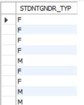
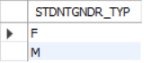
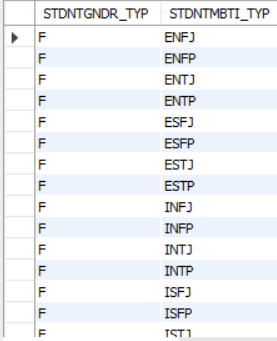
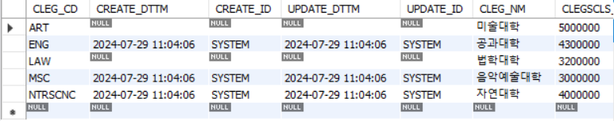
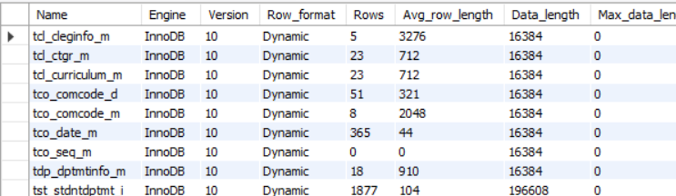

# 2024.07.31

## 실습

```
select s.stnb
	,  S.STDNTMBTI_TYP
    ,  MID(S.STDNTMBTI_TYP,1,1)
    ,  MID(S.STDNTMBTI_TYP,2,3)
    ,  CONCAT('E', MID(S.STDNTMBTI_TYP,2,3))
  FROM TST_STDNTINFO_M  S
  JOIN TST_STDNTDPTMT_I M
    ON S.STNB = M.STNB
  JOIN TDP_DPTMTINFO_M  O
    ON M.DPTMT_CD = D.DPTMT_CD
  JOIN TCL_CLEGINFO_M   C
    ON C.CLEG_CD = D.CLEG_CD
 WHERE C.CLEG_NM = '음악예술대학';
```
```
UPDATE s.stnb
  JOIN TST_STDNTDPTMT_I M
    ON S.STNB = M.STNB
  JOIN TDP_DPTMTINFO_M  D
    ON M.DPTMT_CD = D.DPTMT_CD
  JOIN TCL_CLEGINFO_M   C
    ON C.CLEG_CD = D.CLEG_CD
   SET S.STDNTMBTI_TYP = CONCAT('E', MID(S.STDNTMBTI_TYP,2,3))
 WHERE C.CLEG_NM = '음악예술대학';
```

## useful dql
select 사용 시, 적재적소에 활용하면 유용

### DISTINCT
- 조회 대상 커럽의 UNIQUE한 VALUE값만 구함
### CASE WHEN (A) THEN (B) ELSE (C) END ; DECODE
- (A) 조건이 참일 경우, (B) 값을 반환하게 되며, 거짓인 경우 (C)값을 반환
### (NOT) EXISTS
- SUB QUERY 형태로 사용하며, 일반 JOIN 대ㅑ비 좀 더 좋은 효율(성능)

</br></br>

`SELECT STDNTGNDR_TYP FROM TST_STDNTINFO_M`   


`SELECT distinct STDNTGNDR_TYP FROM TST_STDNTINFO_M `  


`SELECT distinct STDNTGNDR_TYP, STDNTMBTI_TYP FROM TST_STDNTINFO_M order by 1,1`     
가능한 모든 경우의 수   
   


## Merge (Upsert)
### 개념
- INSERT/UPDATE를 통합하여, "저장"이라는 개념으로 활용
### 특징
- 추가/수정에 대한 구분을 CLIENT 입장에서 할 필요가 없음 
- PK가 변경되는 경우가 별로 없기 때문에, 한 번 작성해놓으면 그대로 사용하기 좋음
```
-- 1
INSERT INTO TCL_CLEGINFO_M ( CLEG_CD, CLEG_NM, CLEGSCLS_AMT)
VALUES ( 'ART','미술대학',5000000)
ON DUPLICATE KEY
UPDATE CLEG_CD = 'ART'
, CLEG_NM = '미술대학'
, CLEGSCLS_AMT = 5000000;

-- 2
INSERT INTO TCL_CLEGINFO_M ( CLEG_CD, CLEG_NM, CLEGSCLS_AMT)
VALUES ('LAW', '법학대학',3200000)
ON DUPLICATE KEY
UPDATE CLEG_CD = 'LAW'
, CLEG_NM = '법학대학'
, CLEGSCLS_AMT = 3200000;

-- 3
INSERT INTO TCL_CLEGINFO_M ( CLEG_CD, CLEG_NM, CLEGSCLS_AMT)
VALUES ('MSC', '음악예술대학',7000000)
ON DUPLICATE KEY
UPDATE CLEG_CD = 'MSC'
, CLEG_NM = '음악예술대학'
, CLEGSCLS_AMT = 3000000;
```
`SELECT * FROM tcl_cleginfo_m S`


## Hierarchy Table
댓글, 대댓글, 대대댓글 등   

root에 대한 시작점을 가져오게 하고 밑에는 반복   
재귀함수?   

자기자신의 아버지가 누구예요 하면서 알려주는 게 있어야함


## 성능개선 이론
지금까지 db와 dbms는 같았음(분리할 필요가 없었음)

성능이라는 과정이 있다면   
db와 dbms를 다르게 해야 한다   
=   
지금까지는 dbms가 알아서 일하겠지... 냅뒀는데   
이제는 직접 dbms까지 컨트롤해야겠다 라는 느낌   

## Optimizer
어린 아이한테 서울에서 부산가려면 어떻게 해야 하니?    
= 아빠 차 타면 되요...

자동이 아니라 

### 정의
- SQL을 가장 빠르고 효율적으로 수행할 최적의 경로를 생성해주는 DBMS의 핵심모듈
- Optimizer가 생성한 경로를 실행계획이라 함
### 특징
- Optimizer 도 RDBMS 향상에 따라 지속적으로 개선되어짐

### Optimizer = 네이게이션
네이게이션이 주행결로를 선택하는 기준은?
- 예정소요시간
- 주행거리
- 비용
- 운전 난이도
- 사고다발구간 통과
- 도로괴담(?) 여부

</br></br>

그렇다면 Optimizer는?   
### 종류 : 비용기반 최적화, 규칙기반최적화
### 비용기반 최적화 (Cost Based Optimizer, CBO)
- 가성비. 
- 실시간 교통 정보()
- 고속도로가 거리만 보면 빠른데, 너무 사람이 많아서 국도로 가면 빠르겠는데?
- 각 단위 작업의 비용(부하) 정보
### 규칙기반 최적화(Rule Based Optimizer, RBO)
- 실시간 교통 정보 없던 시절의 네비게이션
- 그냥 내장된 우선 순위에 따라서만 계획 수립
- 고속도로 위주, 신호가 없는 도로 위주 등

### 주요 통계정보
- 테이블 내 Row, Columnn 수
- 각 열의 길이와 데이터 형
- 테이블의 크기
- Column의 Primary Key, Not NULL 등 제약 정보
- Column내 Value에 대한 분산수준
이런 애들을 DB가 아니라 DBMS가 하고 있다

</br></br>

SHOW table status   
    
이런 것들을 다 인지하고 있다.

## 비용질의 실행계획
1. 질의 변환기 - 오탈자부터 잡음 Syntax error
2. 질의 변환기 - 자기가 보기 좋은 기준으로 query를 바꿈 - 2진법
3. 대안계획 생성기 - 할 수 있는 게 뭐뭐있는지 실시간으로 다 따짐.   
(경부고속1 경부고속2 서울통영1 등등)    
각각 얼마나 걸리는지 다 따짐. 이런 것들 하나하나 다 만든 다음에
4. 비용 예측기 - 비용예측을 시작함
5. 딕셔너리 - 이 경로로 가면 경로, 거리, 차비, 시간 등등 다 보여줌


## Partition
50만 이상부터 느려지기 시작함   
그 이전엔 다 빠름

면접에서 몇천갠데 느려져서 이거 했다 이러면 털림.

우리나라 지도를 좌표로 나눠서 했다 = 몇천만개 나옴   

기존에 있는 테이블을 세팅을 바꿔서 관리한다

## JOIN
넘어감. 안함.

## 인덱스
### 구조
- 테이블이나 컬럼을 기반으로 선택적으로 생성할 수 있는 구조

### 특징: 
- 검색성능 최적화
- WHERE 조건이 걸리면 빠름

```
인덱스라고 하면 책 앞쪽 목차만 생각함.   
일반적으로 알고 있는 인덱스 (단어)

실제로 나눌 수 있는 인덱스 :   
인덱스 (난이도 별)   
상 - 12, 15~18, 29 (난이도 높은 페이지)   
중 - 21, 50

인덱스 (연령가 별)   
전체 - 59~60, 69   
15세 - 189~190

인덱스 (영역 별)   
비즈니스 - 51~60   
테크 - 67~890

끝도없이 나눌 수 있음
```
나는 잘 모르니까 난이도 낮은 것만 찾아 읽어야지   
난 테크에 관심있으니까 테크만 읽어야지    

책 한 장 넣을 때마다 수정할 게 너무 많아짐.   
**<U>index 많아짐 -> insert 성능 낮아짐</U>**


## sql 작성시 - 성능관점
### 인덱스 설정
where 구분에, 컬럼에는 함수를 씌우지 않음
- x)where trunc(height) = 2
- o) where height between 2 and 3   

가급적 pk 위주 조회조건 사용
### 모호한 부분 최대한 제가

### 서브쿼리보다는 join으로
무조건은 아니지만, 서브쿼리가 join보다 성능상 낫다고 말하기 어려움


## 최종 실습
병원에 방문한 환자의 진료기록 및 관련 데이터

### 상세
- 환자는 개인신상정보를 갖고 있음
- 환자는 진료과를 접수하고 진료를 받음
- 환자는 필요시 검사를 수행(진단방사선, 진단검사의학, 특수검사)하며 여기에는 비용이 발생함.
- 검가 이후, 검사별/환자별 상병 (주요 증상)이 정해짐
- 환자별 상병별에 따라 투약이 발생할 수 있음
- 발생한 비용은 환자가 수납
    - H1) 검사/상병/투약은 상호 종속관계가 없음
    - H2) 별도 언급이 없더라도, 테이블 생성시 PK(ID/CD) 생성 권장

### 설계
- ERD (Entity Relational Diagram) - 40점

### 개발 (SQL 작성)
1. 병원 총 수입금액 - 5점 (환자가 납부한 금액 기준)
2. 전체 진료 환자 수 (Unique 환자수) - 5점
3. 진단검사의학과 검사 기본정보 (검사코드, 검사명, 검사금액) - 5점
4. 진료과별 업체별 처방수 조회 - 5점
5. 투약 기본정보.....   
..   
.   


엑셀을 데이터베이스에 넣는 게 제일 우선

여러 방법은
1) 가상의 1통 테이블 > 정규화 > 각 테이블 생성 > 데이터 채우기 > sql 풀이
2) 엑셀에서 미리 분석해서 각 데이터 set 만들고 > 각 테이블 만들고 > sql 풀이
3) import 시켜서 가상의 1통 테이블 > ...

insert into table1 values(' ','     ','     ','     ','....

insert 

