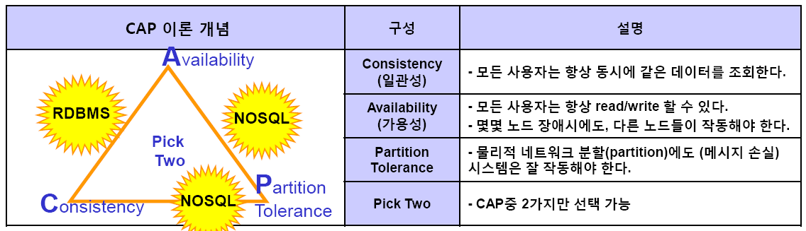
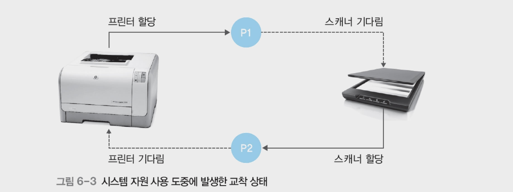

# 2024.08.01

## 데이터

데이터 > 정보 > 지식 > 지혜

데이터 : 센서에서 측정한 온도.   
정보 : 데이터를 가지고ㅓ 어떤 자료를 만들거나, 기업에 의미 있는 정보   
지식 : 마케팃, 어떻게 팔릴지 측정   
지혜 : 미래지향적 생각    

수집 : 기업 내외부 자료를 수집    
정제 및 변환 : 일반적으로 80%가 이 부분. 수집한 데이터를 기업에서 쓸 수 있게 정제 및 변환하는 게 시간이 많이 들고 비중이 크다.   
데잍터 모델링 : 대량의 데이터들이 만들어지면, 데이터 모델링 단계를 거쳐 테이블 이용 및 사용    
시각화 및 탐색 : 시각적을 표현    
보관 : 추후 참조를 위해 안전하게 저장 및 보관

## 데이터 처리
### 데이터 처리 기술의 발전

자동화 : 
- 프로세스 자동화 소프트 웨어
- 로보틱 프로세스 자동화(RPA) : 기존에 했던 작업을 녹화를 하거나 행동을 입력해서 작업 자동화
- 스크립트 및 프로그래밍

인공지능 및 머신러닝 :     


클라우드 기반 처리 : 

</br></br>

### 일괄 처리(Batch Processing)

#### 정의 
- 대량의 데이터를 한 번에 처리하는 방식

#### 장점
- 자원 최적화
- 경제적

#### 단점
- 지연시간
- 유연성 부족

은행 점검 시간에 일일 거래 결산 - 일괄처리

</br>

### 온라인 처리 (Online Processing)
#### 정의
- 데이터가 생성되는 즉시 이를 처리하는 방식
- 실시간 데이터 처리에 적합

#### 장점
- 즉각적인 처리
- 사용자 중심 처리 ☆

#### 단점
- 높은 비용
- 시스템 부하

실시간 신용카드 승인 시스템    
온라인 주문 처리 시스템

</br>

### 분산처리 (Distributed Processing)
#### 정의

#### 장점
- 확장성
- 효율성
- 내구성
#### 단점
- 복잡성
- 통신 비용

금융 거래 부정 사용 감시

</br></br>

## 데이터베이스
### 파일처리시스템
#### 정의
개별적으로 직접 파일에 접근해야 할 때

#### 파일처리시스템의 문제점
- 데이터 종속성
    - 데이터가 변경될 때마다 반드시 프로그램 수정해야 함
- 데이터 중복성 및 비일관성
    - 중복되기도 하고 파일이 퍼져있음
- 데이터 접근의 어려움
- 원자성의 부재
- 동시 접근의 문제
    - 여러 사용자의 파일 접근과 수정이 정보 불일치 발생
- 보안 문제
    - 원하는 부분만 접근 허용하는 것이 어려움

#### 데이터 중복의 문제

#### 동시 접근의 문제

</br></br>

### 데이터베이스 시스템
#### 데이터베이스의 장점
- 데이터 종속성 해결
- 데이터 중복성 미 비일관성의 해결
- 동시 접근의 효율적 관리
- 보안 문제의 체계적 관리

기존 파일처리 시스템에서 불편했던 게    
동시성, 중복처리 문제도 다 해결 되었음

</br></br>

### CAP 이론
Consistency 일관성   
Availability 가용성   
Partition Tolerance ?


#### CAP이론과 DBMS 관계
기업의 모든 시스템은 RDBMS로 봐도 무방
- RDB
- Cons + Ava 선택

</br></br>

### 관계형 데이터베이스 RDBMS
#### 정의와 구조
특징 :    
- ACID 속성 지원
- 복잡한 질의 처리

#### 적용 사례
- 은행 시스템
- 온라인 쇼팅 플랫폼

즉시성은 대부분 RDBMS

</br></br>

### NoSQL 데이터베이스
키 밸류

- 몽고db 같은 곳에서 사용
- 유연한 스키마 :
- 확장성

log나 비일관적인 저장 : NoSQL

</br></br>

## 동시성 제어

### 트랜잭션
한 번에 일어나는 다양한 연산들을 통틀어서 트랜잭션이라 한다

여러 정보에 대한 전체 처리 연산 과정을 하나의 트랜잭션.

</br></br>

### 트랜잭션 특징

#### 원자성(Atomicity)
- ALL OR NOTHING

모두 성공하면 반영. COMMIT   
하나라도 실패할 경우 ROLLBACK   

#### 일관성
송금 전후의 잔액 일관적임

#### 고립성
트랜잭션 작업하는 동안 다른 사람이 접근하지 못하게 하는 것.

A라는 사람이 작업하고 있을 때 다른 사람이 알 수 없도록 고립되게 하는 것

#### 영구성
한 번 데이터베이스에 반영되면 장애가 발생하더라도 유지됨

</br></br>

### 동시성 제어

#### 동시성 제어 개념
여러 사람들이 사용할 수 있게 하는 것

#### 동시성 제어 목적
- 직렬성 보장
- 처리량 증가

동시에 사용하고 동일하게 처리하는 것처럼 보이지만   
직렬성 보장 한다는 것

</br></br>

### 동시성 제어에 따른 문제점
#### 갱신 손실(Lost Update)
두 트랜잭션이 동시에 write 할 떄 생김

#### 현황 파악 오류

#### 모순성

#### 연쇄 복귀

트랜잭션 장점은 있지만    
이런 4개의 문제점이 있긴 함

</br></br>

### 동시성 제어 기법
- 잠금 기법 : 잠근 걸고 동시 접근 못하도록 막는 방법
- 비관적 동시성제어 기법 :
- 낙관적 동시성 제어 기법 : 
- 타임스탬프 순서 기법 : 
- 다중 버전 동시성 제어 기법 : 


문제 하나 (트랜잭션)★   
트랜잭션 성질 4개 중에서 각각 어떤 거다
---
이제부터 하나

### 잠금(Locking)
사용할 때는 lock 걸고 사용하지 않을 땐 lock 푸는 방법

데이터베이스 전체에 대해서 잠금을 하는 게 가장 편함

### 직렬화
모든 데이터베이스가 순차적으로 진행함을 보장하는 것
#### Dirty Read( Read uncommitted)

#### Non-Repeated Read

#### Repeatable Read

#### Phantom Read


격리수준
Read uncommitted    
Read committed     
Repeatable Read    
    - 2번 읽었을 때 문제점 해결   
Serializable Read


점점 공유도가 낮아짐

격리 수준에 따른 문제 발생


### 2단계 잠금(2PL, 2Phase Locking)
Lock과 unlock 사이에 작업하는 것이 2단계

### 비관적 동시성 제어 vs 낙관적 동시성 제어
기본 개념
- 비.충돌 방지를 위해 미리 잠금을 설정
- 낙.충돌 발생 가능성을 낮게보고 잠금없이 진행

잠금 사용   
- 비.있음 (공유잠금)
- 낙.없음(커밋 단계에서 충돌 검사)

비. 데드락이 발생할 가능성이 있음

### 타임스탬프 순ㅅ허 기법

### 다중버전 동시성 제어
가장 많이 사용

트랜잭션이 시작했을 때 값을 그대로 읽는 것

내가 해당하는 데이터를 읽고있는 도중에 다른 사람이 변경작업을 하더라도
undo 영역에 있는 데이터를 읽을 수 있다...?????


최종적으로 트랜잭션a가 500원으로 완료했지만   
트랜잭션 b가 500

일관성있게 내가 처음 읽었던 영역을 가져올 수 있다...

read uncommitted 같이 사용

### 교착상태(Dead lock) 
식사하는 철학자들 문제    

2개만 있어도 발생.

하나의 프로세스가 프린터 할당받고 팩스를 대기하고 있고,   
댜른 하나의 프로세스가 팩트 할당받고 프린트를 대기하고 있다면    
모든 프로세스가 무한히 기다리는 현상이 발생.    
작업이 진행되지 않고 시스템이 정체되는 문제 발생.

#### 교착상태 조건 : 아래 조건 중 하나라도 충족하지 않으면 교착상태는 발생하지 않음.
- 상호 배제 : 한 프로세스가 사용하는 자원은 다른 프로세스와 공유할 수 없는 배타적인 자원
- 비전섬 : 한 프로세스가 사용중인 자원은 중간에 다른 프로세스가 빼앗을 수 없는 비선점 자원
    - 뺏을 수 없는 상태. 
- 점유와 대기 : 프로세스가 어떤 자원을 할당받은 상태에서 다른 자원을 기다리는 상태
- 원형 대기 : 점유와 대기를 하는 프로세스 간에 관계가 원을 이루어야 함.

4가지 중에 하나라도 발생하지 않는다면 교착상태는 발생하지 않음.




### goprufqkdqjq
- 교착 상태 예방 : 
    - 4가지 중에서 하나를 막는 것
- 교착 상태 회피 : 문제가 발생할 것을 예측하고 가능성이 있다면 자원 할당 중단하고 확인
    - 사전에 교착상태가 발생할지 확인
- 교착 상태 검출(회복) : 
    - 빠졌을 것으로 예상하는 
    - 이쪽이 더 현실적인 방법


### 정리
트랜잭션
원자성
일관성
격리성: 내가 어떤 작업을 할 떄 남이 못오도록 막음
    : 장애가 발생해도 최종적으로 보존하는 것

동시성 제어를 해서 처리량을 늘렸는데
동시성 제어 방법 사용

이런 작업들을 하다 보니 데이터에 대한 deadlock이 발생한다.

## 테이어베이스 보안
### 주요 특징
- 가용성
- 무결성
- 비밀성 : 누출 x

### 보안 요구사항
- 접근제어 
    - 인증
    - 권한 부여
    - 최소 권한 원칙
- 데이터 암호화
- 감사 및 로그
    - 로그 기록
    - 감사 추적
- 데이터 무결성
    - 입력 검증
    - 무결성 제약 조건
- 백업 및 복구
- 네트워크 보안
- 취약점 관리
    - 정기적인 보안 패치
- 감사 기능
- 교육 및 인식

### 백업
#### 전체 데이터베이스 백업(Full Backup)
데이터베이스의 데이터를 온전히 백업하는 방법   

#### 차등 데이터베이스 백업
최초 풀백업하고 이후 변경된 데이터를 차등백업

#### 트랜잭션 로그 백업
로그를 통해서 언제 시점으로 복구하는 방법

백업이 필요한 이유:   
데이터 무결성 확보

### 데이터베이스 보안 단계
- 데이터베이스 접근 전 보안 단계
- 데이터베이스 접근 시 보안 단계

### 임의적 보안 모델(DAC)
가장 유연하다는 장점

#### Capability list
rwxr--r--

#### ACL(Access Control List)

### MAC Mandatory Access Control
- 보안 레벨
- 벨라파듈라 모델 : 기밀성 보장
- 비바 모델 : 무결성 보장

### 벨라파듈라 모델
기밀성 중점

상위 단계는 read 불가.
하위 단계는 read 가능   
상위 단계에는 write 가능
하위 단계에서는 write 불가


### 비바 모델
상위 단계는 read 가능
하위 단계에 read 불가

상위 단계는 write 불가
하위 단계는 write 가능

### 역할 기반 접근 제어 (RBAC)
역할 부여하고 역할에 따라서 권한 매핑하는 RBAC 방법이 있음

</br></br>

#### 보안에 대한 접근 제어는 3가지가 있다.   
DAC   
MAC   
- 벨라파듈라 모델
- 비바 모델   

RBAC

</br>

### 보안 유형
#### 데이터 보안은 3가지
가상 테이블(view)

허가 규칙

암호화


Grant, Revoke

api 방식 : 웹서버 암호화   
plugin 방식 : 데이터베이스 암호화   
TDE 방식 : 데이터베이스 암호화   

## 데이터베이스 백업 및 복구

### 데이터베이스 장애와 회복

트랜잭션 - 영구성   
장애가 있더라도 데이터는 영구적으로 보존되어야 한다

1. 트랜잭션 로그를 통해서 복구를 하는 방법
2. 데이터베이스 디스크를 통해서 복구하는 방법


#### 장애는 왜 발생할까?
사용자가 잘못된 데이터 강제 입럭.   
프로그램적으로   
디스크가 깨지거나 물리적으로 문제    

### 지연갱신 기법
####  
장애가 발생할 확률이 낮을 때

트랜잭션이 완료되어야만 데이터베이스 적용   

문제 발생.   
장애발생하더라도 log에 대한 작업만 함

장애가 났을 때 유용한 방법


### 즉시갱신 기법
데이터베이스와 log를 항상 반영. 

ROLL BACK

평상시엔 문제 없음. 항상 완료를 가정하기 때문.  

장애가 발생시 추가적인 작업 필요.   
데이터베이스에 반영했던 내용을 되돌려야 함

지연갱신은 장애가 발생했을 경우 log를 버려서 빠르게 처리 가능하지만
즉시갱신은 항상 트랜잭션에 대한 결과를 log 와 데이터베이스에 저장해서 추가 작업이 필요

### 검사시점 회복기법
★
1. REDO가 필요한 대상?
    - t1, t2
    - t3, t5
2. UNDO가 필요한 대상?

체크포인트를 기점으로 

REDO는 체크포인트 이후에 커밋된 트랜잭션의 변경사항을 재적용.   
UNDO는 체크포인트 이후에 시작되었으나 커밋되지 않은(작업이 끝나지 않은)

### 그림자페이징 기법
별도의 공간을 마련해서 해당하는 데이터를 그대로 저장해놓고 해당하는 정보에 대해서 다시 올리는 방법

트랜잭션이 시작이 되면 해당하는 하드디스크에 그림자 페이지 테이블이란 걸 저장함.

### 회복기법 비교
지연, 즉시 : REDO, UNDO

### 재해적 실패로부터의 회복
디스크 자체적 문제 시

- 장치 백업 - 먼저 진행.
- REDO - 장치 백업하고 REDO 수행
- UNDO - 수행하지 않음

트랜잭션 영구성 유지하기 위해.

# 시험 =   
1. 트랜잭션
2. 회복기법

바커표기법
```
사원 - - - - - ---------|- 사원신체내역
사원 신체 내역은 사원을 반드시 가진다


부서 - - - - - -------<- 사원
사원은 하나의 부서를 반드시 가진다

상품 ->- - - - --------<- 주문

```
## 정규화
### 이상현상 유형
- 삽입 이상 : 
- 삭제 이상 : 
- 수정 이상 : 수정하려 할 때 속성되지 않는 것

### 함수 종속성

- 완전 함수 종속
    - 학번 -> 이름
    - 학번 -> 학년
    - OR 학번 -> (이름, 학년)
- 부분 함수 종속
    - 학번 -> 이름
    - {학번, 과목번호} -> 학점
    - {학번, 과목번호} -> 이름
- 이행적 종속
    - 학번 -> 주민등록번호
    - 주민등록번호 -> 성별
    - 학번 -> 성별


종속자가 결정자에 포함되어 있는 경우   
함수 종속성 고려하지 않아도 됨.

### 정규화
이상현상이 있는 릴레이션을 분해하여 이상현상을 없애는 과정.     
중복데이터 삭제   
1,2,3 정규화까지만 설명. 이정도만 알아도 됨.

#### 정규화 장단점
장점 :   
- 데이터베이스 변경 시 이상 현상을 제거

단점 :   
- 과도하게 하면 join 연산 증가.

### 1정규화 1NF
비정규 릴레이션

속성중에 원자값이 있지 않으면 원자값을 갖도록 테이블을 분해

|학번|이름|학년|과목명|
|------|---|---|---|
|테스트1|테스트2|테스트3|
|테스트1|테스트2|테스트3|
|테스트1|테스트2|테스트3|


### 2정규화
1정규화 진행한 테이블에   
완전 함수 종속을 만족하도록 테이블을 분해하는 것.   
부분 함수 종속성을 분리하는 과정.

### 3정규화
이행적 종속성을 없애는 것

## 반정규화
반정규화는 데이터가 복잡해졌거나, 성능저하가 예상될 경우

사전에 문제가 될 것으로 보인다 하면

### 반정규화 절차
1. 반정규화 대상 조사
- 범위처리빈도수 조사
- 대량의 번위 처리 조사
- 통계성 프로세스 조사
- 테이블 조인 개수

2. 다른 방법 유도 검토
- 뷰 테이블
- 클러스터링 적용
- 인덱스의 조정
- 응용 애플리케이션

3. 반정규화 적용
- 테이블의 반정규화
- 속성의 반정규화
- 관계의 반정규화

### 반정규화 기법
#### 테이블 반정규화

테이블 병합
- 1:1 관계 
    - 1:1 관계를 통합
- 1:M 관계
    - 1:M 관계를 통합
- 슈퍼/서브타입

테이블 분할
- 수직분할
- 수평분할

테이블 추가
- 중복 테이블
- 통계 테이블
- 이력 테이블
- 부분 테이블

#### 컬럼 반정규화
중복컬럼 추가

파생컬럼 추가

이력테이블 컬럼 추가

### 수직분할
1. 갱신 위주의 컬럼 수직 분할
회원 <----> 회원접속기록

2. 자주 조회되는 컬럼 분할
회원 <----> 회원인증

3. 특정 컬럼의 크기가 아주 큰 경우 분할
회원 <----> 회원사진

4. 특정 컬럼에 보안을 적용해야 하는 경우 분할
회원 <----> 회원개인정보

### 수평분할
데이터가 대량일 때 대량 데이터를 빠르게 조회하기 위해 데이터 값을 기준으로 분할하는 것.   

202401   
202402   
202403   
...


## 데이터 표준
### 데이터 표준어
이음동의어
동음이의어
### 표준 도메인

## 데이터 모델링
### 데이터 모델리으이 개념

## 데이터 모델 표기법
### 엔티티

바커 표기법, I/E 표기법

기본값 #   
필수값 *   
선택값    


## 실습문제
나는 우리회사의 컴퓨터 관리를 담당한다. 지금 내가 관리하고 있는 제품들 관리 시스템을 개발 중에 있다. 내가 관리하는 제품의 종류는 데스크탑, 프린터, 노트북, 모니터 이다. 모든 제품은 제품일련번호, 모델번호, 모델명, 제조사명, 제품종류, 납품일자, 납품가격을 관리한다.
제품은 지급이력을 관리해야 하며, 사원들에게만 지급한다. 사원번호, 지급일자, 회수하였을 경우 회수일자를 관리한다. 부서는 부서코드, 부서명을 관리한다. 사원은 사원번호, 사원명, 소속부서를 관리한다.

## 데이터베이스 언어
### SQL 처리 과정
SQL Parsing -> Optimization 

#### SQL Parsing 과정
- Syntax 확인 : sql 문법적 오류 체크
- Semantic 확인 : 존재하지 않는 데이터를 조회할 때
- Libarary Cache 확인 : sql 구문을 해싱 값으로 변환 후 Library Cache에 저장되어 있는지 확인

#### Soft Parsing vs Hard Parsing
- Soft Parsing : 

### 아래 중 동일한 SQL은?
1) SELECT a.* FROM STUDNET a
2) SELECT * FROM STUDENT
3) SELECT  * FROM STUDENT 
4) SELECT * /* 전체 자료 출력 */ FROM STUDENT

4개 다 다른 해싱 값을 가짐    
Library Cache에 4가지 다 다른 해싱값을 가진 것으로 저장됨   
같은 해싱값을 가지려면 완전히 똑같아야 함

Library Cache를 잘 사용해야 한다.   
= select * form where %d   
= select * form where hand   
hand라고 하드코딩x  
%d 바인드 변수 사용하여 Library Cache 이용

바인드 변수를 하지 않고 하드코딩을 하게 되면 성능적으로 떨어짐.   
그때그때마다 optimazer가 확인하기 때문에 성능이 떨어짐

## 데이터 정의 언어 DDL
- CREATE : 
- ALTER
- RENAME
- TRUNCATE
- DROP

## 자료형
### Boolean
true, false   
0, 1

### Charter
- CHAR(n) : 고정 길이
- VARCHAR(n) : 가변 길이

### Integers
- SMALLINT : 16QLXM WJDTN
- INTEGER
- BIGINT

### Float 
- FLOAT
- DOUBLE
- NUMBER(p,s)

### DATE/TIME
- DATE
- TIME
- TIMESTAMP

### ARRAY
- integer[]
- varchar[]
- boolean[]

### JSON
- JSON :

### LOB
- CLOB : 텍스트
- BLOB : 이미지, 노래, 비디오 등 대용량 데이터

## 제약조건
- primary key : 지정한 열이 유일한 값이면서 NULL 허용x
- Foreign Key : 다른 테이블의 열을 참조하여 존재하는 값만 입력 가능
- NOT NULL : 지정한 열에 NULL 허용 x
- Unique : 지정한 열에 유일한 값. NULL 허용 o 
- Check : 

## DML
- SELECT
- INSERT
- UPDATE
- DELETE


## INSERT 실습
1.   
INSERT INTO PROFESSOR (PROFESSOR_ID, PROFESSOR_NAME, AGE, ADDR, DEPARTMANT_ID, PHONE_NUMBER) VALUES (102, '신성호', 40, 'TEST', 1, NULL)

2.   
INSERT INTO PROFESSOR VALUES (101, '정혜미', NULL, NULL, 38, 2);

### 여러 개의 데이터를 한 번에 입력하는 방법
INSERT INTO PROFESSOR (PROFESSOR_ID, PROFESSOR_NAME, AGE, ADDR, DEPARTMANT_ID, PHONE_NUMBER) VALUES    
(102, '신성호', 40, 'TEST', 1, NULL),   
(103, '박성호', 28, 'TEST', 1, NULL),   
(104, '주미수', 12, 'TEST', 1, NULL);


UPDATE PROFESSOR SET PROFESSOR_NAME = 'TEST' WHERE PROFESSOR_ID = 101;


### DELETE
DELETE VS TRUNCATE VS DROP

- DELETE : 데이터는 지워지지만 테이블 용량은 줄어들지 않음.   
WHERE 조건절로 이용하여 원하는 데이터만 삭제 가능.    
COMMIT 이후 되돌리기 가능 
- TRUNCATE : 용량이 줄어 들고, 인덱스 등도 모두 삭제.    
하지만 테이블은 삭제되지 않고 데이터만 삭제하고 모든 데이터를 한 번에 다 삭제.    
삭제 후 되돌릴 수 없음
- DROP : 테이블 전체를 삭제.    
공간, 객체를 삭제.    
삭제 후 절대 되돌릴 수 없음


### GRANT
GRANT [권한명] ON [객체명]  ????

### REVOKE
REVOEK [권한명] ON [객체명] FROM [사용자명]

## 트랜잭션 제어 언어 TCL

### 트랜잭션 제어 언어 주요 명령어
- COMMIT
- ROLLBACK
- SAVEPOINT

#### COMMIT
변경된 데이터를 테이블에 영구히 반영하는 것으로 COMMIT 이전ㅇ 데이터는 영원히 복구 불가

#### ROLLBACK
바로 직전 COMMIT 한 순간지점까지 복구

### 추가 정리
- COMMIT은 변경된 데이터를 테이블에 영구 반영
- ROLLBACK은 변경 전 데이터의 문제가 있으니 변경전 데이터로 복구
- SAVEPOINT는 데이터 변경을 사전에 지정된 저장점까지 롤백

- CREATE, ALTER, DROP, RENAME, TRUNCATE 등.. ~~~???


## 정렬 실습
학생 중 학과id가 1,2,3,4 인 대상자에 대해서 나이와 학과id의 오름차순 조회

SELECT STUDNT_NAME, DEPARTMENT_ID ORDER BY DESC WHERE DEPARTMENT_ID = 1,2,3,4

SELECT *
FROM student
WHERE DEPARTMENT_ID IN (1, 2, 3, 4)
ORDER BY AGE ASC, DEPARTMENT_ID ASC;


과목 정보에 대해서 강의실과 교수id의 내림차순 조회(null 값이 있을 경우 가장 뒤로 정렬)
 
